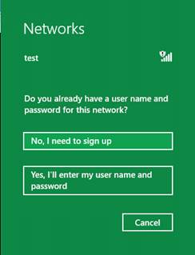

# WISPr authentication


A Wireless Internet Service Provider roaming (WISPr)-capable hotspot includes a payload in its captive portal page that is similar to the following:

``` syntax
<HTML> 
<!--
    <?xml version=”1.0” encoding=”UTF-8”?>
    <WISPAccessGatewayParam xmlns:xsi=”http://www.w3.org/2001/XMLSchema-instance”
      xsi:noNamespaceSchemaLocation=”http://www.acmewisp.com/WISPAccessGatewayParam.xsd”>
      <Redirect>
        <AccessProcedure>1.0</AccessProcedure>
        <AccessLocation>Hotel Contoso Guest Network</AccessLocation>
        <LocationName>Hotel Contoso</LocationName>
        <LoginURL>https://captiveportal.com/login</LoginURL>
        <MessageType>100</MessageType>
        <ResponseCode>0</ResponseCode>
      </Redirect>
    </WISPAccessGatewayParam>
--> 
</HTML>
```

A smart client, such as Windows, interprets this XML (which is contained in an HTML comment to avoid its display to customers), to learn where the user’s credentials must be submitted.

When a customer manually connects to a WISPr-capable network, they see the following prompt:



Customers who select **No, I need to sign up** are directed to your captive portal. Customers who select **Yes, I’ll enter my user name and password** are prompted to enter their credentials. These credentials are provided to your website, and the user is connected after successfully authentication.

A mobile broadband app can automatically supply credentials or replace the credentials prompt by using a tailored purchase or authentication flow. This requires that the network support WISPr, and that the app be installed before the user connects to the network.

If your network offers WISPr to clients by using certain UserAgent strings, the user will not see this prompt and cannot manually enter credentials. However, your app can still participate in WISPr authentication by including the appropriate UserAgent when it creates the network profile.

The following topics are included in this section:

-   [Provisioning for hotspot authentication](provisioning-for-hotspot-authentication.md)

-   [Handling large numbers of SSIDs](handling-large-numbers-of-ssids.md)

-   [Handling the hotspot authentication event](handling-the-hotspot-authentication-event.md)

## <span id="related_topics"></span>Related topics


[Hotspot authentication methods](hotspot-authentication-methods.md)

 

 


