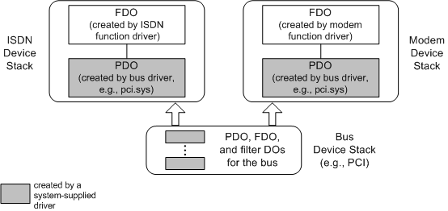

# Supporting Multifunction PCI Devices

If a multifunction PCI device conforms completely to the PCI multifunction standard, the PCI bus driver enumerates the individual functions. The PCI bus driver manages the fact that there is more than one function residing at a single device location. To the rest of the system, the individual functions operate like independent devices.

Vendors of a PCI multifunction device on an NT-based platform must do the following:

-   Ensure that the device conforms to the PCI multifunction specification.

-   Provide a PnP function driver for each function of the device.

    Since the system-supplied bus driver handles the multifunction semantics, the function drivers can be the same drivers that would be used if the functions were packaged as individual devices.

-   Provide an INF file for each function of the device.

    The INF files can be the same files that would be used if the functions were packaged as a individual devices. The INF files do not need any special multifunction semantics.

For example, the following figure shows the sample device stacks that might be created for a multifunction PCI device with ISDN and modem functions.

As shown in the previous figure, rather than enumerating one multifunction device, the PCI driver enumerates two child devices. The PnP manager treats each child device like a typical device, locating INF files, loading the appropriate drivers, calling their AddDevice routines, and so forth until a device stack is created for each device. The PCI driver arbitrates the resources for the child devices and manages any other multifunction aspects of the device. The vendor of the multifunction card provides function drivers and INFs for the ISDN and modem devices, just as if they were separate devices.

The illustration focuses on the function driver and bus driver for each function and their associated FDO and PDO. Any filter drivers (and filter DOs) are omitted for simplicity.

 

 

