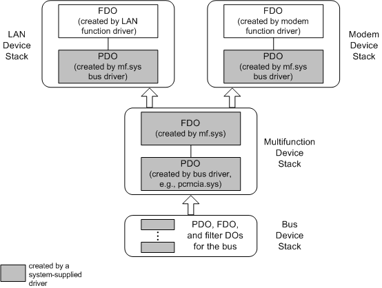

# Using the System-Supplied Multifunction Bus Driver


If a device's underlying bus supports a multifunction bus standard, such as PC Card, the vendor for a multifunction device on an NT-based platform can use the system-supplied multifunction bus driver (mf.sys) to support the device.

The mf.sys bus driver handles PnP enumeration of the device functions and arbitrates resources, such as I/O ports and IRQs, between the functions. The mf.sys driver handles power management for the child functions by power managing the parent multifunction device.

To use mf.sys, a multifunction device must meet the following requirements:

-   The device's underlying bus must have a multifunction standard.

-   The [**DEVICE\_CAPABILITIES**](https://msdn.microsoft.com/library/windows/hardware/ff543095) of the child functions must be identical and must match those of the parent device. When queried for the device capabilities of a child function ([**IRP\_MN\_QUERY\_CAPABILITIES**](https://msdn.microsoft.com/library/windows/hardware/ff551664)), the mf.sys driver reports the device capabilities of the parent device.

-   The driver for the bus on which the multifunction device resides, such as pcmcia.sys, must handle any [**IRP\_MN\_READ\_CONFIG**](https://msdn.microsoft.com/library/windows/hardware/ff551727) and [**IRP\_MN\_WRITE\_CONFIG**](https://msdn.microsoft.com/library/windows/hardware/ff551769) requests. The mf.sys driver just passes these IRPs to the parent bus driver.

-   The functions must be independent: they cannot have start-order dependencies; the resource requirements for one function cannot be expressed in terms of the resources of another function (for example, function1 uses I/O port X and function2 uses portX + 200); and each function must be able to operate as a separate device, even if it is serviced by the same driver(s) as another function.

To use mf.sys, a vendor supplies an INF for the multifunction device that specifies mf.sys as the driver for the device. If a device completely and accurately conforms to the multifunction standard for its underlying bus, the vendor of such a device can use the system-supplied mf.inf. If a device does not completely conform to the standard, the vendor must provide a custom INF.

In either case, the vendor also supplies drivers and INF files for the individual functions on the device.

The following skeleton of a custom multifunction INF illustrates the required syntax for specifying mf.sys as the driver for a multifunction device:

```cpp
[Version]
Signature = "$Windows NT$"
; ...
Class = Multifunction   ; the system-defined class for MF devices
ClassGUID  = {4d36e971-e325-11ce-bfc1-08002be10318} ; GUID for MF
; ...
; ...
[ControlFlags]
ExcludeFromSelect = *   ; don&#39;t include PnP devices in a displayed list of 
                        ; devices available for manual installation
[Manufacturer]
; ...
; ...
[ModelsSection]         ; models section
; ...
; ...
[DDInstall.NT]          ; install section
Include = mf.inf        ; specify that this device requires mf.sys
Needs = MFINSTALL.mf
; ...
 
[DDinstall.NT.Services]
Include = mf.inf
Needs = MFINSTALL.mf.Services

[DDInstall.NT.HW]
AddReg=DDInstall.RegHW
 
[DDInstall.RegHW]
; put entries with child function hardware IDs here
; ...
 
; put override sections here...
; ...
 
[Strings]
; ...
```

Consider a combination LAN/modem PC Card device. Without any special multifunction support, such a device might be reported by the PCMCIA bus driver as a single modem device. With the additional support of a multifunction INF and the mf.sys bus driver, both functions of the device are enumerated. The following figure shows the sample device stacks that might be created for such a combo PC Card with the required multifunction support.



As shown in the preceding figure, the driver for the bus on which the multifunction device resides enumerates one device. The hardware ID in the multifunction INF file causes the PnP manager to load the mf.sys bus driver as the function driver for the device. The mf.sys bus driver enumerates two child devices, a LAN device and a modem.

The PnP manager treats each child device like a typical device, locating INF files, loading the appropriate drivers, calling their AddDevice routines, and so forth until a device stack is created for each device. The mf.sys bus driver arbitrates the resources for the child devices and manages any other multifunction aspects of the device. The vendor of the multifunction card provides function drivers and INFs for the multiple functions (LAN and modem), just as if they were separate devices.

The illustration focuses on the function drivers and parent bus drivers and their associated FDOs and PDOs. Any filter drivers (and filter DOs) are omitted for simplicity.

 

 


