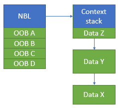
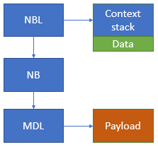
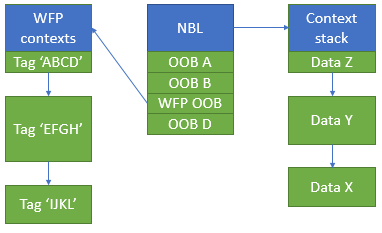

# Datapath descriptors and packet extensions

This topic introduces concepts underlying datapath descriptors and packet extensions in NetAdapterCx 1.2 and later.

## Overview

*Datapath descriptors* are small, runtime-extensible structures that describe a network packet. They can be used by different components in the system and are not limited in scope to specific APIs or header files. Different components are free to allocate and manage collections of descriptors however they see fit, such as in a linked list or in an array. 

In NetAdapterCx, client drivers use datapath descriptors to interface with their datapath queue's ring buffers of packets and packet fragments.

> [!NOTE]
> Datapath descriptors can also be referred to as *packet descriptors*. These terms may be used interchangeably throughout this topic.

*Packet extensions* are attached to each datapath queue's core descriptor and are used by client drivers to share information with the upper layers. Packet extensions can hold information such as advanced offload tasks, like checksum, LSO, and RSS hash, or they can hold application-specific details.

## History

Packet descriptors have changed several times in Windows. NDIS 6 introduced the [NET_BUFFER_LIST]((https://docs.microsoft.com/windows-hardware/drivers/ddi/content/ndis/ns-ndis-_net_buffer_list)(NBL) structure, which had the following goals in mind when it was designed:

1. Extensibility
    - The NBL introduced the **context stack**. At *runtime*, other networking features can allocate and push an arbitrary block of memory onto the NBL's context stack.
2. Versionability
    - NDIS 6 requires all NBLs to be allocated by the OS. Therefore, in new versions of Windows, the size of the NBL can be trivially increased by adding a new value to the *out of band (OOB) array*, a *compile time* array of PVOID values. The OOB array is the `NetBufferListInfo` member of the NBL.
3. Performance
    - Many similar packets can be grouped into a single NBL. A driver can parse the first packet in an NBL and reuse those parsing results for every packet in the NBL. This reduces CPU cycles per byte with large batches of similar packets.
4. Reusability
    - Every component in the Windows networking stack, from the NIC client driver to the TCP/IP stack and the Hyper-V virtual switch, was designed to use the NBL as its core data descriptor. The NBL is the central data structure for I/O in many core networking drivers.

The OOB array is positioned at the end of the NBL so it can easily grow with each new version of Windows. However, the context stack is a linked list of data blocks, as illustrated in the following figure.

## NBL opportunities

The NBL accomplished its previously stated goals. However, because network throughputs have increased by an order of magnitude since the NBL was introduced, several shortcomings have arisen.

1. The NBL context stack requires expensive per-packet allocation and deallocation.
2. NBLs are frequently "lost" by drivers, leading to 0x9F bug checks.
3. NBLs are not cache-friendly.

### Expensive context

When a driver acquires an NBL, it allocates a context block and pushes the context onto the NBL's context stack. When the driver returns an NBL, it pops the context from the NBL's context stack. This is resource-expensive and can be difficult to manage.

Drivers don't know how many NBLs are in circulation, so they cannot preallocate enough context blocks. Instead, they dynamically allocate the *N*-th context when the *N*-th NBL is first seen. However, since drivers must pop their context before returning an NBL, they need to manage a lookaside list of unused context blocks. In the absence of any serialization guarantees, this lookaside list needs to be protected with locks.

High-performance NDIS 6-based drivers dedicate many lines of complex code to manage context space.

### Lost NBLs

Every NDIS 6 NIC driver has hundreds of lines of code to rearrange the NBL data structures into something that can be sent through DMA to hardware. Frequently, drivers introduce bugs in this code that causes NBLs to be leaked, eventually resulting in a bug check.

### Cache unfriendly

If a driver wants to read the payload of an NBL, it needs to dereference `Nbl->FirstNb->CurrentMdl->MappedSystemVa`. Reading the next packet means indirecting through `Nbl->Next`. Indirecting through a pointer can result in occasional memory stalls and inhibits CPU-level optimizations. Furthermore, the 8 bytes occupied by the pointer that is not being used by workload. This dereferencing path is shown in the following figure.

Although pointers are not unavoidable, data structures that are more scalable than the NBL have denser data and fewer pointers.

The most important bits of data are scattered across the NBL data structures with little consideration given to CPU cacheline boundaries. For example, on the transmit path, a NIC driver needs to touch `NBL::FirstNetBuffer`, `NBL::TcpIpChecksumNetBufferListInfo`, `NB::DataLength`, `NB::MiniportReserved`, and `MDL::ByteOffset`, each of which is on a different cache line.

### No random access

The NBL's context stack exposes strict push/pop semantics. This makes it impossible for two different drivers to share a context space since there isn't a way for one driver to find another driver's NBL context. This limitation can occasionally arise with NDIS 6 drivers (for example, if an IHV's light weight filter (LWF) and miniport wanted to share a context).

However, unlike the NDIS driver model, the [Windows Filtering Platform](../network/windows-filtering-platform-callout-drivers2.md) (WFP)'s driver model is designed for numerous, small callout drivers that all collaborate along various stages in the packet processing pipeline. These callouts often need to share context data. To accommodate them, WFP provides an alternative scheme with named context blocks called *[packet tagging](../network/using-packet-tagging.md)*. Conceptually, a WFP callout can attach a context block to a packet by naming it with a tag. Any callout can then retrieve the context by looking up the same tag...

Since the NBL's context stack doesn't permit random access and its OOB array doesn't permit runtime extensibility, WFP uses a separate extensibility mechanism. It's implemented as a separate linked list of contexts, as shown in the following figure.

To look up a particular context, WFP searches through the linked list of contexts for the matching tag. Searching a linked list on *each packet* is slow and inefficient.

### Too big

A larger descriptor means fewer packets fit in the data cache, reducing the optimal batching size and scalability. A larger descriptor also reduces the maximum number of queues that can be instantiated. An NBL's size = `sizeof(NET_BUFFER_LIST) + sizeof(NET_BUFFER) + sizeof(MDL)` = 608 bytes.

## New datapath descriptors and NetAdapterCx

The datapath descriptor used by NetAdapterCx 1.2 and later, as well as other networking components, has similar goals to the NDIS 6 NBL:

1. Extensibility
2. Versionability
    - These first two goals are the same as the NBL's goals, but with a different approach.
3. Performance
    - High performance in NetAdapterCx 1.2 is much faster than when the NBL was designed.

Packet extensions in NetAdapterCx are analogous to the OOB array of values in the NDIS 6.*X* NET_BUFFER_LIST structure. That is, they contain information common to all the [NET_PACKET](https://docs.microsoft.com/windows-hardware/drivers/ddi/content/netpacket/ns-netpacket-_net_packet) structures in a datapath queue's ring buffer of packets. Unlike the array of PVOID pointers in a NET_BUFFER_LIST, however, packet extensions are arranged in memory as a flat block attached to the queue's core datapath descriptor. This makes them more CPU cache-friendly and offers several advantages:

1. 