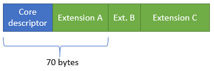

# Datapath descriptors and packet extensions

This topic introduces concepts underlying datapath descriptors and packet extensions in NetAdapterCx 1.2 and later.

## Overview

*Datapath descriptors* are small, runtime-extensible structures that describe a network packet. They can be used by different components in the system and are not limited in scope to specific APIs or header files. Different components are free to allocate and manage collections of descriptors however they see fit, such as in a linked list or in an array. 

> [!NOTE]
> Datapath descriptors can also be referred to as *packet descriptors*. These terms may be used interchangeably throughout this topic.

*Packet extensions* are attached to each datapath queue's core descriptor and are used by client drivers to share information with the upper layers. Packet extensions can hold information such as advanced offload tasks, like checksum, large send offload (LSO), and receive side scaling (RSS) hash. They can also hold application-specific details.

## History

Packet descriptors have changed several times in Windows. NDIS 3 did not have a dedicated data structure, with functions instead taking length and buffer arguments. NDIs 4 and 5 used the **NDIS_PACKET** structure, which was not easy to change in newer versions of Windows and thus could not be extended easily. NDIS 6 introduced the [NET_BUFFER_LIST](https://docs.microsoft.com/windows-hardware/drivers/ddi/content/ndis/ns-ndis-_net_buffer_list)(NBL) structure as its packet descriptor. The NBL was designed with these goals in mind:

1. Extensibility: permitting a component to add a feature at runtime.
2. Versionability: permitting future versions of Windows to add functionality over time.
3. Performance: processing more packets per second, reducing CPU and RAM usage, scaling to more processors with less penalty.
4. Reusability: the ability for multiple components to reuse the same descriptor.

While the NBL did solve the problems it sought to address, it had shortcomings that were exposed over time because of drastically increasing network throughputs:

1. NBL runtime extensibility required expensive per-packet memory allocation and deallocation.
2. NBLs could be lost by drivers due to bugs in complicated DMA management code, which could lead to system instability.
3. NBLs contained many pointers to handle extensibility and versionability, which made them not CPU cache-friendly. This multitude of pointers could also lead to memory stalls when traversing the levels of pointer indirection required to access packet payloads.
4. NBLs did not support random access of extensions for new functionality, leading to occasional slower performance.
5. NBLs had a large memory overhead owing to their decentralized layout.

## New datapath descriptors and NetAdapterCx

NetAdapterCx 1.2 introduces a new datapath descriptor and new system for packet extensions. The datapath descriptor used by NetAdapterCx 1.2 and later is designed for improved scalability and has the following characteristics.

### Extensibility

Extensibility is a core feature of the NetAdapterCx packet descriptor, as it also affects versionability and performance. At runtime, a client driver can allocate a context block on all packet descriptors in a collection (in other words, on a datapath queue). This enables the operating system to allocate all descriptors with pre-allocated extensions inline with the descriptor. Each extension block is appended to a core descriptor, as shown in the following figure:

Drivers are not permitted to hardcode the offset to any extension block – instead, they must query at runtime for the offset to any particular extension. For example, a driver might query the offset to Extension B, and get back 70 bytes like in the following figure:

Once a descriptor is created, all its offsets are guaranteed by the OS to be constant, so drivers don't have to re-query offsets often. 

Extensions are named with a string and a version number, and can be created by a client driver. For example, an IHV might insert an extension for custom Quality of Service (QoS) features and query the offset to that extension in a value-add protocol driver.

Because extensions are pre-allocated in an array at the time the datapath queue is initialized, there is no need for runtime allocation of blocks, searching a list for a specific descriptor, or having to store pointers to every packet extension.

### Versionability

NetAdapterCx's packet descriptor can be easily versioned by adding new fields to the end, such as in the following figure:

Drivers that know about the V2 fields can access them, while V1 drivers will use extension offsets to skip over the V2 fields so they can access the fields they do understand. In addition, each extension can be versioned in the same way, as the following figure shows:

A driver that understands the new extension can use it. Other drivers can skip over the new fields. This permits different parts of the packet descriptor to be versioned independently.

### Performance

NetAdapterCx client drivers can target network interface cards (NICs) that are capabable of hundreds of gigabits per second (Gbps), with thousands of RSS queues. The extensibility model outlined previously provides benefits to help meet these performance goals:

1. Extensions are allocated at queue creation time, so drivers don't have to allocate and deallocate memory in the active data path or deal with lookaside lists of context blocks.
2. Extensions are in-line, which improves CPU cache hits.
3. There is no need for pointers, which saves space.
4. Features that aren't used occupy 0 bytes of space.

## Using datapath descriptors in a NetAdapterCx client driver

Packet extensions in NetAdapterCx are analogous to the OOB array of values in the NDIS 6.*X* NET_BUFFER_LIST structure. That is, they contain information common to all the [NET_PACKET](https://docs.microsoft.com/windows-hardware/drivers/ddi/content/netpacket/ns-netpacket-_net_packet) structures in a datapath queue's ring buffer of packets. Unlike the array of PVOID pointers in a NET_BUFFER_LIST, however, packet extensions are arranged in memory as a flat block attached to the queue's core datapath descriptor. This makes them more CPU cache-friendly and offers several advantages:

1. 