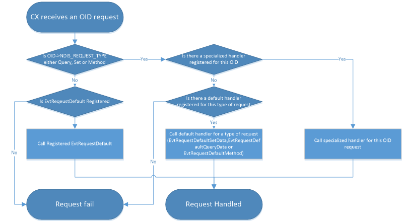

# Handling control requests

[!include[NetAdapterCx Beta Prerelease](../netcx-beta-prerelease.md)]

In the NetAdapterCx model, the client driver receives most control requests as NETREQUEST objects, each of which represents an OID (object identifier) request. The client driver typically sets up one or two WDF queues (called NETREQUESTQUEUEs) to manage control requests.

The NETREQUESTQUEUE object is the parent of each NETREQUEST that it manages. Because the queue is a child of the NETADAPTER object, WDF automatically deletes each queue and any associated requests when the adapter is deleted.

To see all the default parent child relationships for NetAdapterCx, see [Summary of NetAdapterCx objects](summary-of-netadaptercx-objects.md).

## Creating queue objects

In the NetAdapterCx model, the client can use two types of queues for handling control requests (OIDs):
* Sequential queue for normal requests (OIDs). NetAdapterCx delivers requests to the client one at a time.
* Parallel queue for direct requests (OIDs). NetAdapterCx delivers requests in parallel.

For more info on these dispatching methods, see [Dispatching Methods for I/O Requests](../wdf/dispatching-methods-for-i-o-requests.md).

Call these methods to create queues:

* [**NET_REQUEST_QUEUE_CONFIG_INIT_DEFAULT_SEQUENTIAL**](https://docs.microsoft.com/windows-hardware/drivers/ddi/netrequestqueue/nf-netrequestqueue-net_request_queue_config_init_default_sequential)
* [**NET_REQUEST_QUEUE_CONFIG_INIT_DEFAULT_PARALLEL**](https://docs.microsoft.com/windows-hardware/drivers/ddi/netrequestqueue/nf-netrequestqueue-net_request_queue_config_init_default_parallel)

## Registering handlers

For each of the three main request types (query data, set data, and method), the client driver can provide a single default handler, or one or more OID-specific handlers.

You can use both approaches in the same driver, providing custom handlers for some OIDs while using a default handler with a switch statement for the remainder.

A client driver registers OID handlers in its [*EvtDriverDeviceAdd*](https://docs.microsoft.com/windows-hardware/drivers/ddi/wdfdriver/nc-wdfdriver-evt_wdf_driver_device_add) routine.

Here are the control request handlers the client can provide:

* [*EVT_NET_REQUEST_METHOD*](https://docs.microsoft.com/windows-hardware/drivers/ddi/netrequestqueue/nc-netrequestqueue-evt_net_request_method)
* [*EVT_NET_REQUEST_QUERY_DATA*](https://docs.microsoft.com/windows-hardware/drivers/ddi/netrequestqueue/nc-netrequestqueue-evt_net_request_query_data)
* [*EVT_NET_REQUEST_SET_DATA*](https://docs.microsoft.com/windows-hardware/drivers/ddi/netrequestqueue/nc-netrequestqueue-evt_net_request_set_data)
* [*EVT_NET_REQUEST_DEFAULT_METHOD*](https://docs.microsoft.com/windows-hardware/drivers/ddi/netrequestqueue/nc-netrequestqueue-evt_net_request_default_method)
* [*EVT_NET_REQUEST_DEFAULT_QUERY_DATA*](https://docs.microsoft.com/windows-hardware/drivers/ddi/netrequestqueue/nc-netrequestqueue-evt_net_request_default_query_data)
* [*EVT_NET_REQUEST_DEFAULT_SET_DATA*](https://docs.microsoft.com/windows-hardware/drivers/ddi/netrequestqueue/nc-netrequestqueue-evt_net_request_default_set_data)

For each of the three main request types, the OID-specific handlers take precedence over the default handlers. If the client provides neither for a given OID, NetAdapterCx fails the request.

For requests of type other than query data, set data, and method, the client driver can provide an [*EVT_NET_REQUEST_DEFAULT*](https://docs.microsoft.com/windows-hardware/drivers/ddi/netrequestqueue/nc-netrequestqueue-evt_net_request_default) event callback function.

For example, if the protocol driver issues an OID request with `NDIS_REQUEST_TYPE = NdisRequestGeneric1`, NetAdapterCx calls [*EVT_NET_REQUEST_DEFAULT*](https://docs.microsoft.com/windows-hardware/drivers/ddi/netrequestqueue/nc-netrequestqueue-evt_net_request_default). NetAdapterCx fails the request if the client driver has not provided such a handler.

The following diagram shows the typical flow:



The following snippet shows how the client sets up default handlers:

```C++
NTSTATUS status;
NET_REQUEST_QUEUE_CONFIG config;
NETREQUESTQUEUE requestQueue;

NET_REQUEST_QUEUE_CONFIG_INIT_DEFAULT_SEQUENTIAL(&config, NetAdapter);
config.EvtRequestDefaultQueryData = MyDefaultQueryData;
config.EvtRequestDefaultSetData = MyDefaultSetData;
config.EvtRequestDefaultMethod = MyDefaultMethod;

config.EvtRequestDefault = MyDefault;
```

To add an OID-specific handlers, use these methods:

* [**NET_REQUEST_QUEUE_CONFIG_ADD_QUERY_DATA_HANDLER**](https://docs.microsoft.com/windows-hardware/drivers/ddi/netrequestqueue/nf-netrequestqueue-net_request_queue_config_add_query_data_handler)
* [**NET_REQUEST_QUEUE_CONFIG_ADD_SET_DATA_HANDLER**](https://docs.microsoft.com/windows-hardware/drivers/ddi/netrequestqueue/nf-netrequestqueue-net_request_queue_config_add_set_data_handler)
* [**NET_REQUEST_QUEUE_CONFIG_ADD_METHOD_HANDLER**](https://docs.microsoft.com/windows-hardware/drivers/ddi/netrequestqueue/nf-netrequestqueue-net_request_queue_config_add_method_handler)

The following example calls [**NET_REQUEST_QUEUE_CONFIG_ADD_QUERY_DATA_HANDLER**](https://docs.microsoft.com/windows-hardware/drivers/ddi/netrequestqueue/nf-netrequestqueue-net_request_queue_config_add_query_data_handler) with a pointer to the client's [*EVT_NET_REQUEST_QUERY_DATA*](https://docs.microsoft.com/windows-hardware/drivers/ddi/netrequestqueue/nc-netrequestqueue-evt_net_request_query_data) event callback function to register a handler for a specific OID:

```C++
NET_REQUEST_QUEUE_CONFIG_ADD_QUERY_DATA_HANDLER(
 &config, OID_GEN_VENDOR_DESCRIPTION,
 EvtQueryGenVendorDescription, sizeof(NIC_VENDOR_DESC));
```

## Creating the queue

Once you've set up each OID queue the way you like, call [**NetRequestQueueCreate**](https://docs.microsoft.com/windows-hardware/drivers/ddi/netrequestqueue/nf-netrequestqueue-netrequestqueuecreate) to create the queue:

```C++
status = NetRequestQueueCreate(&config, WDF_NO_OBJECT_ATTRIBUTES, NULL);

if(!NT_SUCCESS(status))
{
 return status;
}
```

NetAdapterCx can call the client driver's control request handlers as soon as [*EVT_WDF_DEVICE_PREPARE_HARDWARE*](https://docs.microsoft.com/windows-hardware/drivers/ddi/wdfdevice/nc-wdfdevice-evt_wdf_device_prepare_hardware) returns until the time it calls [*EVT_WDF_DEVICE_RELEASE_HARDWARE*](https://docs.microsoft.com/windows-hardware/drivers/ddi/wdfdevice/nc-wdfdevice-evt_wdf_device_release_hardware).

## Completing Requests

The client driver must complete each NETREQUEST that it receives. Otherwise, the control request is left in a pending state. If the request cannot be handled synchronously, the client driver must complete the pending NETREQUEST at a later time. Failure to complete a pending request can cause the client driver to become unresponsive when the device is powered down.

If the original request did not contain a large enough buffer, call [**NetRequestSetBytesNeeded**](https://docs.microsoft.com/windows-hardware/drivers/ddi/netrequest/nf-netrequest-netrequestsetbytesneeded). To complete a control request and specify only completion status, call [**NetRequestCompleteWithoutInformation**](https://docs.microsoft.com/windows-hardware/drivers/ddi/netrequest/nf-netrequest-netrequestcompletewithoutinformation) from the OID handler, as shown in the following snippet:
 
```C++
 NetRequestCompleteWithoutInformation(Request, STATUS_SUCCESS);
```

If the original request did contain a large enough buffer, the client driver calls [**NetRequestRetrieveInputOutputBuffer**](https://docs.microsoft.com/windows-hardware/drivers/ddi/netrequest/nf-netrequest-netrequestretrieveinputoutputbuffer) to retrieve the input/output buffer. Then the client transfers the data and completes the request using one of the following, depending on the request type:

* [**NetRequestMethodComplete**](https://docs.microsoft.com/windows-hardware/drivers/ddi/netrequest/nf-netrequest-netrequestmethodcomplete)
* [**NetRequestQueryDataComplete**](https://docs.microsoft.com/windows-hardware/drivers/ddi/netrequest/nf-netrequest-netrequestquerydatacomplete)
* [**NetRequestSetDataComplete**](https://docs.microsoft.com/windows-hardware/drivers/ddi/netrequest/nf-netrequest-netrequestsetdatacomplete)
