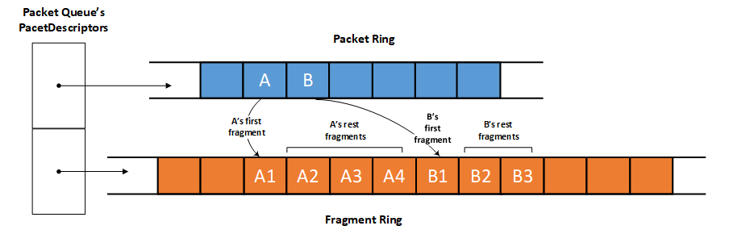

# Introduction to net rings

## NET_RING overview

A **NET_RING** is a circular buffer of network data that is shared between NetAdapterCx and a client driver. Every packet queue in a client driver has two rings: a *packet ring* for core packet descriptors, and a *fragment ring* for each packet's fragment descriptors.

For more information about packet descriptors, see [Packet descriptors and extensions](packet-descriptors-and-extensions.md).

Every core descriptor in the packet ring has indices into the fragment ring for locating that packet's fragment descriptors. Another data structure, the **NET_RING_COLLECTION**, groups the packet ring and fragment ring together for a given packet queue as shown in the following diagram.

 

Every packet queue has its own **NET_RING_COLLECTION** structure, and, consequently, its own packet ring, fragment ring, and descriptors in those rings. Therefore, the network data transfer operation of each packet queue is completely independent. To learn more about packet queues, see [Transmit and receive queues](transmit-and-receive-queues.md).

## NET_RING element ownership

Each element in a **NET_RING** is owned by either the client driver or NetAdapterCx. Ownership is controlled by three indices, which mark sections of the **NET_RING**. These indices are described in the following table. The act of moving these indices is described by *post* and *drain* semantics. 

| **NET_RING** index name | Description | Required for transferring network data | Modified by |
| --- | --- | --- | --- |
| BeginIndex | The beginning of the range of elements in the **NET_RING** that the NIC client driver owns. **BeginIndex** is also the beginning of the *drain* subsection of the **NET_RING**. When **BeginIndex** is incremented, the driver *drains* the elements from the ring and transfers ownership of them to the OS. | Yes | NIC client driver |
| NextIndex | The beginning of the *post* subsection of the **NET_RING**. **NextIndex** divides the section of the ring that the client driver owns into the post and drain subsections. When **NextIndex** is incremented, the driver *posts* the buffers to hardware and transfers the buffers to the drain section of the ring. | No | NIC client driver |
| EndIndex | The end of the range of elements in the **NET_RING** that the NIC client driver owns. Client drivers own elements up to **EndIndex - 1** inclusive. | Yes | NetAdapterCx |

Manipulating these indices during a packet queue's [*EvtPacketQueueAdvance*](/windows-hardware/drivers/ddi/netpacketqueue/nc-netpacketqueue-evt_packet_queue_advance) callback is how client drivers transfer network data between the system and the network interface card (NIC) hardware.

Client drivers own every element from **BeginIndex** to **EndIndex - 1** inclusive. For example, if **BeginIndex** is 2 and **EndIndex** is 5, the client driver owns three elements: the elements with index values 2, 3, and 4.

If **BeginIndex** is equal to **EndIndex**, the client driver does not own any elements.

NetAdapterCx posts elements to the ring buffer by incrementing **EndIndex**. A client driver drains the buffers and returns ownership of the elements by advancing **BeginIndex**.

**NextIndex** is optional for client drivers to use, and is provided for convenience in separating the post and drain subsections of the client driver's section of the ring.

Elements with index values between **NextIndex** and **EndIndex - 1** inclusive are owned by the client but have not yet been posted to hardware. If **NextIndex** is equal to **BeginIndex**, the client driver does not have any completed buffers to transfer to the OS. If **NextIndex** is equal to **EndIndex**, the client driver does not have any buffers to post to hardware.

Because the net ring is circular, eventually the index values wrap around the end of the buffer and come back to the beginning. NetAdapterCx automatically handles wrapping the index values around the ring when the client driver calls the appropriate method.

For specific information about managing the elements in net rings, see [Net ring element management](net-ring-element-management.md).

## Sending and receiving network data with net rings

See the following topics for more information and code samples about sending and receving network data in net rings.

[Sending network data with net rings](sending-network-data-with-net-rings.md)

[Receiving network data with net rings](receiving-network-data-with-net-rings.md)
