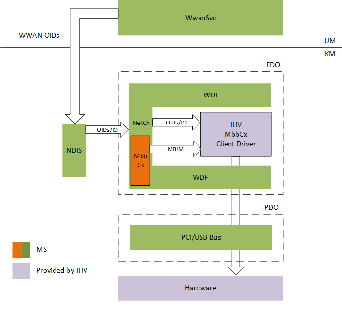

# Introduction to the Mobile Broadband (MBB) WDF class extension (MBBCx)

[!include[MBBCx Beta Prerelease](../mbbcx-beta-prerelease.md)]

Starting in the next release of Windows 10, the Windows Driver Kit (WDK) includes a Mobile Broadband (MBB) WDF class extension that works with NetAdapterCx. MBB-NetAdapter client drivers are first and foremost fully fledged WDF client drivers, then they're NetAdapterCx client drivers just like other NIC drivers, and finally they're client drivers of the MBB class extension (MBBCx) that provides MBB media-specific functionality. The following block diagram illustrates the MBBCx architecture:

An MBB-NetAdapter client driver performs 3 categories of tasks based on its relationships with the framework:

- Call [standard WDF APIs](https://docs.microsoft.com/windows-hardware/drivers/ddi/content/_wdf/) for common device tasks like Pnp and Power management.
- Call [NetAdapterCx APIs](https://docs.microsoft.com/windows-hardware/drivers/ddi/content/_netvista/#netadaptercx) for common network device operations like transmitting or receiving network packets.
- Call [MbbCx APIs](https://docs.microsoft.com/windows-hardware/drivers/ddi/content/_netvista/#mbbcx) for MBB-specific control path operations like MBIM message handling.

Before you begin, you should familiarize yourself with these concepts:

- [Windows Driver Foundation (WDF)](../wdf/using-the-framework-to-develop-a-driver.md)
- [NetAdapter class extension (NetAdapterCx)](index.md)

The topics in this section assume you already know how to write a NetAdapterCx client driver for a basic NIC, so they focus only on MBBCx-specific code.

This section contains the following topics:

- [Writing an MBBCx client driver](writing-an-mbbcx-client-driver.md)
