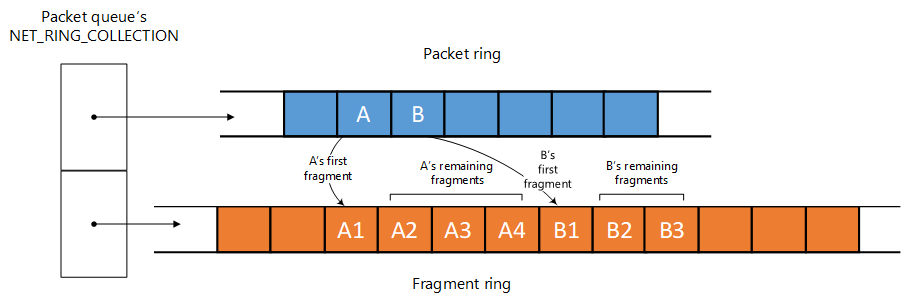

# Net rings and net ring iterators

[!include[NetAdapterCx Beta Prerelease](../netcx-beta-prerelease.md)]

## NET_RING overview

A **NET_RING** is a circular buffer of network data that is shared between NetAdapterCx and a client driver. Every packet queue in a client driver has two rings: a *packet ring* for core packet descriptors, and a *fragment ring* for each packet's fragment descriptors. Client drivers perform operations on their net rings by calling into the *Net Ring Iterator Interface*.

For more information about packet descriptors, see [Packet descriptors and extensions](packet-descriptors-and-extensions.md).

Every core descriptor in the packet ring has indices into the fragment ring for locating that packet's fragment descriptors. Another data structure, the [**NET_RING_COLLECTION**](TBD), groups the packet ring and fragment ring together for a given packet queue.

 

Every packet queue has its own **NET_RING_COLLECTION** structure, and, consequently, its own packet ring, fragment ring, and descriptors in those rings. Therefore, the network data transfer operation of each packet queue is completely independent. To learn more about packet queues, see [Transmit and receive queues](transmit-and-receive-queues.md).

## NET_RING post and drain operations

Each element in a **NET_RING** is owned by either the client driver or NetAdapterCx. The **NET_RING** contains three indices that control ownership and mark sections of the **NET_RING**.

| Index | Description | Modified by |
| --- | --- | --- |
| BeginIndex | The beginning of the range of elements in the **NET_RING** that the NIC client driver owns. **BeginIndex** is also the beginning of the *drain* section of the **NET_RING**. When the driver increments **BeginIndex** by advancing the ring's drain iterator, the driver *drains* the elements from the ring and returns ownership of them to the OS. | NIC client driver |
| NextIndex | The beginning of the *post* section of the **NET_RING**. When the driver increments **NextIndex** by advancing the ring's post iterator, the driver *posts* the buffers to hardware and transfers the buffers to the drain section of the ring. | NIC client driver |
| EndIndex | The end of the range of elements in the **NET_RING** that the NIC client driver owns. Client drivers own elements up to **EndIndex - 1** inclusive. | NetAdapterCx |

Client drivers own every element from **BeginIndex** to **EndIndex - 1** inclusive. For example, if **BeginIndex** is 2 and **EndIndex** is 5, the client driver owns three elements: the elements with index values 2, 3, and 4.

If **BeginIndex** is equal to **EndIndex**, the client driver does not own any elements.

NetAdapterCx adds elements to the ring buffer by incrementing **EndIndex**. A client driver returns ownership of the elements by using the ring's drain iterator to increment **BeginIndex**.

The following animation illustrates the post and drain operations that iterators perform on a **NET_RING**.

In this model, the client has posted packets with index values between **BeginIndex** and **NextIndex - 1** inclusive to hardware. At the beginning of the previous animation, this includes packets A, B, C, and D, as well as their fragments. Note that each packet has one or more fragments. 

Packets with index values between **NextIndex** and **EndIndex - 1** are owned by the client but have not yet been posted to hardware. In the animation, after NetAdapterCx adds packets E, F, and G to the packet ring (along with their fragments), the client driver submits packet E to hardware and advances the rings' post iterators accordingly.

After the hardware transmits or receives data, the client uses the rings' drain iterators to advance **BeginIndex**, transferring ownership of the packets and their fragments back to NetAdapterCx. In the animation, the driver returns packet A and its fragments to the OS.

Because the net ring is circular, eventually the index values wrap around the end of the buffer and come back to the beginning. When a driver advances any net ring iterator, the Net Ring Iterator Interface automatically handles wrap around for incrementing the appropriate index.

## Net rings and net ring iterators

### Post operations

### Drain operations

## PCI Device Drivers

Drivers for devices that use ring buffers at the hardware level (for example, typical PCI NICs) normally manipulate the [**NET_RING_BUFFER**](https://docs.microsoft.com/windows-hardware/drivers/ddi/content/netringbuffer/ns-netringbuffer-_net_ring_buffer) indices directly.

Here is a typical sequence for a PCI device driver:

1. Call [**NetRxQueueGetDatapathDescriptor**](https://docs.microsoft.com/windows-hardware/drivers/ddi/content/netrxqueue/nf-netrxqueue-netrxqueuegetdatapathdescriptor) or [**NetTxQueueGetDatapathDescriptor**](https://docs.microsoft.com/windows-hardware/drivers/ddi/content/nettxqueue/nf-nettxqueue-nettxqueuegetdatapathdescriptor) to retrieve the queue's datapath descriptor. You can store this in the queue's context space to reduce calls out of the driver.
2. Use the datapath descriptor to retrieve the queue's packet ring buffer by calling [NET_DATAPATH_DESCRIPTOR_GET_PACKET_RING_BUFFER](https://docs.microsoft.com/windows-hardware/drivers/ddi/content/netdatapathdescriptor/nf-netdatapathdescriptor-net_datapath_descriptor_get_packet_ring_buffer).
3. Program packets to hardware by looping until the ring buffer's **NextIndex** equals **EndIndex**:
    1. Call [**NetRingBufferGetPacketAtIndex**](https://docs.microsoft.com/windows-hardware/drivers/ddi/content/netadapterpacket/nf-netadapterpacket-netringbuffergetpacketatindex) on **NextIndex**.
    2. Translate the **NET_PACKET** descriptor into the associated hardware packet descriptors.
    3. Call [**NetRingBufferIncrementIndex**](https://docs.microsoft.com/windows-hardware/drivers/ddi/content/netringbuffer/nf-netringbuffer-netringbufferincrementindex).
4. Complete packets by looping until **BeginIndex** equals **NextIndex** or until an incomplete packet is reached:
    1. Call [**NetRingBufferGetPacketAtIndex**](https://docs.microsoft.com/windows-hardware/drivers/ddi/content/netadapterpacket/nf-netadapterpacket-netringbuffergetpacketatindex) on **BeginIndex**.
    2. Detect if the associated hardware descriptors indicate completion. If not, terminate.
    3. Translate the hardware descriptor to the [**NET_PACKET**](https://docs.microsoft.com/windows-hardware/drivers/ddi/content/netpacket/ns-netpacket-_net_packet).
    4. Call [**NetRingBufferIncrementIndex**](https://docs.microsoft.com/windows-hardware/drivers/ddi/content/netringbuffer/nf-netringbuffer-netringbufferincrementindex).

## Device Drivers with Asynchronous I/O

While a client driver that targets a device with an asynchronous I/O model, such as USB, can also modify the [**NET_RING_BUFFER**](https://docs.microsoft.com/windows-hardware/drivers/ddi/content/netringbuffer/ns-netringbuffer-_net_ring_buffer) indices directly, we recommend instead using higher level routines to manage out-of-order-completions:

* [**NetRingBufferAdvanceNextPacket**](https://docs.microsoft.com/windows-hardware/drivers/ddi/content/netadapterpacket/nf-netadapterpacket-netringbufferadvancenextpacket)
* [**NetRingBufferGetNextPacket**](https://docs.microsoft.com/windows-hardware/drivers/ddi/content/netadapterpacket/nf-netadapterpacket-netringbuffergetnextpacket)
* [**NetRingBufferReturnCompletedPackets**](https://docs.microsoft.com/windows-hardware/drivers/ddi/content/netadapterpacket/nf-netadapterpacket-netringbufferreturncompletedpackets)

Here is a typical sequence for a device driver with asynchronous I/O:

1. Call [**NetRxQueueGetDatapathDescriptor**](https://docs.microsoft.com/windows-hardware/drivers/ddi/content/netrxqueue/nf-netrxqueue-netrxqueuegetdatapathdescriptor) or [**NetTxQueueGetDatapathDescriptor**](https://docs.microsoft.com/windows-hardware/drivers/ddi/content/nettxqueue/nf-nettxqueue-nettxqueuegetdatapathdescriptor) to retrieve the queue's datapath descriptor.
2. Use the datapath descriptor to retrieve the queue's packet ring buffer by calling [NET_DATAPATH_DESCRIPTOR_GET_PACKET_RING_BUFFER](https://docs.microsoft.com/windows-hardware/drivers/ddi/content/netdatapathdescriptor/nf-netdatapathdescriptor-net_datapath_descriptor_get_packet_ring_buffer).
3. Iterate on the packets in the ring buffer. Typically, do the following in a loop:
    1. Call [**NetRingBufferGetNextPacket**](https://docs.microsoft.com/windows-hardware/drivers/ddi/content/netadapterpacket/nf-netadapterpacket-netringbuffergetnextpacket).
    2. Program hardware to receive or transmit. This initiates the asynchronous I/O.
    3. Call [**NetRingBufferAdvanceNextPacket**](https://docs.microsoft.com/windows-hardware/drivers/ddi/content/netadapterpacket/nf-netadapterpacket-netringbufferadvancenextpacket).
4. Call [**NetRingBufferReturnCompletedPackets**](https://docs.microsoft.com/windows-hardware/drivers/ddi/content/netadapterpacket/nf-netadapterpacket-netringbufferreturncompletedpackets).

As asynchronous I/O completions come in, the client sets the **Completed** flag of the first associated [**NET_PACKET_FRAGMENT**](https://docs.microsoft.com/windows-hardware/drivers/ddi/content/netpacket/ns-netpacket-_net_packet_fragment) to **TRUE**. This enables [**NetRingBufferReturnCompletedPackets**](https://docs.microsoft.com/windows-hardware/drivers/ddi/content/netadapterpacket/nf-netadapterpacket-netringbufferreturncompletedpackets) to complete packets. To access the first associated **NET_PACKET_FRAGMENT** of a packet, call the [NET_PACKET_GET_FRAGMENT](https://docs.microsoft.com/windows-hardware/drivers/ddi/content/netdatapathdescriptor/nf-netdatapathdescriptor-net_packet_get_fragment) macro with the packet, the queue's datapath descriptor, and the *0* index parameters.