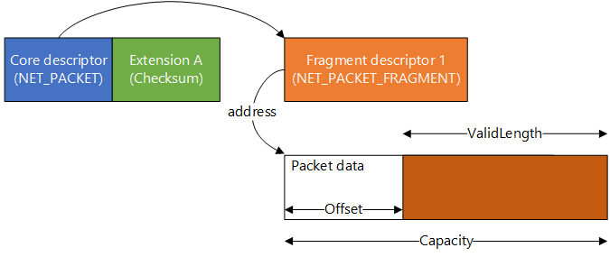
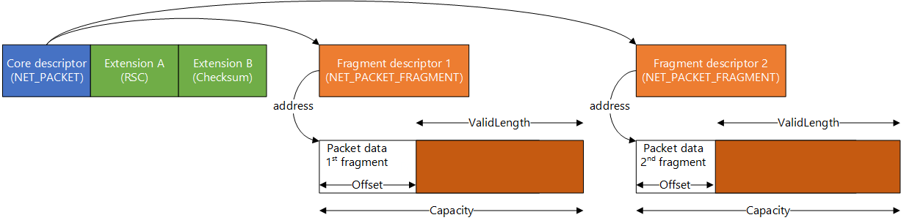
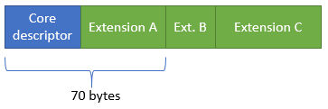

# Packet descriptors and extensions

In NetAdapterCx, *packet descriptors* are small, compact, runtime-extensible structures that describe a network packet. Each packet requires the following:

- One core descriptor 
- One or more fragment descriptors
- Zero or more packet extensions 

The *core descriptor* of the packet is the [**NET_PACKET**](/windows-hardware/drivers/ddi/packet/ns-packet-_net_packet) structure. It contains only the most basic metadata applicable to all packets, such as the framing layout of a given packet and the index to the packet's first fragment descriptor.   

Each packet must also have one or more *fragment descriptors*, or [**NET_FRAGMENT**](/windows-hardware/drivers/ddi/fragment/ns-fragment-_net_fragment) structures, that describe the location within system memory where the packet data resides.

*Extensions* are optional and hold per-packet or per-fragment metadata for scenario-specific features. For instance, packet extensions can hold offload information for checksum, large send offload (LSO), and receive segment coalescence (RSC), or they can hold application-specific details. Fragment extensions can hold virtual address information, logical DMA address information, or other information for the fragment.

Together, these descriptors and extensions hold all the metadata about a network packet. Here are two examples of how they describe a packet. The first figure shows a scenario where the entire packet is stored inside a single memory fragment and checksum offload has been turned on.



The second figure shows a packet stored across two memory fragments, with both RSC and checksum offload enabled.




## Packet descriptor storage and access

Packet descriptors and fragment descriptors are both stored in **NET_RING** structures. A NIC client driver accesses the net rings and performs operations on them by calling into the Net Ring Iterator Interface, which enables the driver to work with NetAdapterCx to post network data to hardware and drain completed data back to the OS. 

For more information on net rings and the Net Ring Iterator Interface, see [Introduction to net rings](introduction-to-net-rings.md).

## Packet descriptor extensibility

Extensibility is a core feature of the NetAdapterCx packet descriptor, forming the foundation for the descriptor's versionability and performance. At runtime, the operating system allocates all packets descriptors for each packet queue in a contiguous block, together with any avaiable extensions. Each extension block is immediately behind the core descriptor, as shown in the following figure:


NIC client drivers are not permitted to hardcode the offset to any extension block. Instead, they must query at runtime for the offset to any particular extension. For example, a driver might query the offset to Extension B and get back 70 bytes like in the following figure:



Once a packet queue and its descriptors are created, all their extension offsets are guaranteed by the system to be constant, so drivers don't have to re-query offsets often. Furthermore, because all extensions are pre-allocated by the system in a block at the time the packet queue is initialized, there is no need for runtime allocation of blocks, searching a list for a specific descriptor, or having to store pointers to every packet extension.

## Packet descriptor versionability

NetAdapterCx's core packet descriptor can be easily extended in future releases by adding new fields to the end, such as in the following figure:


Newer client drivers that know about the V2 fields can access them, while older V1-only drivers will use extension offsets to skip over the V2 fields so they can access the fields they do understand. In addition, each extension can be versioned in the same way, as the following figure shows:


A client driver that understands the new extension can use it. Other client drivers can skip over the new fields. This permits different parts of the packet descriptor to be versioned independently.

## Packet descriptors and datapath performance

The extensibility feature outlined previously provides benefits to help client drivers meet the performance requirements of NICs that are capabable of hundreds of gigabits per second, with thousands of queues:

1. The packet descriptors are kept as compact as possible to improve CPU cache hits, as features and extensions that aren't used occupy 0 bytes of space in the descriptors. 
2. There is no pointer dereferencing, only offset arithmetic because extensions are in-line, which not only saves space but also helps with CPU cache hits. 
3. Extensions are allocated at queue creation time, so drivers don't have to allocate and deallocate memory in the active data path or deal with lookaside lists of context blocks.

## Using packet extensions

> [!IMPORTANT]
> Currently, client drivers are limited to [pre-existing packet extensions defined by the operating system](#predefined-packet-extension-constants-and-helper-methods).

### Registering packet extensions

The first step in working with packet extensions in your NIC client driver is to declare your supported hardware offloads. When you advertise support for offloads such as checksum and LSO, NetAdapterCx automatically registers the associated packet extensions on your behalf.

For a code example of advertising hardware offloads, see [Introduction to  hardware offloads](introduction-to-hardware-offloads.md).

### Querying packet extension offsets for datapath queues

After registering packet extensions by declaring your hardware offload support, you'll need the extension offsets to access each one as you process your packets. To reduce calls out of your driver and improve performance, you can query the offsets for your extensions during the *EvtNetAdapterCreateTx(Rx)Queue* callback function and store the offset information in your queue context.

For an example of querying extension offsets and storing them in the queue context, see [Transmit and receive queues](transmit-and-receive-queues.md).

### Getting packet extensions at runtime

Once you have stored extension offsets in your queue context, you can use them any time you need information in an extension. For example, you could call the [**NetExtensionGetPacketChecksum**](/windows-hardware/drivers/ddi/checksum/nf-checksum-netextensiongetpacketchecksum) method while you program descriptors to hardware for a transmit queue:

```C++
    // Get the extension offset from the device context
    PMY_TX_QUEUE_CONTEXT queueContext = GetMyTxQueueContext(txQueue);
    NET_EXTENSION checksumExtension = queueContext->ChecksumExtension;

    // Get the checksum info for this packet
    NET_PACKET_CHECKSUM* checksumInfo = NetExtensionGetPacketChecksum(checksumExtension, packetIndex);

    // Do work with the checksum info
    if (packet->Layout.Layer3Type == NET_PACKET_LAYER3_TYPE_IPV4_NO_OPTIONS ||
        packet->Layout.Layer3Type == NET_PACKET_LAYER3_TYPE_IPV4_WITH_OPTIONS ||
        packet->Layout.Layer3Type == NET_PACKET_LAYER3_TYPE_IPV4_UNSPECIFIED_OPTIONS)
    {
        if(checksumInfo->Layer4 == NET_PACKET_TX_CHECKSUM_REQUIRED)
        {
            ...
        }
    }
    ...
```

## Predefined packet extension constants and helper methods

NetAdapterCx provides definitions for known packet extension constants.

| Constant | Definition |
| --- | --- |
| NET_PACKET_EXTENSION_INVALID_OFFSET | Guards against invalid offset sizes. |
| NET_PACKET_EXTENSION_CHECKSUM_NAME NET_PACKET_EXTENSION_CHECKSUM_VERSION_1| The name and version of the checksum packet extension. |
| NET_PACKET_EXTENSION_LSO_NAME NET_PACKET_EXTENSION_LSO_VERSION_1 | The name and version of the large send offload (LSO) packet extension. |
| NET_PACKET_EXTENSION_RSC_NAME NET_PACKET_EXTENSION_RSC_VERSION_1 | The name and version of the receive segment coalescence (RSC) packet extension. |

Additionally, NetAdapterCx provides three helper methods that act as wrappers around the [**NetExtensionGetData**](/windows-hardware/drivers/ddi/extension/nf-extension-netextensiongetdata) method. Each of these methods returns a pointer to the appropriate type of structure.

| Method | Structure |
| --- | --- |
| [**NetExtensionGetPacketChecksum**](/windows-hardware/drivers/ddi/checksum/nf-checksum-netextensiongetpacketchecksum) | [**NET_PACKET_CHECKSUM**](/windows-hardware/drivers/ddi/checksumtypes/ns-checksumtypes-_net_packet_checksum) |
| [**NetExtensionGetLso**](/windows-hardware/drivers/ddi/lso/nf-lso-netextensiongetpacketlso) | [**NET_PACKET_LSO**](/windows-hardware/drivers/ddi/lsotypes/ns-lsotypes-_net_packet_lso)
| [**NetExtensionGetPacketRsc**](/windows-hardware/drivers/ddi/rsc/nf-rsc-netextensiongetpacketrsc) | [**NET_PACKET_RSC**](/windows-hardware/drivers/ddi/rsctypes/ns-rsctypes-_net_packet_rsc) |

## Using fragment extensions

> [!IMPORTANT]
> Currently, client drivers are limited to pre-existing fragment extensions defined by the operating system.

### Registering fragment extensions

NetAdapterCx automatically registers most fragment extensions by interpreting a driver's expressed capabilities. For example, if the driver expresses it supports DMA the framework will automatically add the NET_FRAGMENT_LOGICAL_ADDRESS extension that is necessary for DMA programming.

### Querying fragment extension offsets for datapath queues

To access fragment extensions, you can follow the same process for accessing packet extensions outlined in [Querying packet extension offsets for datapath queues](#querying-packet-extension-offsets-for-datapath-queues).

## Predefined fragment extension constants

NetAdapterCx provides definitions for known fragment extension constants.

| Constant | Definition |
| --- | --- |
| NET_FRAGMENT_EXTENSION_DATA_BUFFER_NAME NET_FRAGMENT_EXTENSION_DATA_BUFFER_VERSION_1 | The name and version of the data buffer fragment extension. |
| NET_FRAGMENT_EXTENSION_LOGICAL_ADDRESS_NAME NET_FRAGMENT_EXTENSION_LOGICAL_ADDRESS_VERSION_1 | The name and version of the logical address fragment extension. |
| NET_FRAGMENT_EXTENSION_MDL_NAME NET_FRAGMENT_EXTENSION_MDL_VERSION_1 | The name and version of the MDL fragment extension. |
| NET_FRAGMENT_EXTENSION_RETURN_CONTEXT_NAME NET_FRAGMENT_EXTENSION_RETURN_CONTEXT_VERSION_1 | The name and version of the return context fragment extension. |
| NET_FRAGMENT_EXTENSION_VIRTUAL_ADDRESS_NAME NET_FRAGMENT_EXTENSION_VIRTUAL_ADDRESS_VERSION_1 | The name and version of the virtual address fragment extension. |
