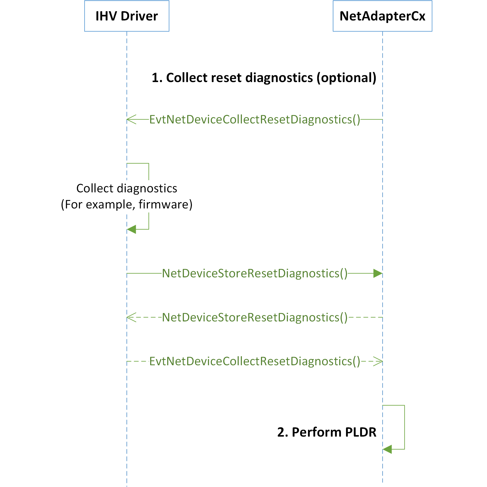

# Recovering an unresponsive NIC with NetAdapterCx PLDR

NetAdapterCx provides an effective way to reset and recover malfunctioning network devices through platform-level device reset (PLDR). Without rebooting the entire Windows system, the PLDR operation tears down the stack of affected network devices ensuring their hardware and drivers restart from a blank state. NetAdapterCx also enables client drivers to collect diagnostics from failed devices before they are platform-level reset.

PLDR is triggered when abnormal device behavior is detected. It can be triggered by either:

* The operating system (OS). For example, the OS side may trigger PLDR when an in-transit packet is stuck in the driver for too long.

* Independent hardware vendor (IHV) client drivers. For example, client drivers may request NetAdapterCx to trigger PLDR when a driver detects that their device is unresponsive to its control command.

To provide user-friendly device failure and recovery, we recommend that IHVs and original equipment manufacturers (OEMs) support PLDR for their network devices. For more information on PLDR, see [Resetting and recovering a device](../kernel/resetting-and-recovering-a-device.md).
NetAdapterCx does not recover network devices through function-level device reset.

## Register the optional diagnostics collection callback

As part of the NetAdapterCx reset and recovery process the client driver can collect device-specific diagnostics from the failed device before the device is platform-level reset. IHVs and Microsoft can use this data in post-failure analysis to improve the quality of their products.

### Register NET_DEVICE_RESET_CAPABILITIES

Client drivers need to initialize and register the [**NET_DEVICE_RESET_CAPABILITIES**](/windows-hardware/drivers/ddi/netdevice/ns-netdevice-net_device_reset_capabilities) structure in their [*EVT_WDF_DRIVER_DEVICE_ADD*](/windows-hardware/drivers/ddi/wdfdriver/nc-wdfdriver-evt_wdf_driver_device_add) callback function in order to collect device-specific diagnostics.

[**NET_DEVICE_RESET_CAPABILITIES**](/windows-hardware/drivers/ddi/netdevice/ns-netdevice-net_device_reset_capabilities) contains:

* A unique GUID. The IHV specifies this GUID and uses it later to identify and retrieve the reset diagnostics from a memory dump. For example, the [.enumtag](../debugger/-enumtag--enumerate-secondary-callback-data-.md) command can be used to retrieve the diagnostics.

* An [*EVT_NET_DEVICE_COLLECT_RESET_DIAGNOSTICS*](/windows-hardware/drivers/ddi/netdevice/nc-netdevice-evt_net_device_collect_reset_diagnostics) event callback function. NetAdapterCx invokes this callback to collect diagnostics. If the client driver provides an *EVT_NET_DEVICE_COLLECT_RESET_DIAGNOSTICS* callback, NetAdapterCx invokes it on the client driver using a *dedicated* thread.

The following example shows how to register **NET_DEVICE_RESET_CAPABILITIES** to NetAdapterCx:

```cpp
EVT_WDF_DRIVER_DEVICE_ADD EvtWdfDriverDeviceAdd;
EVT_NET_DEVICE_COLLECT_RESET_DIAGNOSTICS EvtDeviceCollectResetDiagnostics;

NTSTATUS EvtWdfDriverDeviceAdd(
    WDFDRIVER Driver,
    PWDFDEVICE_INIT DeviceInit
)
{
    ...

    NET_DEVICE_RESET_CAPABILITIES resetCapabilities;
    NET_DEVICE_RESET_CAPABILITIES_INIT(
        &resetCapabilities,
        DUMMY_GUID,
        EvtDeviceCollectResetDiagnostics);
    NetDeviceInitSetResetCapabilities(DeviceInit, &resetCapabilities);

    ...
}
```

For information about how to initialize the **NET_DEVICE_RESET_CAPABILITIES** structure, see [**NET_DEVICE_RESET_CAPABILITIES_INIT**](/windows-hardware/drivers/ddi/netdevice/nf-netdevice-net_device_reset_capabilities_init).

To learn how to advertise the **NET_DEVICE_RESET_CAPABILITIES** structure to NetAdapterCx, see [**NetDeviceInitSetResetCapabilities**](/windows-hardware/drivers/ddi/netdevice/nf-netdevice-netdeviceinitsetresetcapabilities).

### Implement *EVT_NET_DEVICE_COLLECT_RESET_DIAGNOSTICS*

The reset and recovery sequence can happen at any time. Therefore, the client driver's [*EVT_NET_DEVICE_COLLECT_RESET_DIAGNOSTICS*](/windows-hardware/drivers/ddi/netdevice/nc-netdevice-evt_net_device_collect_reset_diagnostics) callback implementation must consider the following:

* NetAdapterCx synchronizes the *EVT_NET_DEVICE_COLLECT_RESET_DIAGNOSTICS* callback with other callbacks that might occur during the [power-down sequence](power-down-sequence-for-a-netadaptercx-client-driver.md). The client driver can assume that NetAdapterCx won't invoke callbacks like packet queue cancel/stop, hardware release, and device object deletion until *EVT_NET_DEVICE_COLLECT_RESET_DIAGNOSTICS* returns.

* The client driver must use extra caution when handling diagnostics collection to avoid deadlock. It must take into account that the hardware may already be in a failed state.

* It's critical for *EVT_NET_DEVICE_COLLECT_RESET_DIAGNOSTICS* to complete as soon as possible so the rest of the PLDR process can proceed. *EVT_NET_DEVICE_COLLECT_RESET_DIAGNOSTICS* must be reliable and must return within 3 seconds.

* NetAdapterCx always invokes *EVT_NET_DEVICE_COLLECT_RESET_DIAGNOSTICS* at PASSIVE_LEVEL.

To submit diagnostics to NetAdapterCx, the client driver performs the following steps:

1. Preallocate a flat buffer from either paged or non-paged pool to collect the reset diagnostics. The driver should preallocate this buffer to avoid an out-of-memory error during device reset.

2. Within the *EVT_NET_DEVICE_COLLECT_RESET_DIAGNOSTICS* callback, submit the diagnostics as a flat data buffer by calling the [**NetDeviceStoreResetDiagnostics**](/windows-hardware/drivers/ddi/netdevice/nf-netdevice-netdevicestoreresetdiagnostics) API. The client driver must call the **NetDeviceStoreResetDiagnostics** API at PASSIVE_LEVEL.

3. Free the data buffer once **NetDeviceStoreResetDiagnostics** returns.

> [!IMPORTANT]
> The [**NetDeviceStoreResetDiagnostics**](/windows-hardware/drivers/ddi/netdevice/nf-netdevice-netdevicestoreresetdiagnostics) API must only be called in the [*EVT_NET_DEVICE_COLLECT_RESET_DIAGNOSTICS*](/windows-hardware/drivers/ddi/netdevice/nc-netdevice-evt_net_device_collect_reset_diagnostics) callback.
> It also can't be used to re-submit diagnostics data after previous **NetDeviceStoreResetDiagnostics** returns.
> Violating either of these cases will result in a bugcheck.

> [!IMPORTANT]
> The size limitation for reset diagnostics is 1 MB.

## How a client driver requests PLDR

A client driver triggers PLDR using the NetAdapterCx [**NetDeviceRequestReset**](/windows-hardware/drivers/ddi/netdevice/nf-netdevice-netdevicerequestreset) API when it detects device failure. **NetDeviceRequestReset** returns immediately to the client driver.
The reset and recovery sequence described in [NetAdapterCx reset and recover sequence](#netadaptercx-reset-and-recover-sequence) is triggered and is asynchronous to the **NetDeviceRequestReset** call.

Only one PLDR operation can happen at any given time. Therefore, subsequent calls of **NetDeviceRequestReset** have no effect when a PLDR operation has already started.

Calling **NetDeviceRequestReset** also has no effect if the [power-down sequence](power-down-sequence-for-a-netadaptercx-client-driver.md) has already been initiated.

## NetAdapterCx reset and recover sequence

When the OS or the client driver triggers PLDR, the following sequence occurs:

1. Collect reset diagnostics: NetAdapterCx invokes the client driver's [*EVT_NET_DEVICE_COLLECT_RESET_DIAGNOSTICS*](/windows-hardware/drivers/ddi/netdevice/nc-netdevice-evt_net_device_collect_reset_diagnostics) callback to collect diagnostics from the failed device. For example, the driver may collect a snapshot of the device firmware. This step is optional and only occurs if the client driver has registered the [**NET_DEVICE_RESET_CAPABILITIES**](/windows-hardware/drivers/ddi/netdevice/ns-netdevice-net_device_reset_capabilities) structure. Otherwise, NetAdapterCx will skip this step.

2. Perform PLDR: NetAdapterCx performs the platform-level device reset operation. NetAdapterCx power recycles the hardware and tears down the software device stack.

The following diagram illustrates the NetAdapterCx reset and recover sequence:


