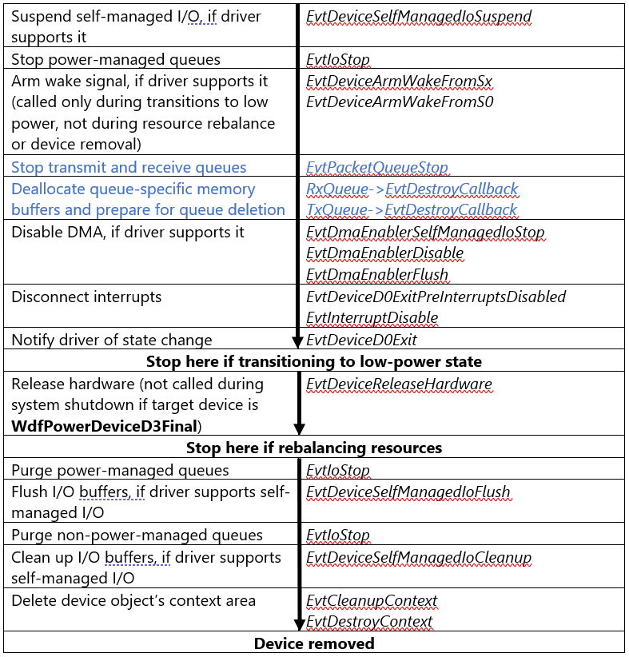

# Power-down sequence for a NetAdapterCx client driver

The following figure shows the order in which NetAdapterCx calls a client driver's event callback functions when powering down and removing the device. The sequence starts at the top of the figure with an operational device that is in the working power state (D0):

The broad horizontal lines mark the steps that are involved in powering down a device. The column on the left side of the figure describes the step, and the column on the right lists the event callbacks that accomplish it. Steps marked with blue text are specific to NetAdapterCx, while other steps are common to all WDF-based drivers.

As the figure shows, the power-down and removal sequence involves calling the corresponding "undo" callbacks in the reverse order in which the framework called the functions that are involved in making the device operational. The framework deletes the device object after it deletes the device object context area.
