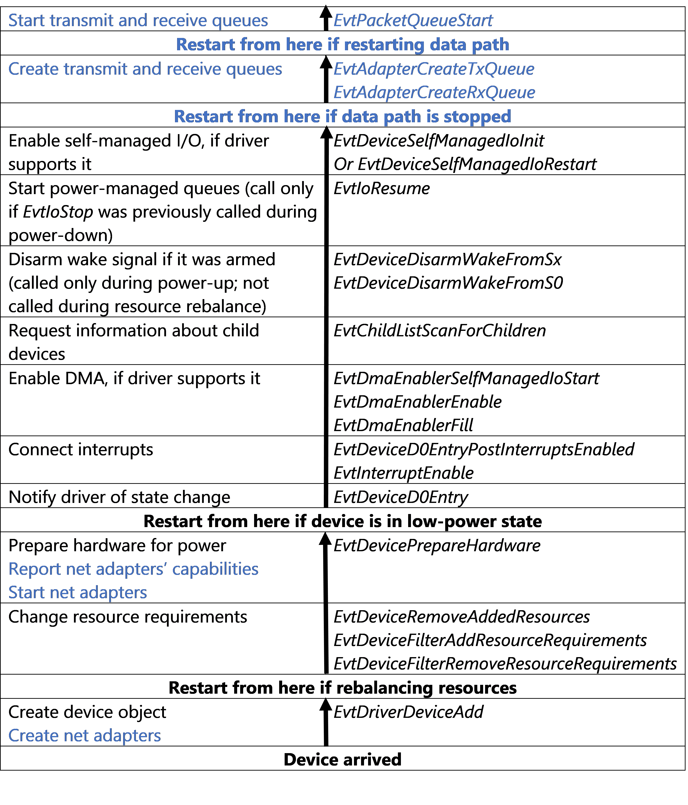

# Power-up sequence for a NetAdapterCx client driver

The following figure shows the order in which NetAdapterCx calls a client driver's event callback functions when bringing a device to the fully operational state, starting from the Device Arrived state at the bottom of the figure:

The broad horizontal lines mark the steps that are involved in starting a device. The column on the left side of the figure describes the step, and the column on the right lists the event callbacks that accomplish it. Steps marked with blue text are specific to NetAdapterCx, while other steps are common to all WDF-based drivers.

At the bottom of the figure, the device is not present on the system. When the user inserts the device, the framework begins by calling the driver’s [*EvtDriverDeviceAdd*](/windows-hardware/drivers/ddi/wdfdriver/nc-wdfdriver-evt_wdf_driver_device_add) callback so that the driver can create a device object to represent the device. The framework continues calling the driver's callback routines by progressing up through the sequence until the device is operational. Remember that the framework invokes the event callbacks in bottom-up order as shown in the figure, so [*EvtDeviceFilterRemoveResourceRequirements*](/windows-hardware/drivers/ddi/wdffdo/nc-wdffdo-evt_wdf_device_filter_resource_requirements) is called before [*EvtDeviceFilterAddResourceRequirements*](/windows-hardware/drivers/ddi/wdffdo/nc-wdffdo-evt_wdf_device_filter_resource_requirements) and so on. If the device was stopped to rebalance resources or was physically present but in a low-power state, not all of the steps are required, as the figure shows.
