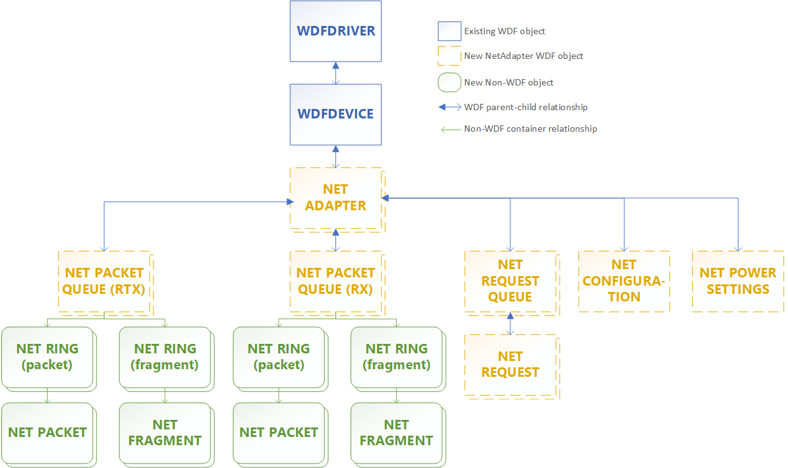

# Summary of NetAdapterCx objects

The following figure shows the default parent-child relationships for NetAdapterCx objects. Parent objects are at the top of the figure, so for example the NETADAPTER object is, by default, a child of the WDFDEVICE object. Objects that can have multiple instances are denoted by a double box.

A WDFDEVICE object is a standard [framework object](../wdf/introduction-to-framework-objects.md) that represents a device. A NETADAPTER object represents a network interface, which is the endpoint for all networking I/O. You can have multiple NETADAPTER objects per WDFDEVICE, with the WDFDEVICE being the parent object of each NETADAPTER.

Most network interface card (NIC) drivers only have one NETADAPTER for their physical device, but some client drivers might have more than one NETADAPTER if they manage a server NIC with multiple slots. As an example, [Mobile Broadband WDF Class Extension (MBBCx)](mobile-broadband-mbb-wdf-class-extension-mbbcx.md) client drivers might manage more than one NETADAPTER object, each representing an additional Packet Data Protocol (PDP) context. 

NETADAPTER objects must be initialized and created from within the client driver's [*EVT_WDF_DRIVER_DEVICE_ADD*](/windows-hardware/drivers/ddi/wdfdriver/nc-wdfdriver-evt_wdf_driver_device_add) callback function by calling [**NetAdapterInitAllocate**](/windows-hardware/drivers/ddi/netadapter/nf-netadapter-netadapterinitallocate) and [**NetAdapterCreate**](/windows-hardware/drivers/ddi/netadapter/nf-netadapter-netadaptercreate). Then, it must be started from within the driver's [*EVT_WDF_DEVICE_PREPARE_HARDWARE*](/windows-hardware/drivers/ddi/wdfdevice/nc-wdfdevice-evt_wdf_device_prepare_hardware) callback function by calling [**NetAdapterStart**](/windows-hardware/drivers/ddi/netadapter/nf-netadapter-netadapterstart). Before calling **NetAdapterStart**, the driver can optionally set the adapter's capabilities such as link layer capabilities, power capabilities, datapath capabilities, receive scaling capabilities, and hardware offload capabilities.

For more information about the relationship between the [**NET_PACKET**](/windows-hardware/drivers/ddi/netpacket/ns-netpacket-_net_packet), and [**NET_FRAGMENT**](/windows-hardware/drivers/ddi/netpacket/ns-netpacket-_net_packet_fragment) objects, see [Packet descriptors and extensions](packet-descriptors-and-extensions.md). For more information about **NET_RING** objects, see [Introduction to net rings](introduction-to-net-rings.md).
