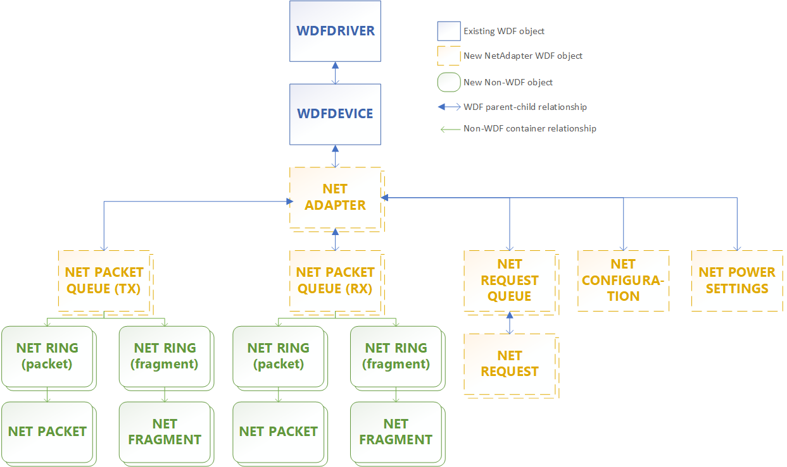

# Summary of NetAdapterCx objects

[!include[NetAdapterCx Beta Prerelease](../netcx-beta-prerelease.md)]

The following figure shows the default parent-child relationships for NetAdapterCx objects. Parent objects are at the top of the figure, so for example the NETADAPTER object is by default a child of the WDFDEVICE object.

## WDFDEVICE and NETADAPTER object relationship

A WDFDEVICE object is a standard framework object that represents a device. A NETADAPTER object represents a network interface, which is the endpoint for all networking I/O. You can have multiple NETADAPTER objects per WDFDEVICE, with the WDFDEVICE being the parent object of each NETADAPTER. 

The primary NETADAPTER is called the *default adapter*. Most network interface card (NIC) drivers only have one NETADAPTER for their physical device, but some client drivers might manage more than one if they manage a server NIC with multiple slots. As another example, [Mobile Broadband WDF Class Extension (MBBCx)](mobile-broadband-mbb-wdf-class-extension-mbbcx.md) client drivers might manage more than one NETADAPTER object, each representing an additional Packet Data Protocol (PDP) context bearer. 

The default adapter must be initialized and created from within the client driver's [*EVT_WDF_DRIVER_DEVICE_ADD*](https://docs.microsoft.com/windows-hardware/drivers/ddi/content/wdfdriver/nc-wdfdriver-evt_wdf_driver_device_add
) callback function by calling [**NetDefaultAdapterInitAllocate**](https://docs.microsoft.com/windows-hardware/drivers/ddi/content/netadapter/nf-netadapter-netdefaultadapterinitallocate) and [**NetAdapterCreate**](https://docs.microsoft.com/windows-hardware/drivers/ddi/content/netadapter/nf-netadapter-netadaptercreate). Then, it must be started from within the driver's [*EVT_WDF_DEVICE_PREPARE_HARDWARE*](https://docs.microsoft.com/windows-hardware/drivers/ddi/content/wdfdevice/nc-wdfdevice-evt_wdf_device_prepare_hardware) callback function by calling [**NetAdapterStart**](https://docs.microsoft.com/windows-hardware/drivers/ddi/content/netadapter/nf-netadapter-netadapterstart). Before calling **NetAdapterStart**, the driver can set the adapter's capabilities such as link layer capabilities, power capabilities, datapath capabilities, receive scaling capabilities, and hardware offload capabilities.

> [!TIP]
> Currently, the default adapter is the only one visible to to user mode applications.

You can add more NETADAPTER objects as needed during *EvtDeviceAdd* as well. Each subsequent NETADAPTER in addition to the default one is initialized with [**NetAdapterInitAllocate**](https://docs.microsoft.com/windows-hardware/drivers/ddi/content/netadapter/nf-netadapter-netadapterinitallocate) instead of **NetDefaultAdapterInitAllocate**. Otherwise, the procedure to create them is the same, and they are started the same way later in *EvtDevicePrepareHardware*.

