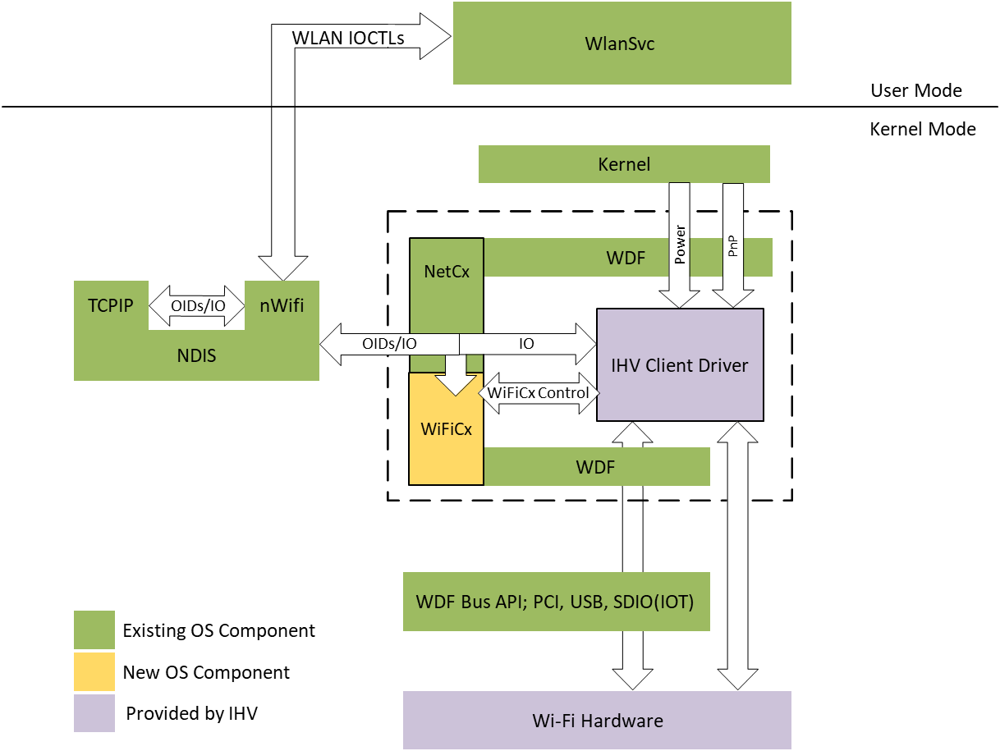

# Introduction to the Wi-Fi WDF class extension (WiFiCx)

This section covers the Wi-Fi WDF class extension (WifiCx) that works with NetAdapterCx. This enables Wi-Fi network drivers to be fully fledged WDF client drivers. In addition, they are also NetAdapterCx client drivers just like other NIC drivers and also client drivers of Wifi class extension that provides Wi-Fi media-specific functionality. 

## WifiCx architecture

The following block diagram illustrates the WifiCx architecture:

A Wifi-NetAdapter client driver performs 3 categories of tasks based on its relationships with the framework:

- Call [standard WDF APIs](https://docs.microsoft.com/windows-hardware/drivers/ddi/_wdf/) for common device tasks like Pnp and Power management.
- Call [NetAdapterCx APIs](https://docs.microsoft.com/windows-hardware/drivers/ddi/_netvista/#netadaptercx) for common network device operations like transmitting or receiving network packets.
- Call [WiFiCx APIs] for for Wi-Fi-specific control path operations like WDI command handling.

The topics in this section assume you already know how to write a NetAdapterCx client driver for a basic NIC, so they focus only on WiFiCx-specific code.

This section contains the following topics:

