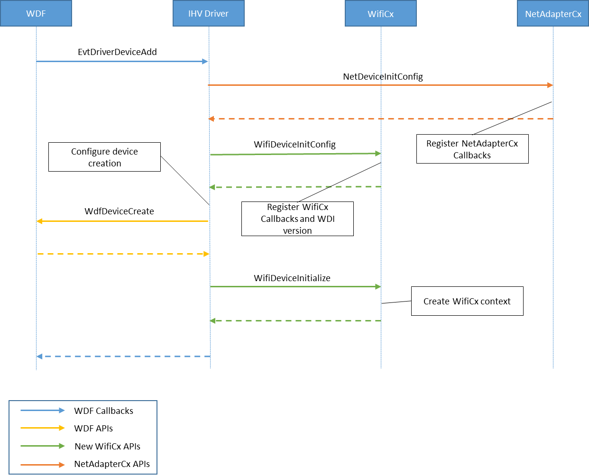
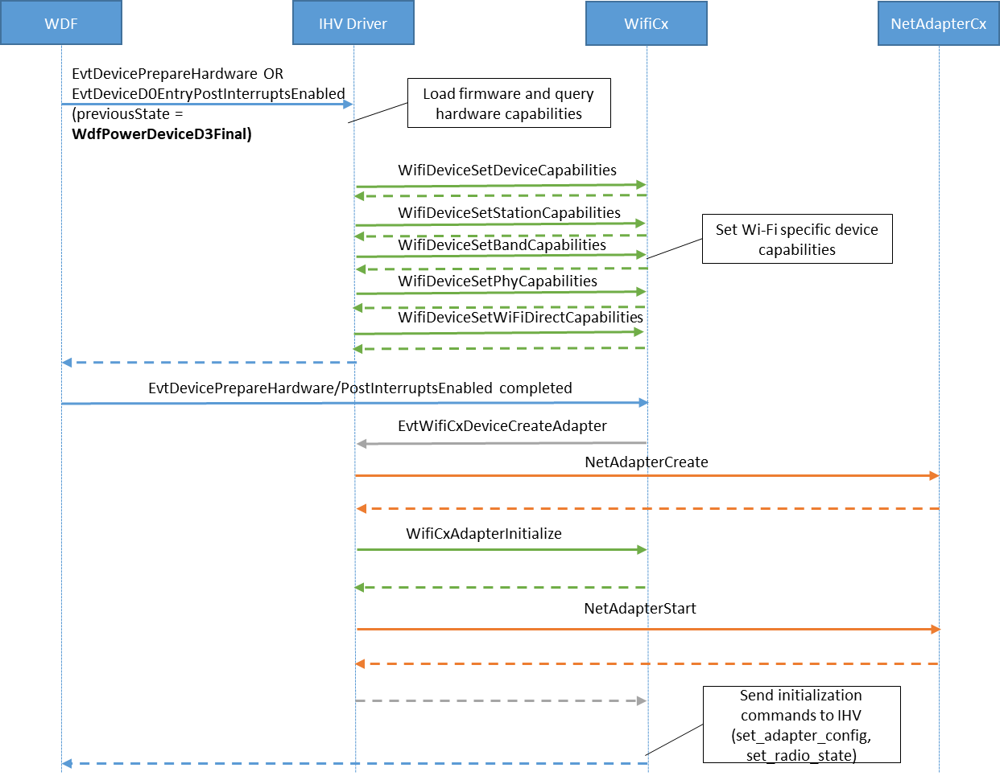

# Wi-Fi WDF class extension (WiFiCx)

## Introduction

This drop includes a Wi-Fi WDF class extension (WifiCx) that works with NetAdapterCx. This enables Wi-Fi network drivers to be fully fledged WDF client drivers. In addition, they are also NetAdapterCx client drivers just like other NIC drivers and also client drivers of Wifi class extension that provides Wi-Fi media-specific functionality. The following block diagram illustrates the WifiCx architecture:


An Wifi-NetAdapter client driver performs 3 categories of tasks based on its relationships with the framework:

- Call [standard WDF APIs](https://docs.microsoft.com/windows-hardware/drivers/ddi/_wdf/) for common device tasks like Pnp and Power management.
- Call [NetAdapterCx APIs](https://docs.microsoft.com/windows-hardware/drivers/ddi/_netvista/#netadaptercx) for common network device operations like transmitting or receiving network packets.
- Call [WiFiCx APIs] for for Wi-Fi-specific control path operations like WDI command handling.

## Device Initialization

In addition to those tasks required by NetAdapterCx for [NetAdapter device initialization](device-and-adapter-initialization.md), a WifiCx client driver must also perform the following tasks in its [EvtDriverDeviceAdd](https://docs.microsoft.com/windows-hardware/drivers/ddi/wdfdevice/nf-wdfdevice-wdfdevicecreate) callback function:
1.	Call  WifiDeviceInitConfig after calling NetDeviceInitConfig but before calling [WdfDeviceCreate](https://docs.microsoft.com/windows-hardware/drivers/ddi/wdfdevice/nf-wdfdevice-wdfdevicecreate), referencing the same [WDFDEVICE_INIT](https://docs.microsoft.com/en-us/windows-hardware/drivers/wdf/wdfdevice_init) object passed in by the framework.

2.	Call WifiDeviceInitialize to register WifCx device-specific callback functions using an initialized WIFI_DEVICE_CONFIG structure and the WDFDEVICE object obtained from WdfDeviceCreate.
The following example demonstrates how to initialize the WifiCx device. Error handling has been left out for clarity.

```C++
status = NetDeviceInitConfig(deviceInit);
status = WifiDeviceInitConfig(deviceInit);

// Set up other callbacks such as Pnp and Power policy

status = WdfDeviceCreate(&deviceInit, &deviceAttributes, &wdfDevice);
WIFI_DEVICE_CONFIG wifiDeviceConfig;
WIFI_DEVICE_CONFIG_INIT(&wifiDeviceConfig,
                        WDI_VERSION_LATEST,
                        EvtWifiDeviceSendCommand,
                        EvtWifiDeviceCreateAdapter);

status = WifiDeviceInitialize(wdfDevice, &wifiDeviceConfig);
```

This message flow diagram illustrates the initialization process.



### **Default (station) adapter creation flow**

Next, the client driver must set all the WiFi specific device capabilities, typically in the [EvtDevicePrepareHardware](https://docs.microsoft.com/windows-hardware/drivers/ddi/wdfdevice/nc-wdfdevice-evt_wdf_device_prepare_hardware) callback function that follows. Note that WifiCx/WDI will no longer be querying for these capabilities via WDI_GET_ADAPTER_CAPABILITIES command. Also, unlike other types of NetAdapterCx drivers, WiFi client drivers must not create the NETADAPTER for object from within the EvtDriverDeviceAdd callback function. Instead, it will be instructed by WifiCx to create the default NetAdapter (station) do so later using the EvtWifiCxDeviceCreateAdapter callback (after the client’s PrepareHardware WDF callback is successful). Note that WifiCx/WDI will no longer call WDI_TASK_CREATE_PORT command.

In this call, the client driver needs to call into NetAdapterCx to create the new NetAdapter object and then call into WifiCx (using WifiCxAdapterInitialize API) to initialize the WiFiCx context and associate it with this NetAdapter object.

If this succeeds, WifiCx will then go on to send initialization commands for the device/adapter (TASK_OPEN, SET_ADAPTER_CONFIGURATION, TASK_SET_RADIO_STATE if necessary etc).



## WDI Command flow via WifiCx APIs

WifiCx uses WDI commands for most control path operations as defined in the WDI spec. The commands are exchanged through a set of callback functions provided by the client driver and APIs provided by WifiCx. The following function calls are used by WifiCx to replicate WDI command handling:
- WifiCx sends a WDI command message to the client driver by invoking its EvtWifiDeviceSendCommand callback function. The client driver sends the M3 for the command asynchronously by calling WifiRequestComplete. The client driver calls API WifiRequestGetInOutBuffer to retrieve the input/output buffer and buffer lengths and WifiRequestGetMessageId to retrieve the WDI message ID of the command.
If this was a set command and the original request did not conatin a large enough buffer, the client should call WifiRequestSetBytesNeeded to set the needed buffer size and then fail the request with status BUFFER_OVERFLOW.

- If this is a task command, the client driver needs to later send the associated M4 indication by calling WifiDeviceReceiveIndication and pass the indication buffer with a WDI header that contains the same transaction ID as in the M1.

- Unsolicited indications are also notified via the WifiDeviceReceiveIndication API but with transaction ID set to 0.


## Appendix

1911 (Drop 1):

**What’s new**:
-	WifiCx Client APIs to initialize device, set capabilities, create default adapter and process WDI commands implemented.
-	Basic STA functionality including scan, connect, radio toggle etc supported.

**Limitations**:
-	Data path support (for STA) is limited and implemented using existing NetAdapterCx APIs. Packet extension for encryption exclusion policy etc is not implemented yet, therefore connection to only open networks has been tested.
-	Direct OID commands not yet forwarded by NetAdapter to WifiCx (will be available in next drop).
-	API for IHV to query OS WDI version not implemented yet (please use WDI_VERSION_LATEST for now).
-	Wi-Fi requests are targeted towards device (in the future, this may be sent on the adapter object).
-	Reset recovery (PLDR) and aborting of commands not yet implemented.
-	Wi-Fi Direct/power related commands not yet implemented.
-	No support for FIPS.
