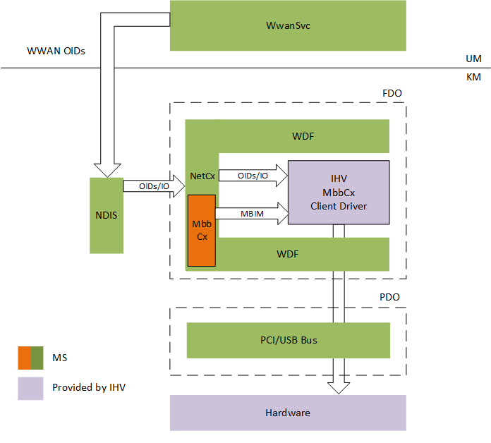
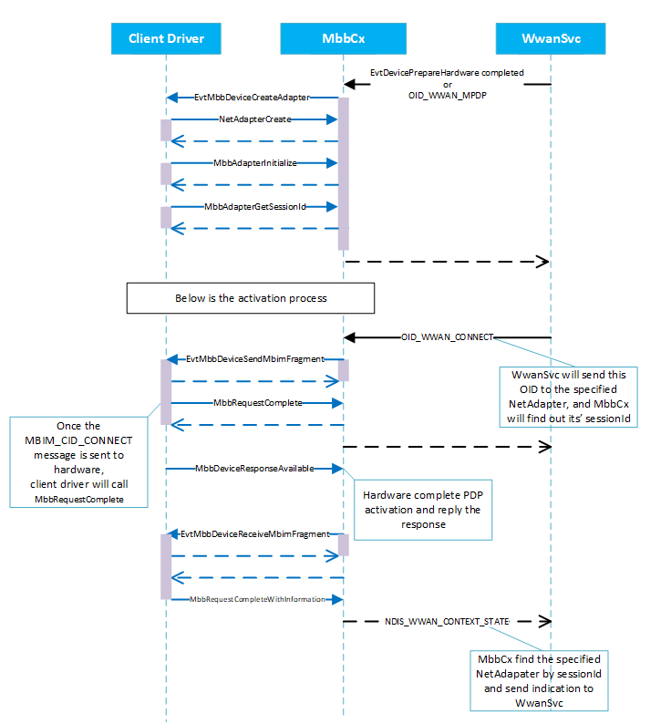

# Write a MBB-NetAdapter client driver
Any MBB-NetAdapter client driver is first and foremost a full-fledged WDF client driver, and then it's also a NetAdapterCx client driver just like other NIC drivers, and finally it's a client driver to the MBB class extension, which provides MBB media specific functionalities. 



Therefore, a MBB-NetAdapter driver performs 3 categories of tasks
- call [standard WDF APIs](https://docs.microsoft.com/en-us/windows-hardware/drivers/ddi/content/_wdf/) for common device tasks, like Pnp and Power management
- call [NetAdapterCx APIs](netadaptercx-api-reference.md) for common network device operations, like transmitting/receiving network packets.
- call [MbbCx APIs]() for MBB specific control path operation, such as MBIM message handling

Before you begin
- Familiarize yourself with [Windows Driver Foundation (WDF)](https://docs.microsoft.com/en-us/windows-hardware/drivers/wdf/using-the-framework-to-develop-a-driver)
- Familiarize yourself with [NetAdapter class extension](index.md)

This topic assume you have already known how to write a NetAdapterCx client driver for a basic NIC, and it focues on the codes needed specifically for MBBCx.  

## Initialize the device
In addition to [these tasks required by NetAdapterCx for device initialization](device-initialization.md), the MBB client driver must perform the following tasks in its [*EvtDriverDeviceAdd*](https://msdn.microsoft.com/library/windows/hardware/ff541693) callback function:

1. Call [**MbbDeviceInitConfig**]() after calling [**NetAdapterDeviceInitConfig**]() with the same reference to [*WDFDEVICE\_INIT*](https://msdn.microsoft.com/library/windows/hardware/ff546951) passed by the framework. It must be called before calling [*WdfDeviceCreate*](https://msdn.microsoft.com/library/windows/hardware/ff545926), 

2. Call [**MbbDeviceInitialize**] to register the MBB device specific callback functions using the [MBB_DEVICE_CONFIG]() structure and the WDFDEVICE object created from *WdfDeviceCreate*.
```cpp
    status = NetAdapterDeviceInitConfig(deviceInit);
    status = MbbDeviceInitConfig(deviceInit);

    // setup other callbacks such as Pnp and Power policy

    status = WdfDeviceCreate(&deviceInit, &deviceAttributes, &wdfDevice);

    MBB_DEVICE_CONFIG mbbDeviceConfig;
    MBB_DEVICE_CONFIG_INIT(&mbbDeviceConfig,
                           EvtMbbDeviceSendMbimFragment,
                           EvtMbbDeviceReceiveMbimFragment,
                           EvtMbbDeviceSendServiceSessionData,
                           EvtMbbDeviceCreateAdapter);

    status = MbbDeviceInitialize(wdfDevice, &mbbDeviceConfig);
```
Unlike other types of NetAdapterCx drivers, the MBB client driver must not create the NETADAPTER object within the *EvtDriverDeviceAdd* callback function. Instead, it will be instructed by MbbCx to do so later.

In the *EvtDevicePrepareHardware* callback function followed, the client driver must call [**MbbDeviceSetMbimParameters**]().

## Handling MBIM control message
The MbbCx uses the standard MBIM control commands (as defined in MBIM specification Rev 1.0, sections 8, 9, 10) for the control plane. The commands and responses are exchanged through a set of callback functions provided by the client driver and APIs provided by MbbCx. The MbbCx mimics the operational model of MBIM device (as defined in MBIM specification Rev 1.0, sections 5.3) by using these function calls

- The MbbCx sends a MBIM control message to the client driver by calling its [**EvtMbbDeviceSendMbimFragment**]() callback function. The client driver asynchronously completes this send request by calling [**MbbRequestComplete**]()
- The client driver signals availability of the result by calling [**MbbDeviceResponseAvailable**]()
- The MbbCx, then, fetches the response from the client driver by calling its [**EvtMbbDeviceReceiveMbimFragment**]() callback function. The client driver asynchronously completes this get-response request by calling *MbbRequestCompleteWithInformation* 
- The Mbb client driver may notify the MbbCx of an unsolicited device events by calling *MbbDeviceResponsAvailable*. The MbbCx, then, retrieves the information from the client driver similar to how it fetches responses


power-up 

MBIM_CLOSE_MSG

## Creating the NetAdapter interface for PDP context/EPS bearer
Before establishing a data session, the MbbCx will instruct the client driver to create a NETADAPTER object, and it will be used to represent the network interface for the data session activated. This is achieved by MbbCx calling into the client driver's [**EvtMbbDeviceCreateAdapter**]()  callback function. 

In the implementation of *EvtMbbDeviceCreateAdapter* callback function, the client driver must perform [the required tasks of creating a NETADAPTER object as any NetAdapterCx drivers would do](). Furthermore, it must perform the following additional tasks:

1. Call [**MbbAdapterInitialize**]() with the NETADAPTER object just created by [*NetAdapterCreate*]().

2. After calling *MbbAdapterinitialize*, call [**MbbAdapterGetSessionId**]() to retreive the data session Id that MbbCx intend to use this NETADAPTER object for. For instance, if the returned value is 0, and then it means MbbCx will use this NETADAPTER interface for the data session established by the primary PDP context/default EPS bearer

3. We recommend the MBB client driver to keep an internal mapping between the created NETADAPTER object and the returned SessionId. This helps to track the data session to NETADAPTER object relationship, especially useful when multiple PDP contexts/EPS bears have been activated.

The MbbCx calls this callback function at least once so there always be 1 NETADPATER object for the primary PDP context/default EPS bearer. In case of multiple PDP contexts/EPS bearers activations, the MbbCx might call this callback function more times, once for every data sessions to be established. There must be 1-to-1 relationship between the network interface represented by the NETADAPTER object and a data session.

TODO: Diagram
```cpp
    NTSTATUS
    EvtMbbDeviceCreateAdapter(
        WDFDEVICE  Device,
        PNETADAPTER_INIT AdapterInit)
    {
        // client driver defined per device context 
        PMY_DEVICE_CONTEXT deviceContext = MyGetDeviceContext(Device);
        
        // Setup data path capabilities

        // client driver defined per adapter context
        WDF_OBJECT_ATTRIBUTES adapterAttributes;
        WDF_OBJECT_ATTRIBUTES_INIT_CONTEXT_TYPE(
            &adapterAttributes, 
            MY_NETADAPTER_CONTEXT);

        NETADAPTER netAdapter;
        NTSTATUS ntStatus = 
            NetAdapterCreate(
                AdapterInit, 
                &adapterAttributes,
                &netAdapter);
        
        ntStatus = MbbAdapterInitialize(netAdapter);

        // retrieve the session id and use an array to store
        // the session <-> NETADAPTER object mapping
        ULONG sessionId;
        PMY_NETADAPTER_CONTEXT netAdapterContext = 
            WmbClassGetNetAdapterContext(netAdapter);

        netAdapterContext->NetAdapter = netAdapter;

        sessionId = MbbAdapterGetSessionId(netAdapter);

        netAdapterContext->SessionId = sessionId;

        deviceContext->Sessions[sessionId].NetAdapterContext 
            = netAdapterContext;        
    }
```
The MbbCx guarantees that it calls *EvtMbbDeviceCreateAdapter* before requesting MBIM_CID_CONNECT with the same session Id. The following pictures show the interactions between the client driver and the class extension in creating the NETADAPTER object

>[!WARNING]
>The sequence diagrams shown below is for illustration purpose only. They are not public contracts and subject to change in the future.   



- the flow for creating the NETADAPTER object for the primary PDP context/default EPS bearer is initiated by MbbCx when EvtDevicePrepareHardware has successfully finished

- the flow for creating the NETADAPTER object for the secondary PDP context/Dedicated EPS bearer is triggered by WwanSvc whenever on-demand connections are requested by applications

### Life time of the NETADAPTER object
The NETADAPTER object created by the client driver will be automatically destroyed by MbbCx when it's no long in use, for instance, after the additional PDP context/EPS bearer being deactivated. **The client driver itself must not call WdfObjectDelete on it**. 

If the client driver needs to clean up context data tied to this NETADAPTER object, it should provide a [*EvtDestroyCallback*]() callback function when calling *NetAdapterCreate*  

## Power management of the MBB device
MBIM specification defines MBIM_CID_DEVICE_SERVICE_SUBSCRIBE_LIST and MBIM_CID_IP_PACKET_FILTERS for arming wakeup. The MbbCx provides two APIs, [**MbbDeviceArmWake**]() and [**MbbDeviceDisarmWake**](), for a client driver which wants to arm/disarm their device wakeup using MBIM messages. If the client driver decides not to use MBIM messages for wakeup, it can choose to use the [*NETPOWERSETTINGS*]() object instead [as other types of NetAdapterCx client driver would do](configuring-power-management.md).
```cpp
    NTSTATUS
    EvtDeviceArmWakeFromS0(
        _In_ WDFDEVICE wdfDevice)
    {
        MbbDeviceArmWake(wdfDevice);
        return STATUS_SUCCESS;
    }

    void
    EvtDeviceDisarmWakeFromS0(
        _In_ WDFDEVICE wdfDevice)
    {
        MbbDeviceDisarmWake(wdfDevice);
    }

    //EvtDeviceArmWakeFromSx and EvtDeviceDisarmWakeFromSx can
    //be handled similarly
```
## Handling Device Service Session
When an application sends DSS data down to the device, MbbCx will call the client driver's[**EvtMbbDeviceSendServiceSessionData**]() callback function. The client driver should then send the data asynchronously to the device and call [**MbbDeviceSendDeviceServiceSessionDataComplete**]() once the send has completed, so MbbCx then can free the memory allocated for the data. 

Conversely, the client driver will call [**MbbDeviceReceiveDeviceServiceSessionData**]() to pass any data up to the application through MbbCx

