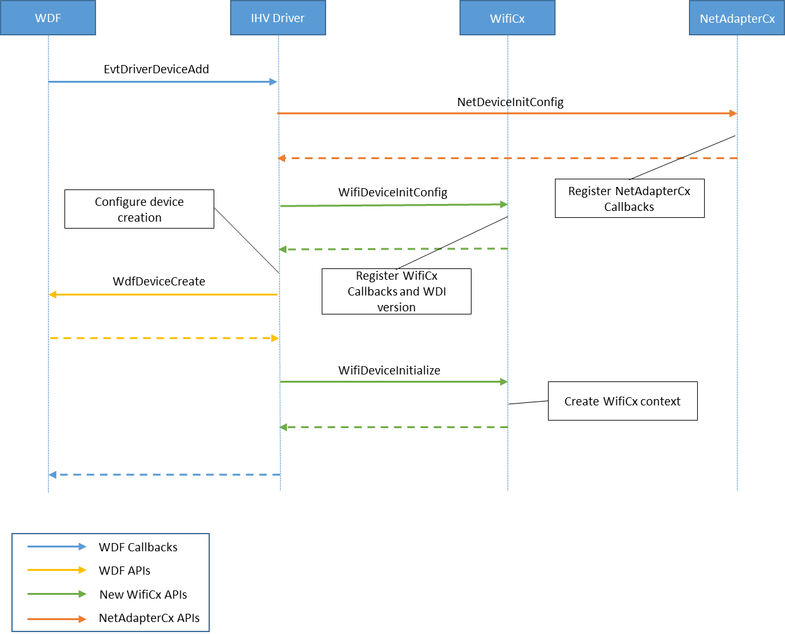
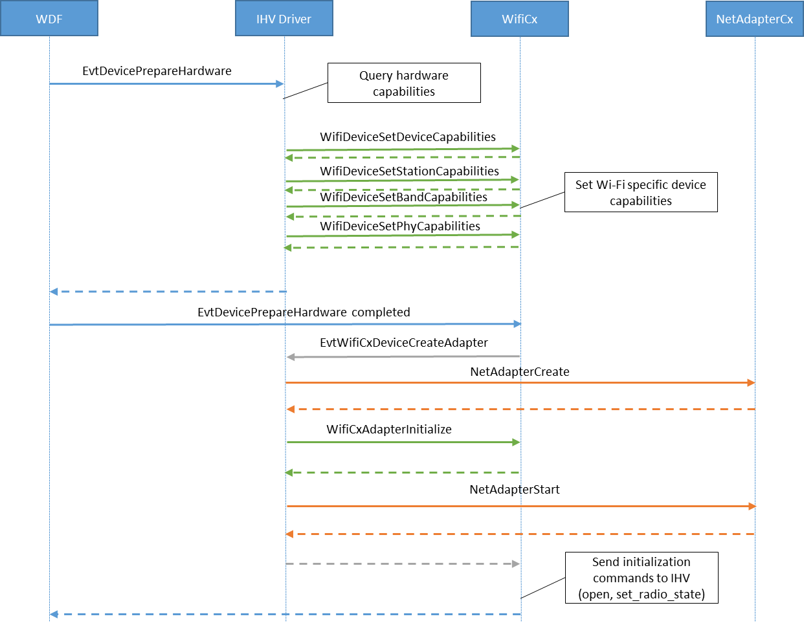
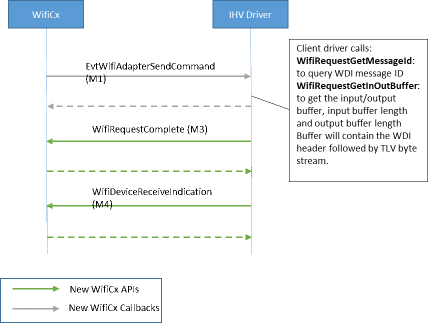
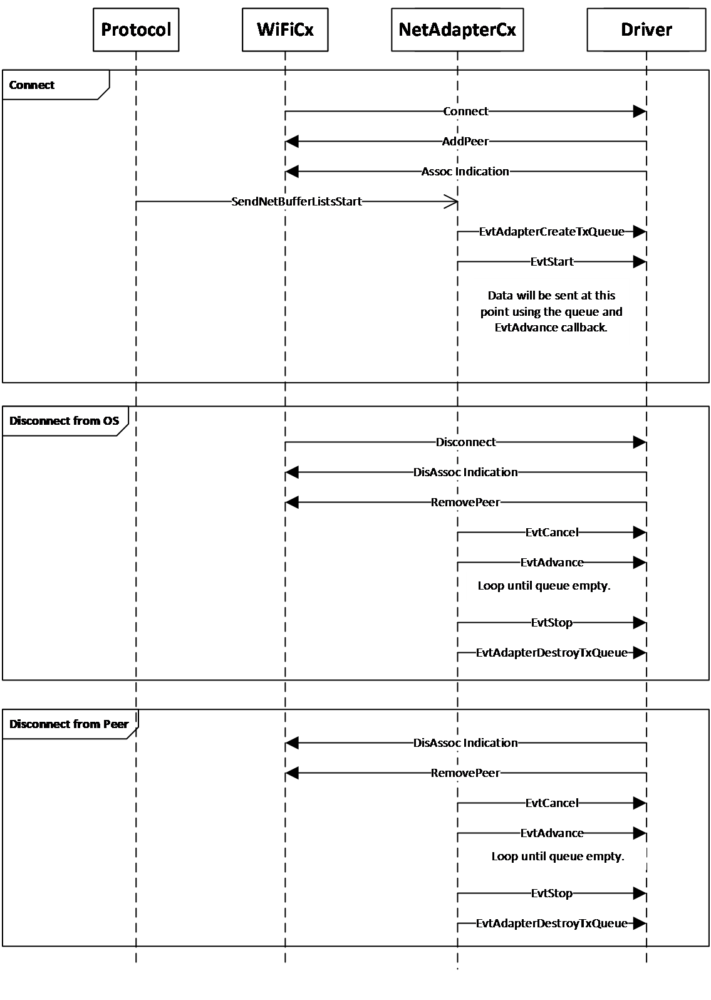

# Writing a WiFiCx client driver

## Device Initialization

In addition to those tasks required by NetAdapterCx for [NetAdapter device initialization](device-and-adapter-initialization.md), a WifiCx client driver must also perform the following tasks in its [EvtDriverDeviceAdd](/windows-hardware/drivers/ddi/wdfdevice/nf-wdfdevice-wdfdevicecreate) callback function:
1.	Call  WifiDeviceInitConfig after calling NetDeviceInitConfig but before calling [WdfDeviceCreate](/windows-hardware/drivers/ddi/wdfdevice/nf-wdfdevice-wdfdevicecreate), referencing the same [WDFDEVICE_INIT](/windows-hardware/drivers/wdf/wdfdevice_init) object passed in by the framework.

2.	Call **WifiDeviceInitialize** to register WifCx device-specific callback functions using an initialized WIFI\_DEVICE\_CONFIG structure and the WDFDEVICE object obtained from **WdfDeviceCreate**.
The following example demonstrates how to initialize the WifiCx device. Error handling has been left out for clarity.

```C++
status = NetDeviceInitConfig(deviceInit);
status = WifiDeviceInitConfig(deviceInit);

// Set up other callbacks such as Pnp and Power policy

status = WdfDeviceCreate(&deviceInit, &deviceAttributes, &wdfDevice);
WIFI_DEVICE_CONFIG wifiDeviceConfig;
WIFI_DEVICE_CONFIG_INIT(&wifiDeviceConfig,
                        WDI_VERSION_LATEST,
                        EvtWifiDeviceSendCommand,
                        EvtWifiDeviceCreateAdapter,
                        EvtWifiDeviceCreateWifiDirectDevice); 

status = WifiDeviceInitialize(wdfDevice, &wifiDeviceConfig);
...
// Get the TLV version used by WifiCx to initialize client't TLV parser/generator
auto peerVersion = WifiDeviceGetOsWdiVersion(wdfDevice);

```

This message flow diagram illustrates the initialization process.



### **Default (station) adapter creation flow**

Next, the client driver must set all the WiFi specific device capabilities, typically in the [EvtDevicePrepareHardware](/windows-hardware/drivers/ddi/wdfdevice/nc-wdfdevice-evt_wdf_device_prepare_hardware) callback function that follows. If your hardware needs interrupts to be enabled in order to query firmware capabilities, this can be done in the [EvtWdfDeviceD0EntryPostInterruptsEnabled](/windows-hardware/drivers/ddi/wdfdevice/nc-wdfdevice-evt_wdf_device_d0_entry_post_interrupts_enabled). Note that WifiCx will no longer be calling WDI\_TASK\_OPEN\WDI\_TASK\_CLOSE to instruct clients to load\unload firmware nor will it be querying for Wi-Fi capabilities via WDI\_GET\_ADAPTER\_CAPABILITIES command. Also, unlike other types of NetAdapterCx drivers, WiFi client drivers must not create the NETADAPTER object from within the EvtDriverDeviceAdd callback function. Instead, it will be instructed by WifiCx to create the default NetAdapter (station) later using the EvtWifiCxDeviceCreateAdapter callback (after the client’s PrepareHardware WDF callback is successful). Furthermore, WifiCx/WDI will no longer call WDI\_TASK\_CREATE\_PORT command.

In this call, the client driver needs to call into NetAdapterCx to create the new NetAdapter object and then call into WifiCx (using **WifiAdapterInitialize** API) to initialize the WiFiCx context and associate it with this NetAdapter object.

If this succeeds, WifiCx will then go on to send initialization commands for the device/adapter (SET\_ADAPTER\_CONFIGURATION, TASK\_SET\_RADIO\_STATE if necessary etc).



## WDI Command flow via WifiCx APIs

WifiCx uses WDI commands for most control path operations as defined in the WDI spec. The commands are exchanged through a set of callback functions provided by the client driver and APIs provided by WifiCx. The following function calls are used by WifiCx to replicate WDI command handling:
- WifiCx sends a WDI command message to the client driver by invoking its **EvtWifiDeviceSendCommand** callback function. The client driver sends the M3 for the command asynchronously by calling **WifiRequestComplete**. The client driver calls API **WifiRequestGetInOutBuffer** to retrieve the input/output buffer and buffer lengths and **WifiRequestGetMessageId** to retrieve the WDI message ID of the command.
If this was a set command and the original request did not conatin a large enough buffer, the client should call **WifiRequestSetBytesNeeded** to set the needed buffer size and then fail the request with status BUFFER\_OVERFLOW.

- If this is a task command, the client driver needs to later send the associated M4 indication by calling **WifiDeviceReceiveIndication** and pass the indication buffer with a WDI header that contains the same transaction ID as in the M1.

- Unsolicited indications are also notified via the **WifiDeviceReceiveIndication** API but with transaction ID set to 0.


## Wi-Fi Direct (P2P) Support

The following sections describe how clients can support Wi-Fi Direct using WifiCx and NetAdapter.
### Wi-Fi Direct Device Capabilities

WIFI\_WIFIDIRECT\_CAPABILITIES represents all the relevant capabilities that were previously set in WDI via the WDI\_P2P\_CAPABILITIES and WDI\_AP\_CAPABILITIES TLVs. The client driver needs to call **WifiDeviceSetWiFiDirectCapabilities** API for updating WifiCx in the set device capabilities phase.
```C++
WIFI_WIFIDIRECT_CAPABILITIES wfdCapabilities = {};

// Set values
wfdCapabilities.ConcurrentGOCount = 1;
wfdCapabilities.ConcurrentClientCount = 1;

// Update back to WifiCx
WifiDeviceSetWiFiDirectCapabilities(Device, &wfdCapabilities);
```
### Wi-Fi Direct Event Callback For "WfdDevice"

For Wi-Fi Direct, the "WfdDevice" is a control object with no data path capabilities. Therefore, WifiCx has a new WDFObject named **WIFIDIRECTDEVICE**. It is created using the **WifiDirectDeviceCreate** and initialized using **WifiDirectDeviceInitialize**. The port id (used in WDI commands) can be determined using API **WifiDirectDeviceGetPortId**.

```C++
NTSTATUS
EvtWifiDeviceCreateWifiDirectDevice(
    WDFDEVICE  Device,
    WIFIDIRECT_DEVICE_INIT * WfdDeviceInit
)
{
    WDF_OBJECT_ATTRIBUTES wfdDeviceAttributes;
    WDF_OBJECT_ATTRIBUTES_INIT_CONTEXT_TYPE(&wfdDeviceAttributes, WIFI_WFDDEVICE_CONTEXT);
    wfdDeviceAttributes.EvtCleanupCallback = EvtWifiDirectDeviceContextCleanup;

    WIFIDIRECTDEVICE wfdDevice;
    NTSTATUS ntStatus = WifiDirectDeviceCreate(WfdDeviceInit, &wfdDeviceAttributes, &wfdDevice);
    if (!NT_SUCCESS(ntStatus))
    {
        TraceEvents(TRACE_LEVEL_ERROR, DBG_DEVICE, "%!FUNC!: WifiDirectDeviceCreate failed, status=0x%x\n", ntStatus);
        return ntStatus;
    }

    ntStatus = WifiDirectDeviceInitialize(wfdDevice);

    if (!NT_SUCCESS(ntStatus))
    {
        TraceEvents(TRACE_LEVEL_ERROR, DBG_DEVICE, "%!FUNC!: WifiDirectDeviceInitialize failed with %!STATUS!\n", ntStatus);
        return ntStatus;
    }

    ntStatus = ClientDriverInitWifiDirectDeviceContext(
        Device,
        wfdDevice,
        WifiDirectDeviceGetPortId(wfdDevice));
    if (!NT_SUCCESS(ntStatus))
    {
        TraceEvents(TRACE_LEVEL_ERROR, DBG_DEVICE, "%!FUNC!: ClientDriverInitWifiDirectDeviceContext failed with %!STATUS!\n", ntStatus);
        return ntStatus;
    }

    return ntStatus;
}
```
### Event Callback For Create Adapter

The station adapter and WfdRole adapter are created using the same event callback. The adapter type can be determined using **WifiAdapterGetType** (or **WifiAdapterInitGetType** if type needs to be queried from the NETADAPTER_INIT object by the client driver before the adapter is created). The port id (used in WDI commands) can be determined using API **WifiAdapterGetPortId**.
.
```C++
NTSTATUS
EvtWifiDeviceCreateAdapter(
    WDFDEVICE Device,
    NETADAPTER_INIT* AdapterInit
)
{
    NET_ADAPTER_DATAPATH_CALLBACKS datapathCallbacks;
    NET_ADAPTER_DATAPATH_CALLBACKS_INIT(&datapathCallbacks,
        EvtAdapterCreateTxQueue,
        EvtAdapterCreateRxQueue);

    NetAdapterInitSetDatapathCallbacks(AdapterInit, &datapathCallbacks);

    WDF_OBJECT_ATTRIBUTES adapterAttributes;
    WDF_OBJECT_ATTRIBUTES_INIT(&adapterAttributes);
    WDF_OBJECT_ATTRIBUTES_INIT_CONTEXT_TYPE(&adapterAttributes, WIFI_NETADAPTER_CONTEXT);
    adapterAttributes.EvtCleanupCallback = EvtAdapterContextCleanup;

    NETADAPTER netAdapter;
    NTSTATUS ntStatus = NetAdapterCreate(AdapterInit, &adapterAttributes, &netAdapter);
    if (!NT_SUCCESS(ntStatus))
    {
        TraceEvents(TRACE_LEVEL_ERROR, DBG_DEVICE, "%!FUNC!: NetAdapterCreate failed, status=0x%x\n", ntStatus);
        return ntStatus;
    }

    ntStatus = WifiAdapterInitialize(netAdapter);

    if (!NT_SUCCESS(ntStatus))
    {
        TraceEvents(TRACE_LEVEL_ERROR, DBG_DEVICE, "%!FUNC!: WifiAdapterInitialize failed with %!STATUS!\n", ntStatus);
        return ntStatus;
    }

    ntStatus = ClientDriverInitDataAdapterContext(
        Device,
        netAdapter,
        WifiAdapterGetType(netAdapter) == WIFI_ADAPTER_EXTENSIBLE_STATION ? EXTSTA_PORT : EXT_P2P_ROLE_PORT,
        WifiAdapterGetPortId(netAdapter));

    if (!NT_SUCCESS(ntStatus))
    {
        TraceEvents(TRACE_LEVEL_ERROR, DBG_DEVICE, "%!FUNC!: ClientDriverInitDataAdapterContext failed with %!STATUS!\n", ntStatus);
        return ntStatus;
    }

    ntStatus = ClientDriverNetAdapterStart(netAdapter);
    if (!NT_SUCCESS(ntStatus))
    {
        TraceEvents(TRACE_LEVEL_ERROR, DBG_DEVICE, "%!FUNC!: ClientDriverNetAdapterStart failed with %!STATUS!\n", ntStatus);
        return ntStatus;
    }

    return ntStatus;
}
```
### Wi-Fi ExemptionAction support in TxQueue

ExemptionAction is added as a NetAdapter packet extension and it indicates whether the packet is expected to be exempt from any cipher operations performed by the client. Please read documentation on [usExemptionActionType](/windows-hardware/drivers/ddi/windot11/ns-windot11-dot11_extsta_send_context) for details.
```C++
#include <net/wifi/exemptionaction.h>

typedef struct _WIFI_TXQUEUE_CONTEXT
{
    WIFI_NETADAPTER_CONTEXT* NetAdapterContext;
    LONG NotificationEnabled;
    NET_RING_COLLECTION const* Rings;
    NET_EXTENSION VaExtension;
    NET_EXTENSION LaExtension;
    NET_EXTENSION ExemptionActionExtension;
    CLIENTDRIVER_TCB* PacketContext;
} WIFI_TXQUEUE_CONTEXT, * PWIFI_TXQUEUE_CONTEXT;
WDF_DECLARE_CONTEXT_TYPE_WITH_NAME(WIFI_TXQUEUE_CONTEXT, WifiGetTxQueueContext);

NTSTATUS
EvtAdapterCreateTxQueue(
    _In_ NETADAPTER NetAdapter,
    _Inout_ NETTXQUEUE_INIT* TxQueueInit
)
{
    TraceEvents(TRACE_LEVEL_VERBOSE, DBG_INIT, "-->%!FUNC!\n");

    NTSTATUS status = STATUS_SUCCESS;
    PWIFI_TXQUEUE_CONTEXT txQueueContext = NULL;
    PWIFI_NETADAPTER_CONTEXT netAdapterContext = WifiGetNetAdapterContext(NetAdapter);
    WDF_OBJECT_ATTRIBUTES txAttributes;

    WDF_OBJECT_ATTRIBUTES_INIT(&txAttributes);
    WDF_OBJECT_ATTRIBUTES_INIT_CONTEXT_TYPE(&txAttributes, WIFI_TXQUEUE_CONTEXT);

    txAttributes.EvtDestroyCallback = EvtTxQueueDestroy;

    NET_PACKET_QUEUE_CONFIG queueConfig;
    NET_PACKET_QUEUE_CONFIG_INIT(&queueConfig,
        EvtTxQueueAdvance,
        EvtTxQueueSetNotificationEnabled,
        EvtTxQueueCancel);
    queueConfig.EvtStart = EvtTxQueueStart;
    NETPACKETQUEUE txQueue;
    status =
        NetTxQueueCreate(TxQueueInit,
            &txAttributes,
            &queueConfig,
            &txQueue);

    if (!NT_SUCCESS(status))
    {
        TraceEvents(TRACE_LEVEL_ERROR, DBG_INIT, "NetTxQueueCreate failed, Adapter=0x%p status=0x%x\n", NetAdapter, status);
        goto Exit;
    }

    txQueueContext = WifiGetTxQueueContext(txQueue);

    TraceEvents(TRACE_LEVEL_INFORMATION, DBG_INIT, "NetTxQueueCreate succeeded, Adapter=0x%p, TxQueue=0x%p\n", NetAdapter, txQueue);

    txQueueContext->NetAdapterContext = netAdapterContext;
    txQueueContext->Rings = NetTxQueueGetRingCollection(txQueue);
    netAdapterContext->TxQueue = txQueue;

    NET_EXTENSION_QUERY extensionQuery;
    NET_EXTENSION_QUERY_INIT(
        &extensionQuery,
        NET_FRAGMENT_EXTENSION_VIRTUAL_ADDRESS_NAME,
        NET_FRAGMENT_EXTENSION_VIRTUAL_ADDRESS_VERSION_1,
        NetExtensionTypeFragment);

    NetTxQueueGetExtension(
        txQueue,
        &extensionQuery,
        &txQueueContext->VaExtension);

    if (!txQueueContext->VaExtension.Enabled)
    {
        TraceEvents(
            TRACE_LEVEL_ERROR,
            DBG_INIT,
            "%!FUNC!: Required virtual address extension is missing.");

        status = STATUS_UNSUCCESSFUL;
        goto Exit;
    }

    NET_EXTENSION_QUERY_INIT(
        &extensionQuery,
        NET_FRAGMENT_EXTENSION_LOGICAL_ADDRESS_NAME,
        NET_FRAGMENT_EXTENSION_LOGICAL_ADDRESS_VERSION_1,
        NetExtensionTypeFragment);

    NetTxQueueGetExtension(
        txQueue,
        &extensionQuery,
        &txQueueContext->LaExtension);

    if (!txQueueContext->LaExtension.Enabled)
    {
        TraceEvents(
            TRACE_LEVEL_ERROR,
            DBG_INIT,
            "%!FUNC!: Required logical address extension is missing.");

        status = STATUS_UNSUCCESSFUL;
        goto Exit;
    }

     NET_EXTENSION_QUERY_INIT(
        &extensionQuery,
        NET_PACKET_EXTENSION_WIFI_EXEMPTION_ACTION_NAME,
        NET_PACKET_EXTENSION_WIFI_EXEMPTION_ACTION_VERSION_1,
        NetExtensionTypePacket);

    NetTxQueueGetExtension(
        txQueue,
        &extensionQuery,
        &txQueueContext->ExemptionActionExtension);

    if (!txQueueContext->ExemptionActionExtension.Enabled)
    {
        TraceEvents(
            TRACE_LEVEL_ERROR,
            DBG_INIT,
            "%!FUNC!: Required Exemption Action extension is missing.");

        status = STATUS_UNSUCCESSFUL;
        goto Exit;
    }

    status = InitializeTCBs(txQueue, txQueueContext);

    if (status != STATUS_SUCCESS)
    {
        goto Exit;
    }

Exit:
    TraceEvents(TRACE_LEVEL_VERBOSE, DBG_INIT, "<--%!FUNC! with 0x%x\n", status);

    return status;
}

static
void
BuildTcbForPacket(
    _In_ WIFI_TXQUEUE_CONTEXT const * TxQueueContext,
    _Inout_ CLIENTDRIVER_TCB * Tcb,
    _In_ UINT32 PacketIndex,
    _In_ NET_RING_COLLECTION const * Rings
)
{
    auto const pr = NetRingCollectionGetPacketRing(Rings);
    auto const fr = NetRingCollectionGetFragmentRing(Rings);

    auto const packet = NetRingGetPacketAtIndex(pr, PacketIndex);

    auto const & vaExtension = TxQueueContext->VaExtension;
    auto const & laExtension = TxQueueContext->LaExtension;
    auto const & exemptionActionExtension = TxQueueContext->ExemptionActionExtension;


    auto const packageExemptionAction = WifiExtensionGetExemptionAction(&exemptionActionExtension, PacketIndex);
    Tcb->EncInfo.ExemptionActionType = packageExemptionAction->ExemptionAction;

}

```
### Wi-Fi Direct INI/INF file change

vWifi functionalities has been replaced by the NetAdapter, if porting from WDI based driver, the INI/INF should remove the vWIFI related information. 
```INF
Characteristics = 0x84
BusType         = 5
*IfType         = 71; IF_TYPE_IEEE80211
*MediaType      = 16; NdisMediumNative802_11
*PhysicalMediaType = 9; NdisPhysicalMediumNative802_11
NumberOfNetworkInterfaces   = 5; For WIFI DIRECT DEVICE AND ROLE ADAPTER

; TODO: Set this to 0 if your device is not a physical device.
*IfConnectorPresent     = 1     ; true

; In most cases, you can keep these at their default values.
*ConnectionType         = 1     ; NET_IF_CONNECTION_DEDICATED
*DirectionType          = 0     ; NET_IF_DIRECTION_SENDRECEIVE
*AccessType             = 2     ; NET_IF_ACCESS_BROADCAST
*HardwareLoopback       = 0     ; false

[ndi.NT.Wdf]
KmdfService = %ServiceName%, wdf

[wdf]
KmdfLibraryVersion      = $KMDFVERSION$

```

## NetAdapter Data Path Change

### Data Buffer Pool for receiving network data

The client drive normally allocates common buffers to store the packets received the NIC. The NetAdapterCx has a new feature that provides the client driver a pool of common buffers that are pre-allocated by the system on behalf of the client driver. 


To opt-in, set **AllocationMode** and **AttachmentMode** fields of the [NET_ADAPTER_RX_CAPABILITIES](/windows-hardware/drivers/ddi/netadapter/ns-netadapter-_net_adapter_rx_capabilities) as the following:

```C++
rxCapabilities.AllocationMode = NetRxFragmentBufferAllocationModeSystem;
rxCapabilities.AttachmentMode = NetRxFragmentBufferAttachmentModeDriver;
```

Once the above configuration is set, later the [NET_RING_COLLECTION](/windows-hardware/drivers/ddi/ringcollection/ns-ringcollection-_net_ring_collection) structure obtained through the [NetRxQueueGetRingCollection](/windows-hardware/drivers/ddi/netrxqueue/nf-netrxqueue-netrxqueuegetringcollection) would consist of three [NET_RING](/windows-hardware/drivers/ddi/ring/ns-ring-_net_ring) structures, a packet ring, a fragment ring and a data buffer ring. The 3rd ring, data buffer ring, is where those pre-allocated data buffer stored.

> [!IMPORTANT]
> Just like any other [NET_RING](/windows-hardware/drivers/ddi/ring/ns-ring-_net_ring), the data buffer ring must be operated in a sequential manner too, i.e. use of data buffers stored in the data buffer ring must be in sequence order. It is not allowed to skip unused data buffer and leave gaps 

A driver that leverages the system allocated data buffer pool, typically implements its Rx [EvtPacketQueueAdvance](/windows-hardware/drivers/ddi/netpacketqueue/nc-netpacketqueue-evt_packet_queue_advance) callback in following steps:
1. Obtains an unused data buffer from the data buffer ring
2. Programs that data buffer to its hardware for receive
3. Once new network data has been received, the client driver links the packet and fragment descriptor together with that data buffer
4. Return the packet descriptor, the fragment descriptors, and the data buffer to OS.

#### Obtains an unused data buffer from the data buffer ring

Similar to other rings, every element in the data buffer ring from **BeginIndex** to **EndIndex - 1** is one available data buffer for the client driver to uses. The client driver owns all of them and it decides how many of data buffers it wants to use. The only constraint is that the client driver must use the data buffers in sequential order. **NextIndex** is optional for the driver to use as a way to remember which data buffers have been already used by the client driver.

We provide a convenience helper API **NetDataBufferFetch** to perform the "fetch" operation

```C++

NET_RING * br = NetRingCollectionGetDataBufferRing(ringCollection);
NET_DATA_BUFFER_HANDLE dataBufferHandle;

while (NetDataBufferFetch(br, 1, &dataBufferHandle))
{
    //post the data buffer to the hardware
    ...
}

inline
SIZE_T 
NetDataBufferFetch(
    _In_ NET_RING* BufferRing,
    _In_ UINT32 BufferCount,
    _Out_ NET_DATA_BUFFER_HANDLE* Buffer
)
{
    UINT32 avaiableBufferCount = 
        NetRingGetRangeCount(BufferRing, BufferRing->EndIndex, BufferRing->NextIndex);

    UINT32 count = min(avaiableBufferCount, BufferCount);

    for (UINT32 i = 0; i < count; i++)
    {
        Buffer[i] = *((NET_DATA_BUFFER_HANDLE*) NetRingGetElementAtIndex(BufferRing, BufferRing->NextIndex));
        BufferRing->NextIndex = NetRingIncrementIndex(BufferRing, BufferRing->NextIndex);
    }

    return count;
}
```

#### Programs that data buffer to its hardware for receive

The data buffer object fetched from data buffer ring is an opaque handle, to get the actual LogicalAddress and VirtualAddress for that data buffer, call corresponding APIs. For example, 

```C++
...

while (NetDataBufferFetch(br, 1, &dataBufferHandle))
{
    //post the data buffer to the hardware
    //get the LA
    UINT64 la = NetDataBufferGetLogicalAddress(br, dataBufferHandle);
    ...
}
```
#### Links the packet and fragment descriptor together with the data buffer

Once the hardware indicates the receive is done, the client driver needs to fill-in NET_PACKET and NET_FRAGMENT structures, so that it can describe to the OS where is the network data, in which data buffer it stores, what's the starting offset and length, and other meta data. See [Receiving network data with net rings](receiving-network-data-with-net-rings.md) for full detail. 

Note, the client driver must use NET_FRAGMENT_DATA_BUFFER fragment extension to associate the fragment and the data buffer handle

```C++
NET_FRAGMENT_DATA_BUFFER* dataBuffer = NetExtensionGetFragmentDataBuffer(
    &rx->DataBufferExtension, currentFragmentIndex);

dataBuffer->Handle = dataBufferHandle;
```

#### Return the packet descriptor, the fragment descriptors, and the data buffer to OS

The formed packets and fragments should be returned to the OS as described in [Receiving network data with net rings](receiving-network-data-with-net-rings.md). 
In addition, the data buffer described by the fragment descriptor should be returned to the OS by the client driver too, by incrementing **EndIndex** of the data buffer ring. Note, the data buffer must only be returned in-order.

We provide a convenience helper API **NetDataBufferReturn** to perform the "return" operation.

If a data buffer is used to store a single received network packet, the data buffer is returned whenever that packet is returned to the OS.

If a data buffer is used to store multiple received network packets, **keep the ownership of the data buffer until all the packets have been returned to OS. Only then the client driver returns the data buffer to the OS .**  

### Setting up multiple Tx queues

By default, NetAdapter will create one Tx queue for all packets intended for a NetAdapter. 
If a driver needs to support multiple Tx queues for QOS or needs to setup different queues for different peers, it can do so by setting up the appropriate DEMUX properties. If demux properties are added, Tx queue count is a product of maximum number of peers, maximum number of tids, + 1 (for broadcast/multicast).

#### Multiple queues for QOS
Before using a NETADAPTER_INIT * object to create a NETADAPTER, the client driver should add WMMINFO demux to it:

```C++
...
WIFI_ADAPTER_TX_DEMUX wmmInfoDemux;
WIFI_ADAPTER_TX_WMMINFO_DEMUX_INIT(&wmmInfoDemux);
WifiAdapterInitAddTxDemux(adapterInit, &wmmInfoDemux);
```

This will cause the translator to create up to 8 Tx queues on demand, depending on the value in the NBL WlanTagHeader::WMMInfo value.

From **EvtPacketQueueStart** the client driver should query the priority the framework will use for this queue:

```C++
auto const priority = WifiTxQueueGetDemuxWmmInfo(queue);
```
All packets placed to this queue between **EvtStart** and **EvtStop** will be for the given priority.

#### Multiple queues for peers
Before using a NETADAPTER_INIT * object to create a NETADAPTER, the client driver should add PEER_ADDRESS demux to it:

```C++
...
WIFI_ADAPTER_TX_DEMUX peerInfoDemux;
WIFI_ADAPTER_TX_PEER_ADDRESS_DEMUX_INIT(&peerInfoDemux, maxNumOfPeers);
WifiAdapterInitAddTxDemux(adapterInit, &peerInfoDemux);
```
From **EvtPacketQueueStart** the client driver should query the peer address the framework will use for this queue:

```C++
auto const peerAddress = WifiTxQueueGetDemuxPeerAddress(queue);
```
All packets placed to this queue between **EvtStart** and **EvtStop** will be for this peer.

Queues are only opened for peer addresses that have been added by the driver using the following APIs:

**WifiAdapterAddPeer(Adapter, Address)**:
Tell WiFiCx of a connected peer with the given address.  This address will be used with peer demultiplexing by associating a queue to the peer address. The maximum number of peers the driver may add shall not exceed the range value provided when adding tx demultiplexing info.

**WifiAdapterRemovePeer(Adapter, Address)**:
Tell WiFiCx a peer has been disconnected.  This will cause the associated queue to be stopped.



