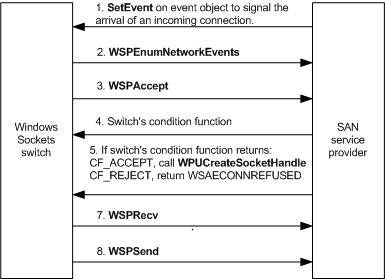

# Accepting Connection Requests

If an application calls the **WSAAccept**, **accept**, or **AcceptEx** function to accept an incoming connection request on a socket, the Windows Sockets switch always forwards this call to the TCP/IP service provider. If an incoming connection request arrives from a non-SAN network, it flows through the NDIS path and the TCP/IP service provider handles it. If a connection request arrives from a remote peer on a SAN, the switch acts as an intermediary between the TCP/IP service provider and the SAN service provider in determining whether to accept the connection request and in completing the application's **WSAAccept**, **accept**, or **AcceptEx** function.

The following figure shows an overview of the interaction between the Windows Sockets switch and the SAN service provider in determining whether to accept or reject an incoming connection request. The sequences and sections that follow describe acceptance determination in more detail.

 **To accept or reject a connect request**

1.  On receiving an incoming connection request from a remote peer, the SAN service provider signals an event object as described in [Listening for Connections on a SAN](listening-for-connections-on-a-san.md).

2.  The Windows Sockets switch calls the SAN service provider's [**WSPEnumNetworkEvents**](https://msdn.microsoft.com/library/windows/hardware/ff566284) function to receive the FD\_ACCEPT event code.

3.  On receiving the FD\_ACCEPT event code, the switch calls the SAN service provider's [**WSPAccept**](https://msdn.microsoft.com/library/windows/hardware/ff566266) function to accept or reject the incoming connection request.

4.  In the switch's call to the SAN service provider's [**WSPAccept**](https://msdn.microsoft.com/library/windows/hardware/ff566266) function, the switch specifies a condition function. The SAN service provider must call this condition function in the same thread in which the **WSPAccept** function was called before returning from the **WSPAccept** call.

5.  The switch returns the CF\_ACCEPT or CF\_REJECT code from this condition function to indicate that it accepts or rejects the connection request, respectively.

### Accepting a Connection Request and Creating an Accepting Socket

If an application accepts an incoming connection request, the switch returns the CF\_ACCEPT code to the SAN service provider to complete the switch's condition function. On receiving CF\_ACCEPT, the SAN service provider initializes an internal data structure in which it stores information about the accepting socket. The SAN service provider's [**WSPAccept**](https://msdn.microsoft.com/library/windows/hardware/ff566266) function must next call the **WPUCreateSocketHandle** function to acquire a descriptor for the accepting socket from the switch. The SAN service provider must store the switch's descriptor in its internal data structure for the accepting socket and must return its own descriptor for the accepting socket to complete the **WSPAccept** call. The switch must supply the SAN service provider's internal descriptor for the accepting socket when calling the SAN service provider's functions, while the SAN service provider must supply the switch's socket descriptor in up calls to the switch.

Before successfully completing [**WSPAccept**](https://msdn.microsoft.com/library/windows/hardware/ff566266), the SAN service provider should call the Win32 **ResetEvent** function to reset the event object. Doing so enables the SAN service provider to later call the Win32 **SetEvent** function to signal the switch to accept the next incoming connection request.

### Rejecting a Connection Request

If an application rejects an incoming connection request, the switch returns the CF\_REJECT code to the SAN service provider to complete the switch's condition function. On receiving CF\_REJECT, the SAN service provider should return the WSAECONNREFUSED error code to the switch to complete the [**WSPAccept**](https://msdn.microsoft.com/library/windows/hardware/ff566266) call.

### Indicating Acceptance or Refusal of a Connection Request to a Remote Peer

Before a SAN service provider can indicate to a remote peer that it accepts or refuses the remote peer's connection request, the SAN service provider must call the switch's condition function. Depending on the value that the switch's condition function returns, the SAN service provider should make one of the following indications to the remote peer:

If the switch's condition function returns CF\_ACCEPT, the SAN service provider should indicate that it accepts the remote peer's connection request. The SAN service provider on the remote peer can then successfully complete its connection operation that was initiated by a [**WSPConnect**](https://msdn.microsoft.com/library/windows/hardware/ff566275) call.

If the switch's condition function returns CF\_REJECT, the SAN service provider should indicate that it refuses the remote peer's connection request. The SAN service provider on the remote peer must fail its connection operation that was initiated by a [**WSPConnect**](https://msdn.microsoft.com/library/windows/hardware/ff566275) call with the WSAECONNREFUSED error code.

### Session Negotiation

After the switch has successfully used a SAN service provider to accept a connection request from a remote peer, the switch negotiates a session with that peer.

 **To negotiate a session**

1.  The switch at the remote peer calls the SAN service provider's [**WSPRecv**](https://msdn.microsoft.com/library/windows/hardware/ff566309) function to post a set of receive buffers.

2.  The switch at the remote peer calls the SAN service provider's [**WSPSend**](https://msdn.microsoft.com/library/windows/hardware/ff566316) function to send a session negotiation message to the switch at the local accepting endpoint. This message includes the number of receive buffers that the switch at the remote peer posted.

3.  The switch at the local accepting endpoint calls the local SAN service provider's [**WSPRecv**](https://msdn.microsoft.com/library/windows/hardware/ff566309) function to post its own receive buffers, but it might not be able to do so in time to receive the session negotiation message. If the local switch does not post a receive buffer in time and if the underlying NIC does not support flow control, the SAN service provider at the local accepting endpoint must buffer the remote switch's session negotiation message in its own private receive buffers. When the switch posts receive buffers, the SAN service provider copies data from its private receive buffers to the switch buffers on a one-to-one basis until all of the data has been copied from the private buffers to the switch buffers.

    The SAN service provider performs normal receive processing on subsequent switch buffers--that is, it posts all such switch buffers to the receive queue on the NIC.

    Note that a SAN service provider must not drop a connection simply because the switch did not post a receive buffer before the session negotiation message arrived. The maximum length of a session negotiation message is 256 bytes.

4.  The switch at the local accepting endpoint posts its receive buffers before responding to the session negotiation message. The local switch calls the local SAN service provider's [**WSPSend**](https://msdn.microsoft.com/library/windows/hardware/ff566316) function to respond to the session negotiation message. The local switch's response includes the number of receive buffers that the local switch posted. From this point forward, the local switch guarantees that the posted set of receive buffers is of sufficient size to receive any message that arrives on the connection.

5.  If an application specifies an initial receive buffer in its **AcceptEx** call, the switch waits until it receives the first data message from its remote peer before completing the application's **AcceptEx** call.

6.  If the application cancels its own **accept** call, the switch calls the appropriate SAN service provider's [**WSPCloseSocket**](https://msdn.microsoft.com/library/windows/hardware/ff566273) function to close the accepting SAN socket.

 

 

