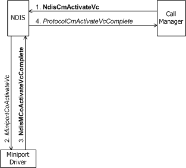
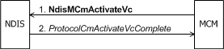

# Activating a VC

After a virtual connection (VC) has been created (see [Creating a VC](creating-a-vc.md)), it must be activated before data can be transmitted or received on it. A call manager initiates the activation of a VC by calling [**NdisCmActivateVc**](https://msdn.microsoft.com/library/windows/hardware/ff561649)(see the following figure).

An MCM driver initiates the activation of a VC by calling [**NdisMCmActivateVc**](https://msdn.microsoft.com/library/windows/hardware/ff562792)(see the following figure).

A call manager or MCM driver could initiate reactivation of an active VC if the local client or a remote party successfully negotiates a change in call parameters on that VC (see [Client-Initiated Request to Close a Call](client-initiated-request-to-close-a-call.md) and [Incoming Request to Change Call Parameters](incoming-request-to-change-call-parameters.md)). The call manager or MCM driver can call **Ndis(M)CmActivateVc** many times for a single VC to change the call parameters for an already active call.

For a client-initiated outgoing call, a call manager or an MCM driver usually calls **Ndis(M)CmActivateVc** immediately following the packet exchange confirming a negotiated agreement with the remote target of the call or successful call-setup at the switch. The call manager or MCM driver calls **Ndis(M)CmActivateVc** before it notifies NDIS (and the client) of outgoing call completion with **Ndis(M)CmMakeCallComplete**(see [Making a Call](making-a-call.md)). For an incoming call, a call manager or MCM driver usually calls **Ndis(M)CmActivateVc** after it has called **NdisCo(MCm)CreateVc** successfully and before it calls **Ndis(M)CmDispatchIncomingCall**(see [Indicating an Incoming Call](indicating-an-incoming-call.md)).

A call manager's call to **NdisCmActivateVc** causes NDIS to call the [**MiniportCoActivateVc**](https://msdn.microsoft.com/library/windows/hardware/ff559351) function of the underlying miniport driver. *MiniportCoActivateVc* must validate the call parameters for this VC to verify that the adapter can support the requested call. If the call parameters are acceptable, *MiniportCoActivateVc* communicates with its adapter as necessary to prepare the adapter to receive or transmit data across the virtual connection (for example, programming receive buffers). If the requested call parameters cannot be supported, the miniport driver fails the request.

*MiniportCoActivateVc* can complete synchronously or asynchronously. The call to [**NdisMCoActivateVcComplete**](https://msdn.microsoft.com/library/windows/hardware/ff563558) causes NDIS to call the call manager's [**ProtocolCmActivateVcComplete**](https://msdn.microsoft.com/library/windows/hardware/ff570238) function. *ProtocolCmActivateVcComplete* must check the status returned by **NdisMCoActivateVcComplete** to ensure that the virtual connection has been activated successfully. If the miniport driver did not successfully activate the VC, the call manager must not attempt to communicate over the VC. *ProtocolCmActivateVcComplete* must also complete any processing required by the network media to ensure that the virtual connection is ready for data transmission before returning control to NDIS.

An MCM driver's call to **NdisMCmActivateVc** informs NDIS that it has set up call and media parameters on a newly created VC or changed the call parameters on an established VC. This action notifies NDIS that the MCM driver has made a NIC ready for transfers on the VC. NDIS completes the activation sequence by calling the MCM driver's *ProtocolCmActivateVcComplete* function.

An MCM driver calls **NdisMCmActivateVc** to activate only VCs used for transmitting and/or receiving client data, but not to activate VCs used for exchanging signaling messages between the MCM driver and network components such as a switch. An MCM driver activates a signaling VC internally without calling any **Ndis*Xxx*** function. Any VC that an MCM driver sets up for its own signaling purposes is therefore opaque to NDIS.

 

 

