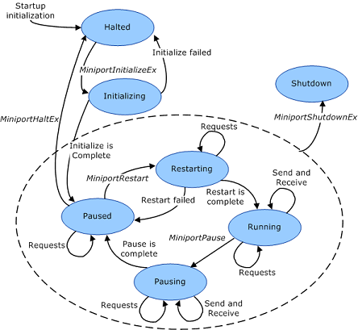

# Adapter States of a Miniport Driver

For each miniport adapter that it manages, an [NDIS miniport driver](ndis-miniport-drivers2.md) must support the following set of operational states:

-   Halted

-   Shutdown

-   Initializing

-   Paused

-   Restarting

-   Running

-   Pausing

The following figure shows the interrelationships between these states.

**Note**  The reset operation does not affect miniport adapter operational states. Also, the state of the adapter might change while a reset operation is in progress. For example, NDIS might call a driver's pause handler when there is a reset operation in progress. In this case, the driver can complete either the reset or the pause operation in any order while following the normal requirements for each operation. For a reset operation, the driver can fail transmit request packets or it can keep them queued and complete them later. However, you should note that an overlying driver cannot complete a pause operation while its transmit packets are pending.

 

The following defines the adapter states:

Halted  
*Halted* is the initial state of all miniport adapters. When a miniport adapter is in the Halted state, and NDIS calls the driver's [*MiniportInitializeEx*](https://msdn.microsoft.com/library/windows/hardware/ff559389) function to initialize the miniport adapter, the miniport adapter enters the Initializing state. If *MiniportInitializeEx* fails, the miniport adapter returns to the Halted state. When the miniport adapter is in the Paused state and NDIS calls the [*MiniportHaltEx*](https://msdn.microsoft.com/library/windows/hardware/ff559388) function, the miniport adapter returns to the Halted state.

Shutdown  
A miniport adapter in the *Shutdown* state cannot be used until the system is shut down and restarted. When the miniport adapter is in the Paused, Restarting, Running, or Pausing state and NDIS calls the miniport driver's [*MiniportShutdownEx*](https://msdn.microsoft.com/library/windows/hardware/ff559449) function, the miniport adapter enters the Shutdown state.

Initializing  
In the *Initializing* state, a miniport driver completes any operations that are required to initialize a miniport adapter. When a miniport adapter is in the Halted state and the NDIS calls the miniport driver's *MiniportInitializeEx* function, the miniport adapter enters the Initializing state. If *MiniportInitializeEx* succeeds, the miniport adapter enters the Paused state. If *MiniportInitializeEx* fails, the miniport adapter returns to the Halted state.

Paused  
When a miniport adapter is in the *Paused* state, a miniport driver does not indicate received network data or accept send requests. When a miniport adapter is in the Pausing state and the pause operation is complete, the miniport adapter enters the Paused state. When a miniport adapter is in the Initializing state and *MiniportInitializeEx* is successful, the miniport adapter enters the Paused state. When NDIS calls the miniport driver's [**MiniportRestart**](https://msdn.microsoft.com/library/windows/hardware/ff559435) function, the miniport adapter transitions from the Paused state to the Restarting state. When NDIS calls the miniport driver's [*MiniportHaltEx*](https://msdn.microsoft.com/library/windows/hardware/ff559388) function, the miniport adapter transitions from the Paused state to the Halted state.

Restarting  
In the *Restarting* state, a miniport driver completes any operations that are required to restart send and receive operations for a miniport adapter. When a miniport adapter is in the Paused state and NDIS calls the driver's *MiniportRestart* function, the miniport adapter enters the Restarting state. If the restart fails, the miniport adapter returns to the Paused state. If the restart is successful, the miniport adapter enters the Running state.

Running  
In the *Running* state, a miniport driver performs normal send and receive processing for a miniport adapter. When the miniport adapter is in the Restarting state and the driver is ready to perform send and receive operations, the miniport adapter enters the Running state.

Pausing  
In the *Pausing* state, a miniport driver completes any operations that are required to stop send and receive operations for a miniport adapter. The driver must wait for NDIS to return all outstanding receive indications. When a miniport adapter is in the Running state and NDIS calls the driver's [*MiniportPause*](https://msdn.microsoft.com/library/windows/hardware/ff559418) function, the miniport adapter enters the Pausing state. A miniport driver cannot fail a pause operation. When the pause operation is complete, the miniport adapter enters the Paused state.

## Related topics

[Driver Stack Management](driver-stack-management.md)

[NDIS Miniport Drivers](ndis-miniport-drivers2.md)

 

 

