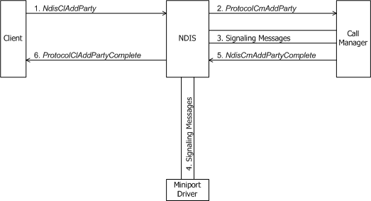
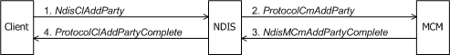

# Adding a Party to a Multipoint Call

A client requests to add a party to a multipoint call with [**NdisClAddParty**](https://msdn.microsoft.com/library/windows/hardware/ff561625). A client can add a party only to an existing multipoint call--that is, a call for which the client supplied a *ProtocolPartyContext* to [**NdisClMakeCall**](https://msdn.microsoft.com/library/windows/hardware/ff561635)(see [Making a Call](making-a-call.md)).

The following figure shows a client of a call manager requesting to add a party to multipoint call.

The following figure shows a client of an MCM driver requesting to add a party to multipoint call.

Before it calls **NdisClAddParty**, a client must allocate and initialize its context area for the party to be added. Clients commonly pass a pointer to such a context area as the *ProtocolPartyContext* and a pointer to a variable within that context area as the *NdisPartyHandle* parameters when they call **NdisClAddParty**.

In addition to an *NdisVcHandle* and a *ProtocolPartyContext*, the client passes call parameters (a buffered [**CO\_CALL\_PARAMETERS**](https://msdn.microsoft.com/library/windows/hardware/ff545384) structure) to **NdisClAddParty**. The underlying network medium determines whether a client can specify per-party traffic parameters on a multipoint VC.

The call to **NdisClAddParty** causes NDIS to forward this request to the [**ProtocolCmAddParty**](https://msdn.microsoft.com/library/windows/hardware/ff570239) function of the call manager or MCM driver with which the client shares the given *NdisVcHandle* . NDIS passes the following to the *ProtocolCmAddParty*:

-   A *CallMgrVcContext* that indicates the VC for the call.

-   A pointer to a CO\_CALL\_PARAMETERS structure that contains the call parameters that the client passes to **NdisClAddParty**.

-   An *NdisPartyHandle* that identifies the party to be added.

*ProtocolCmAddParty* allocates and initializes any dynamic resources needed for the party being added to the call. From *ProtocolCmAddParty*, a call manager or MCM driver communicates with network control devices or other media-specific agents, as necessary, to add the specified party to the multipoint call.

If the client passed in call parameters that did not match those already established for the multipoint VC, the call manager or MCM driver can, for example:

-   Set up the per-party traffic parameters if the underlying network medium supports this feature on multipoint VCs.

-   Reset the client-supplied traffic parameters to those originally established for the VC.

-   Change the call parameters for the VC and for every party currently connected on it.

-   Fail the client's attempt to add a party.

*ProtocolCmAddParty* can complete synchronously or, more probably, asynchronously with [**NdisCmAddPartyComplete**](https://msdn.microsoft.com/library/windows/hardware/ff561651), in the case of a call manager, or [**NdisMCmAddPartyComplete**](https://msdn.microsoft.com/library/windows/hardware/ff562798), in the case of an MCM driver. Whether the call manager or MCM driver completes the operation synchronously or asynchronously, it passes the buffered call parameters to NDIS.

The call to **Ndis(M)CmAddPartyComplete** causes NDIS to call the client's [**ProtocolClAddPartyComplete**](https://msdn.microsoft.com/library/windows/hardware/ff570221) function. If the client's request to add the party succeeded and if the signaling protocol allows the call manager or MCM driver to modify the call parameters, *ProtocolClAddPartyComplete* should test the CALL\_PARAMETERS\_CHANGED flag in the buffered CO\_CALL\_PARAMETERS structure to determine whether the call parameters were modified. The signaling protocol determines what the client can do if it finds the modifications to CO\_CALL\_PARAMETERS unacceptable. Usually, a client calls [**NdisClDropParty**](https://msdn.microsoft.com/library/windows/hardware/ff561629) in this case (see [Dropping a Party from a Multipoint Call](dropping-a-party-from-a-multipoint-call.md)).

 

 

