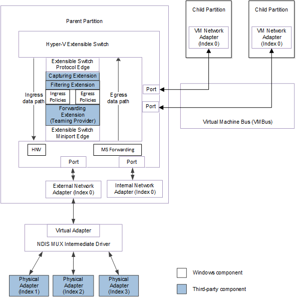
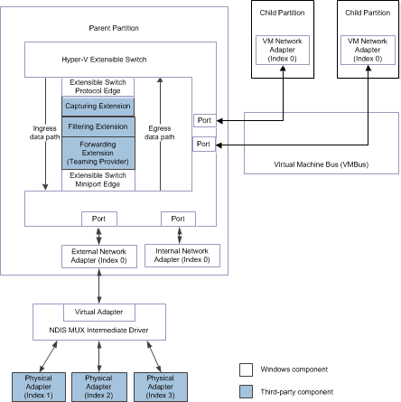

# Adding Extensible Switch Destination Port Data to a Packet

This topic describes how Hyper-V extensible switch forwarding extensions can specify the delivery of packets to one or more destination ports. These extensions can also forward packets to individual physical network adapters that are bound to the extensible switch external network adapter.

**Note**  Only a forwarding extension or the switch itself can forward packets to extensible switch ports or individual network adapters.

The following figure shows the data path for packet traffic through the extensible switch driver stack for NDIS 6.40 (Windows Server 2012 R2) and later. Both figures also show the data path for packet traffic to or from the network adapters that are connected to extensible switch ports.

The following figure shows the data path for packet traffic through the extensible switch driver stack for NDIS 6.30 (Windows Server 2012).

Each extensible switch destination port is specified by an [**NDIS\_SWITCH\_PORT\_DESTINATION**](https://msdn.microsoft.com/library/windows/hardware/hh598224) element within the [**NDIS\_SWITCH\_FORWARDING\_DESTINATION\_ARRAY**](https://msdn.microsoft.com/library/windows/hardware/hh598210) structure. This array is contained in the out-of-band (OOB) forwarding context of the packet's [**NET\_BUFFER\_LIST**](https://msdn.microsoft.com/library/windows/hardware/ff568388) structure. For more information on this context, see [Hyper-V Extensible Switch Forwarding Context](hyper-v-extensible-switch-forwarding-context.md).

If a forwarding extension is bound and enabled in the extensible switch driver stack, it is responsible for determining the destination ports for every packet obtained from the extensible switch ingress data path, unless the packet is an NVGRE packet. For more information about this data path, see [Overview of the Hyper-V Extensible Switch Data Path](overview-of-the-hyper-v-extensible-switch-data-path.md). For more information about NVGRE packets, see [Hybrid Forwarding](hybrid-forwarding.md).

**Note**  If a forwarding extension is not bound or enabled in the driver stack, the extensible switch determines the destination ports for packets it obtains from the ingress data path.

The forwarding extension must follow these guidelines when it determines destination ports for a packet obtained on the ingress data path:

-   The extension must initialize an [**NDIS\_SWITCH\_PORT\_DESTINATION**](https://msdn.microsoft.com/library/windows/hardware/hh598224) structure within the [**NDIS\_SWITCH\_FORWARDING\_DESTINATION\_ARRAY**](https://msdn.microsoft.com/library/windows/hardware/hh598210) structure with the destination port information.

    If the destination port is not connected to the external network adapter, the extension must set the **NicIndex** member of the [**NDIS\_SWITCH\_PORT\_DESTINATION**](https://msdn.microsoft.com/library/windows/hardware/hh598224) structure to **NDIS\_SWITCH\_DEFAULT\_NIC\_INDEX**.

    If the destination port is connected to the extensible switch external network adapter, the extension can specify the index of an underlying physical network adapter to forward the send request to. The extension does this by setting the **NicIndex** member to the nonzero NDIS\_SWITCH\_NIC\_INDEX value of the destination network adapter that is bound to the external network adapter.

    For more information, see [Forwarding Packets to Physical Network Adapters](forwarding-packets-to-physical-network-adapters.md).

-   The extension must add destination ports to a packet's OOB data only for those ports that have active network adapter connections. If the extension had forwarded an [OID\_SWITCH\_NIC\_DISCONNECT](https://msdn.microsoft.com/library/windows/hardware/hh598265) request, it must not add a destination port that is associated with the disconnected network adapter.

-   To improve performance, the extension must only add port destinations that are valid for packet delivery. In this case, the extension must set the **IsExcluded** member of the destination port's [**NDIS\_SWITCH\_PORT\_DESTINATION**](https://msdn.microsoft.com/library/windows/hardware/hh598224) structure to FALSE.

-   To retain the 802.1Q virtual local area network (VLAN) data in a packet before it is delivered to a port, the extension sets the **PreserveVLAN** member to TRUE.

    To remove the 802.1Q virtual local area network (VLAN) data in a packet before it is delivered to a port, the extension sets the **PreserveVLAN** member to FALSE.

-   To retain the 802.1Q priority data in a packet before it is delivered to a port, the extension sets the **PreservePriority** member to TRUE.

    To remove the 802.1Q priority data in a packet before it is delivered to a port, the extension sets the **PreservePriority** member to FALSE.

-   If the forwarding extension adds multiple destination ports for a packet, it must follow these steps:

    1.  The extension first accesses the packet's [**NDIS\_SWITCH\_FORWARDING\_DETAIL\_NET\_BUFFER\_LIST\_INFO**](https://msdn.microsoft.com/library/windows/hardware/hh598211) structure by using the [**NET\_BUFFER\_LIST\_SWITCH\_FORWARDING\_DETAIL**](https://msdn.microsoft.com/library/windows/hardware/hh598259) macro. The extension then reads the **NumAvailableDestinations** member to determine how many unused destination port elements are available in the destination port array. If the extension requires more destination ports than are available in the array, it must call the [*GrowNetBufferListDestinations*](https://msdn.microsoft.com/library/windows/hardware/hh598158) function to allocate space for additional destination ports in the array.

        When the extension calls [*GrowNetBufferListDestinations*](https://msdn.microsoft.com/library/windows/hardware/hh598158), it sets the *NumberOfNewDestinations* parameter to the number of new destination ports to be added to the packet.

        The extension also sets the *NetBufferLists* parameter to a pointer to the packet's [**NET\_BUFFER\_LIST**](https://msdn.microsoft.com/library/windows/hardware/ff568388) structure.

        **Note**  If there are available destination ports in the array, the extension should not call [*GrowNetBufferListDestinations*](https://msdn.microsoft.com/library/windows/hardware/hh598158).

    2.  If the [*GrowNetBufferListDestinations*](https://msdn.microsoft.com/library/windows/hardware/hh598158) function returns successfully, it has added the additional destination ports to the end of the destination array in the [**NDIS\_SWITCH\_FORWARDING\_DESTINATION\_ARRAY**](https://msdn.microsoft.com/library/windows/hardware/hh598210) structure. A pointer to this structure is returned in the *Destinations* parameter.

        **Note**  If the [*GrowNetBufferListDestinations*](https://msdn.microsoft.com/library/windows/hardware/hh598158) function cannot allocate the requested number of destination ports, it returns NDIS\_STATUS\_RESOURCES.

    3.  The extension specifies new destination port elements in the [**NDIS\_SWITCH\_FORWARDING\_DESTINATION\_ARRAY**](https://msdn.microsoft.com/library/windows/hardware/hh598210) structure. The extension initializes each new destination port as an [**NDIS\_SWITCH\_PORT\_DESTINATION**](https://msdn.microsoft.com/library/windows/hardware/hh598224) structure.

        The extension initializes new destination ports to the array starting at the **NumDestinations** offset. **NumDestinations** is a member of the [**NDIS\_SWITCH\_FORWARDING\_DESTINATION\_ARRAY**](https://msdn.microsoft.com/library/windows/hardware/hh598210) structure.

    4.  After the extension has finished adding or modifying destination port elements, it must call [*UpdateNetBufferListDestinations*](https://msdn.microsoft.com/library/windows/hardware/hh598303) to commit those changes.

-   If the extension adds a single destination port for a packet, it must follow these steps:

    1.  The extension initializes the destination port information for the packet in an extension-allocated [**NDIS\_SWITCH\_PORT\_DESTINATION**](https://msdn.microsoft.com/library/windows/hardware/hh598224) structure.

    2.  The extension calls [*AddNetBufferListDestination*](https://msdn.microsoft.com/library/windows/hardware/hh598133) to commit the changes to the [**NET\_BUFFER\_LIST**](https://msdn.microsoft.com/library/windows/hardware/ff568388) structure for the packet. The extension passes the address of the [**NDIS\_SWITCH\_PORT\_DESTINATION**](https://msdn.microsoft.com/library/windows/hardware/hh598224) structure in the *Destination* parameter.

        **Note**  The extension should not call the [*UpdateNetBufferListDestinations*](https://msdn.microsoft.com/library/windows/hardware/hh598303) function to commit the changes to a packet with only one destination port.

-   When the forwarding extension calls [*AddNetBufferListDestination*](https://msdn.microsoft.com/library/windows/hardware/hh598133) or [*UpdateNetBufferListDestinations*](https://msdn.microsoft.com/library/windows/hardware/hh598303) to commit the changes for destination ports, the extensible switch interface will not delete the extensible switch ports that are specified in the elements of the [**NDIS\_SWITCH\_FORWARDING\_DESTINATION\_ARRAY**](https://msdn.microsoft.com/library/windows/hardware/hh598210) structure. After the packet send or receive operation is complete, the interface is free to delete the port if it is necessary.

    **Note**  After the forwarding extension commits the changes for destination ports to the forwarding context, destination ports cannot be removed and only the **IsExcluded** member of a destination port's [**NDIS\_SWITCH\_PORT\_DESTINATION**](https://msdn.microsoft.com/library/windows/hardware/hh598224) structure can be changed. For more information, see [Excluding Packet Delivery to Extensible Switch Destination Ports](excluding-packet-delivery-to-extensible-switch-destination-ports.md).

-   The forwarding extension must synchronize its handling of object identifier (OID) set requests of [OID\_SWITCH\_NIC\_DISCONNECT](https://msdn.microsoft.com/library/windows/hardware/hh598265) with its code that adds destination ports for the disconnected network adapter.

    If the forwarding extension's [*FilterOidRequest*](https://msdn.microsoft.com/library/windows/hardware/ff549954) is called for an [OID\_SWITCH\_NIC\_DISCONNECT](https://msdn.microsoft.com/library/windows/hardware/hh598265) request, the extension can do one of the following:

    -   If the extension called [**NdisFOidRequest**](https://msdn.microsoft.com/library/windows/hardware/ff561830) to forward this OID request, it must not specify the port with the disconnected network adapter as a destination port for the packet.

        **Note**  If the only destination port for the packet is the one with the disconnected network adapter, the extension must drop the packet.

    -   The extension can return NDIS\_STATUS\_PENDING to complete the request asynchronously. This allows the extension to add the port with the disconnected network adapter as a destination port for the packet. This also allows the extension to call [*AddNetBufferListDestination*](https://msdn.microsoft.com/library/windows/hardware/hh598133) or [*UpdateNetBufferListDestinations*](https://msdn.microsoft.com/library/windows/hardware/hh598303) and complete the addition of destination ports to a packet.

        The extension may want to do this for packets that it has to forward to a port before it is torn down.

        **Note**  If the extension returns NDIS\_STATUS\_PENDING, it can also call [*ReferenceSwitchPort*](https://msdn.microsoft.com/library/windows/hardware/hh598295) to increment the reference counter for the port with the disconnected network adapter. However, the extension cannot forward the OID request until after it calls [*DereferenceSwitchPort*](https://msdn.microsoft.com/library/windows/hardware/hh598142) to decrement the reference counter for the port.

-   If the number of destination ports is zero, the forwarding extension must call [**NdisMSendNetBufferListsComplete**](https://msdn.microsoft.com/library/windows/hardware/ff563668) to drop the packet. The extension must also call [*ReportFilteredNetBufferLists*](https://msdn.microsoft.com/library/windows/hardware/hh598297) to notify the extensible switch interface about the dropped packet.

    **Note**  If the forwarding extension obtained a linked list of [**NET\_BUFFER\_LIST**](https://msdn.microsoft.com/library/windows/hardware/ff568388) structures for multiple packets from the ingress data path, it should create a separate list of dropped packets. By doing this, the extension can call [**NdisMSendNetBufferListsComplete**](https://msdn.microsoft.com/library/windows/hardware/ff563668) and [*ReportFilteredNetBufferLists*](https://msdn.microsoft.com/library/windows/hardware/hh598297) just once.

-   If the number of destination ports is greater than zero, the forwarding extension must call [**NdisFSendNetBufferLists**](https://msdn.microsoft.com/library/windows/hardware/ff562616) to forward the packet over the ingress data path to the miniport edge of the extensible switch.

    **Note**  If the forwarding extension obtained a linked list of [**NET\_BUFFER\_LIST**](https://msdn.microsoft.com/library/windows/hardware/ff568388) structures for multiple packets from the ingress data path, it should create a separate list of forwarded packets. By doing this, the extension can call [**NdisFSendNetBufferLists**](https://msdn.microsoft.com/library/windows/hardware/ff562616) just once to forward the list of packets. In addition, the extension should maintain separate lists to forward packets that have the same destination ports. For more information, see [Hyper-V Extensible Switch Send and Receive Flags](hyper-v-extensible-switch-send-and-receive-flags.md).