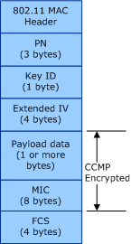

# AES-CCMP

**Important**  The [Native 802.11 Wireless LAN](native-802-11-wireless-lan4.md) interface is deprecated in Windows 10 and later. Please use the WLAN Device Driver Interface (WDI) instead. For more information about WDI, see [WLAN Universal Windows driver model](wifi-universal-driver-model.md).

 

The Advanced Encryption Standard (AES) encryption algorithm is defined in FIPS PUB 197. For the Wi-Fi Protected Access (WPA) and Robust Security Network Association (RSNA) authentication algorithms, the AES cipher suite uses the Counter-Mode Cipher Block Chaining (CBC) Message Authentication Code (MAC) Protocol (CCMP) as defined in IETF RFC 3610. For more information about AES-CCMP, refer to Clause 8.3.3 of the IEEE 802.11i-2004 standard.

AES is a block cipher that encrypts 128-bit blocks of data at a time with a 128-bit encryption key. CCMP produces a message integrity code (MIC) that provides data origin authentication and data integrity for the packet payload data. A packet number (PN) field, which is included in the CCMP header and incorporated into the encryption and MIC calculations, provides replay protection.

If the 802.11 station supports the 802.11i RSNA authentication algorithm, the station must support for the AES-CCMP cipher suite. For more information about this authentication algorithm, see [RSNA](rsna.md).

If the 802.11 station supports the WPA authentication algorithm, support the AES-CCMP cipher suite is optional. For more information about this authentication algorithm, see [WPA](wpa.md).

The AES-CCMP cipher suite uses a 128-bit key for encryption and decryption. An AES-CCMP key can be one of the following:

Pairwise key  
This key is used for all packets sent by the 802.11 station, including unicast, multicast, and broadcast packets. This key is also used for all unicast packets received by the station.

The 802.11 station must support at least one pairwise key. For the pairwise key, the station must use either a key at index 0 in the default key table or a key-mapping key indexed by the media access control (MAC) address of the access point (AP) or peer station.

Group key  
This key is used for all multicast and broadcast packets received by the 802.11 station.

Due to group key rotation, the 802.11 station must support at least two group keys. For the group keys, the station must use keys at index 1 through 3 in the default key table.

AES-CCMP keys are derived through a mutual pairwise master key (PMK) that can be statically defined (preshared) on the 802.11 station or dynamically defined through a port-based authentication algorithm, such as IEEE 802.1X. The PMK is verified between the 802.11 station and the access point (AP) or peer station during the association operation.

The 802.11 station uses the following key types for AES-CCMP cipher operations:

-   [Default Keys](default-keys.md)

-   [Key-Mapping Keys](key-mapping-keys.md)

-   [Per-Station Default Keys](per-station-default-keys.md)

**Note**  Per-station default keys are only supported in the Extensible Station (ExtSTA) operation mode and are only used when the 802.11 station connects to an independent basic service set (IBSS) network through the 802.11i RSNA authentication algorithm.

 

**Note**  IBSS (Ad hoc) and SoftAP are deprecated. Starting with Windows 8.1 and Windows Server 2012 R2, use [Wi-Fi Direct](wi-fi-direct-miniport-initialization-and-configuration.md).

 

The following figure illustrates the format of the 802.11 MAC protocol data unit (MPDU) frame encrypted through the AES-CCMP cipher.

The encrypted MPDU frame consists of the following:

Packet Number (PN)  
Contains bytes 1 through 0 of the AES-CCMP PN value, which is used for replay protection.

Key Identifier (ID)  
Bits 7 through 6 store the index of the key, within the default key table, that is used as the AES-CCMP key. Bit 5 is set to indicate the presence of the Extended IV field. Bits 4 through 0 are reserved and set to zero.

Extended IV  
Contains bytes 5 through 2 of the PN value.

Payload Data  
Data from the MAC service data unit (MSDU) packet.

MIC  
Unlike the TKIP cipher, AES-CCMP computes a MIC value over the payload data of the MPDU.

Frame Check Sequence (FCS)  
The IEEE 32-bit cyclic redundancy code (CRC) computed over all fields of the MPDU.

 

 

