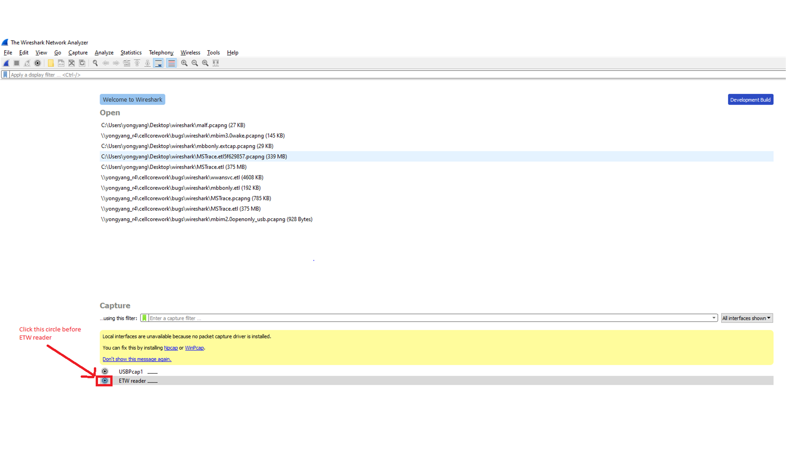

# Analyzing Mobile Broadband Logs in Wireshark

Follow these steps to diagnose the logs related to mobile broadband using Wireshark:

1. Launch the ETW (Event Tracing for Windows) reader.
   
   

2. Option A. Click the "…" button to choose an ETL file to decode. You can set filter parameters to only decode events from specific providers. Then click the Start button to decode the file.

   

   Option B. Start a live session instead of decoding the events from a file. Live sessions require an empty ETL file and you must specify filter parameters. Then click the Start button.

   

3. Wireshark will display the decoded ETW messages and MBIM messages from either a file or a live session. You may choose to filter relevant messages. The example below filters out the WWAN-SVC and MBIM messages. 

   

4. Select a specific message to see its details. 

    

The MBIM extended version used to decode the MBIM messages will be chosen automatically if MBIM_CID_VERSION is found. If MBIM_CID_VERSION is not found in an ETL file or live session, you can manually choose the MBIM extended version to decode the MBIM messages. Click Edit->Preferences…->Protocols->MBIM->Preferred MBIM Extended Version for decoding when MBIM_CID_VERSION not captured.

