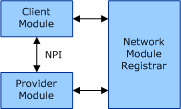

# Architecture overview for the Network Module Registrar

An overview of the basic architecture of the Network Module Registrar (NMR) is shown in the following diagram:

In this situation, there are two [network modules](network-module.md), a [client module](client-module.md) and a [provider module](provider-module.md). The client module and the provider module are respectively a client and a provider of the same [Network Programming Interface (NPI)](network-programming-interface.md). Each network module interacts directly with the NMR for the purpose of registration and deregistration, as well as attaching to, and detaching from, other network modules. The NMR will initiate attaching a client module to a provider module only if they both support the same NPI. After the client module and the provider module are attached to each other, they can interact with each other through their NPI functions independent of the NMR.

The following sections provide an overview of the process by which a client module and a provider module that both support a common NPI are attached and detached.

[Network Module Attachment](network-module-attachment.md)

[Network Module Detachment](network-module-detachment.md)

 

 

