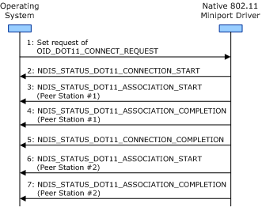
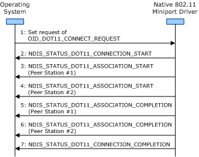

# Association Operation Guidelines for Independent BSS Networks

**Important**  The [Native 802.11 Wireless LAN](native-802-11-wireless-lan4.md) interface is deprecated in Windows 10 and later. Please use the WLAN Device Driver Interface (WDI) instead. For more information about WDI, see [WLAN Universal Windows driver model](wifi-universal-driver-model.md).

 

When associating with a peer station within an independent basic service set (IBSS) network, the miniport driver and 802.11 station must follow the general guidelines defined in [General Association Operation Guidelines](general-association-operation-guidelines.md).

**Note**  IBSS (Ad hoc) and SoftAP are deprecated. Starting with Windows 8.1 and Windows Server 2012 R2, use [Wi-Fi Direct](wi-fi-direct-miniport-initialization-and-configuration.md).

 

In addition, the miniport driver and 802.11 station must follow these guidelines when associating with a peer station:

1.  The method used by the 802.11 station for associating with peer stations within an IBSS network is specific to the implementation by the independent hardware vendor (IHV). Because the 802.11 authentication procedures (as specified in Clause 10.3 of the IEEE 802.11-2012 standard) are optional and association procedures are undefined for IBSS networks, the IHV can develop any algorithm used by a peer station to join an IBSS network.

    For example, the association operation can be initiated by an 802.11 Probe Request frame sent by the 802.11 station to a peer station it is attempting to associate with. In this situation, the association operation completes successfully if the 802.11 station receives an 802.11 Probe Response from the peer station.

2.  The miniport driver performs an association operation while it is performing either a connection or roaming operation. For more information about these operations, see [Connection Operations](connection-operations.md) and [Roaming Operations](roaming-operations.md).

    The miniport driver can perform association operations with all visible peer stations within the IBSS network before it completes the connection or roaming operation. Alternatively, the miniport driver can perform association operations with the other peer stations after the it completes the connection or roaming operation.

    **Note**  The miniport driver must successfully complete at least one association operation before it can complete the connection or roaming operation.

     

3.  After it completes the connection or roaming operation, the miniport driver performs an association operation with each peer station that joins the IBSS network.

    For example, the following figure shows the sequence of events where the miniport driver performs an association operation with peer stations before and after the connection operation.

    

4.  When associating to multiple peer stations within an IBSS network, the miniport driver can initiate another association operation with one peer station before it completes the association operation with another. In this situation, the miniport driver can make another [NDIS\_STATUS\_DOT11\_ASSOCIATION\_START](https://msdn.microsoft.com/library/windows/hardware/ff567321) indication before it makes an [NDIS\_STATUS\_DOT11\_ASSOCIATION\_COMPLETION](https://msdn.microsoft.com/library/windows/hardware/ff567319) indication.

    For example, the following figure shows the sequence of events when the miniport driver overlaps the association operation with two peer stations during the connection operation.

    

 

 

