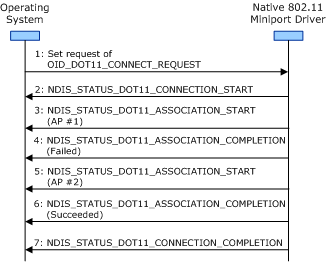

# Association Operation Guidelines for Infrastructure BSS Networks

**Important**  The [Native 802.11 Wireless LAN](native-802-11-wireless-lan4.md) interface is deprecated in Windows 10 and later. Please use the WLAN Device Driver Interface (WDI) instead. For more information about WDI, see [WLAN Universal Windows driver model](wifi-universal-driver-model.md).

 

When associating with an access point (AP) within an infrastructure basic service set (BSS) network, the miniport driver and 802.11 station must follow the general guidelines defined in [General Association Operation Guidelines](general-association-operation-guidelines.md).

In addition, the miniport driver and 802.11 station must follow these guidelines when associating with an AP:

1.  The miniport driver can only perform the association operation while it is performing either a connection or roaming operation. For more information about these operations, see [Connection Operations](connection-operations.md) and [Roaming Operations](roaming-operations.md).

2.  The 802.11 station must successfully associate with no more than one access point (AP) during the connection or roaming operation. The miniport driver must complete the connection or roaming operation after the 802.11 station successfully associates with one AP within the infrastructure BSS network.

3.  If the 802.11 station fails to associate with one AP, the miniport driver must first make an [NDIS\_STATUS\_DOT11\_ASSOCIATION\_COMPLETION](https://msdn.microsoft.com/library/windows/hardware/ff567319) indication before it can initiate another association operation with another AP in the BSS network.

The following figure shows the sequence of events where the miniport driver first performs a failed association operation and then a successful one with two APs in an infrastructure network during the connection operation.

 

 

