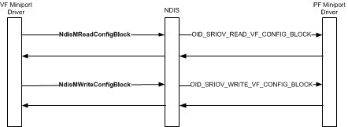

# Backchannel Communication from a VF Miniport Driver

A miniport driver of a PCI Express (PCIe) Virtual Function (VF) communicates with the miniport driver of the PCIe Physical Function (PF) to read or write data from a VF configuration block.

A VF configuration block is used for backchannel communication between the PF and VF miniport drivers. The independent hardware vendor (IHV) can define one or more VF configuration blocks for the device. Each VF configuration block has an IHV-defined format, length, and block ID. For example, the IHV can define a VF configuration block that can be used for the media access control (MAC) address of the VF miniport driver. Another VF configuration block can be used for the current VF and virtual port (VPort) configuration.

**Note**  Data from each VF configuration block is used only by the PF and VF miniport drivers. The format and content of this data is opaque to components of the Windows operating system.

 

Each VF configuration block is assigned a unique identifier by the IHV. This allows the VF miniport driver to query or set information on specific VF configuration blocks.

VF miniport drivers initiate the read or write operation on a specified VF configuration block through the following functions:

-   [**NdisMReadConfigBlock**](/windows-hardware/drivers/ddi/ndis/nf-ndis-ndismreadconfigblock), which reads data from a specified VF configuration block. When the VF miniport driver calls this function, it specifies the block identifier and length of the data to be read. The driver also passes a pointer to the buffer that will contain the requested data.

-   [**NdisMWriteConfigBlock**](/windows-hardware/drivers/ddi/ndis/nf-ndis-ndismreadconfigblock), which writes data to a specified VF configuration block. When the VF miniport driver calls this function, it specifies the block identifier and length of the data to be written. The driver also passes a pointer to the buffer from which the data is to be written.

The PF miniport driver manages access to the specified VF configuration block in the following ways:

-   When the VF miniport driver calls [**NdisMReadConfigBlock**](/windows-hardware/drivers/ddi/ndis/nf-ndis-ndismreadconfigblock), NDIS issues an object identifier (OID) method request of [OID\_SRIOV\_READ\_VF\_CONFIG\_BLOCK](./oid-sriov-read-vf-config-block.md) to the PF miniport driver. This OID request contains the parameter data that was passed by the VF miniport driver in the function call.

    The PF miniport driver performs the read operation and returns the requested data when the driver completes the OID request. After the OID request is completed, NDIS returns from the call to [**NdisMReadConfigBlock**](/windows-hardware/drivers/ddi/ndis/nf-ndis-ndismreadconfigblock).

-   When the VF miniport driver calls [**NdisMWriteConfigBlock**](/windows-hardware/drivers/ddi/ndis/nf-ndis-ndismreadconfigblock), NDIS issues an OID method request of [OID\_SRIOV\_WRITE\_VF\_CONFIG\_BLOCK](./oid-sriov-write-vf-config-block.md) to the PF miniport driver. This OID request contains the parameter data that was passed by the VF miniport driver in the function call.

    The PF miniport driver performs the write operation and completes the OID request. After the OID request is completed, NDIS returns from the call to [**NdisMWriteConfigBlock**](/windows-hardware/drivers/ddi/ndis/nf-ndis-ndismreadconfigblock).

The following figure shows the process involved in reading and writing VF configuration blocks over the SR-IOV backchannel interface.

 

