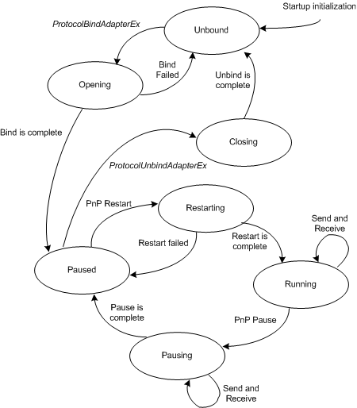

# Binding States of a Protocol Driver

An [NDIS protocol driver](ndis-protocol-drivers2.md) must support the following operational states for each binding that the driver manages:

-   Unbound

-   Opening

-   Running

-   Closing

-   Pausing

-   Paused

-   Restarting

The following figures shows the relationship between these states.

The following defines the protocol driver binding states:

Unbound  
The *Unbound* state is the initial state of a binding. In this state, the protocol driver waits for NDIS to call the [*ProtocolBindAdapterEx*](https://msdn.microsoft.com/library/windows/hardware/ff570220) function. After NDIS calls *ProtocolBindAdapterEx*, the binding enters the Opening state. After an unbind operation is complete, a binding returns to the Unbound state from the Closing state.

Opening  
In the *Opening* state, a protocol driver allocates resources for the binding and attempts to open the miniport adapter. After NDIS calls the driver's *ProtocolBindAdapterEx* function, the binding enters the Opening state. If the protocol driver fails to bind to the miniport adapter, the binding returns to the Unbound state. If the driver successfully binds to the miniport adapter, the binding enters the Paused state.

Running  
In the *Running* state, a protocol driver performs normal send and receive processing for a binding. When the binding is in the Restarting state and the driver is ready to perform send and receive operations, the binding enters the Running state.

Closing  
In the *Closing* state, the protocol driver closes the binding to the miniport adapter and then releases the resources for the binding. After NDIS calls the protocol driver's [*ProtocolUnbindAdapterEx*](https://msdn.microsoft.com/library/windows/hardware/ff570278) function, the binding enters the Closing state. After the protocol driver completes the unbind operations, the binding enters the Unbound state.

Pausing  
In the *Pausing* state, a protocol driver completes any operations that are required to stop send and receive operations for a binding. When a binding is in the Running state and NDIS sends the protocol driver a PnP pause notification, the binding enters the Pausing state. The protocol driver must wait for all its outstanding send request to complete. A protocol driver cannot fail a pause operation. After the pause operation is complete, the binding enters the Paused state.

Paused  
In the *Paused* state, the protocol driver does not perform send or receive operations for a binding. When a binding is in the Pausing state and a pause operation is complete, the binding enters the Paused state. When a binding is in the Opening state and a open operation completes successfully, the binding enters the Paused state. If NDIS sends the protocol driver a PnP restart notification for the binding, the binding enters the Restarting state. If NDIS calls the driver's [*ProtocolUnbindAdapterEx*](https://msdn.microsoft.com/library/windows/hardware/ff570278) function, the binding enters the Closing state.

Restarting  
In the *Restarting* state, a protocol driver completes any operations that are required to restart send and receive operations for a binding. When a binding is in the Paused state and NDIS sends the protocol driver a PnP restart notification, the binding enters the Restarting state. If the restart fails, the binding returns to the Paused state. If the restart is successful, the binding enters the Running state.

## Related topics

[Driver Stack Management](driver-stack-management.md)

[NDIS Protocol Drivers](ndis-protocol-drivers2.md)

 

 

