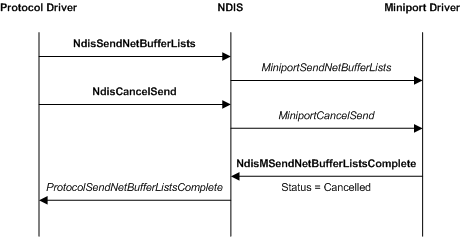

# Canceling a Send Operation

The following figure illustrates canceling a send operation.

A driver calls the [**NDIS\_SET\_NET\_BUFFER\_LIST\_CANCEL\_ID**](/windows-hardware/drivers/ddi/ndis/nf-ndis-ndis_set_net_buffer_list_cancel_id) macro for each [**NET\_BUFFER\_LIST**](/windows-hardware/drivers/ddi/nbl/ns-nbl-net_buffer_list) structure that it passes to lower-level drivers for transmission. The NDIS\_SET\_NET\_BUFFER\_LIST\_CANCEL\_ID function marks the specified packet with a cancellation identifier.

Before assigning cancellation IDs to packets, a driver should call [**NdisGeneratePartialCancelId**](/windows-hardware/drivers/ddi/ndis/nf-ndis-ndisgeneratepartialcancelid) to obtain the high-order byte of each cancellation ID that it assigns. This ensures that the driver does not duplicate cancellation IDs assigned by other drivers in the system. Drivers typically call **NdisGeneratePartialCancelId** once from the **DriverEntry** routine; however, drivers can obtain more than one partial cancellation identifier by calling **NdisGeneratePartialCancelId** more than once.

To cancel the pending transmission of data in a marked NET\_BUFFER\_LIST structure, a driver passes the cancellation ID to the [**NdisCancelSendNetBufferLists**](/windows-hardware/drivers/ddi/ndis/nf-ndis-ndiscancelsendnetbufferlists) function. Drivers can obtain a NET\_BUFFER\_LIST structure's cancellation ID by calling the [**NDIS\_GET\_NET\_BUFFER\_LIST\_CANCEL\_ID**](/windows-hardware/drivers/ddi/ndis/nf-ndis-ndis_get_net_buffer_list_cancel_id) macro.

If a driver marks all [**NET\_BUFFER\_LIST**](/windows-hardware/drivers/ddi/nbl/ns-nbl-net_buffer_list) structures with the same cancellation identifier, it can cancel all pending transmissions with a single call to **NdisCancelSendNetBufferLists**. If a driver marks all NET\_BUFFER\_LIST structures within a subgroup of NET\_BUFFER\_LIST structures with a unique identifier, it can cancel all pending transmissions within that subgroup with a single call to **NdisCancelSendNetBufferLists**.

NDIS calls the [*MiniportCancelSend*](/windows-hardware/drivers/ddi/ndis/nc-ndis-miniport_cancel_send) function of the appropriate lower-level driver on the binding. After aborting the pending transmission, the underlying miniport driver calls the [**NdisMSendNetBufferListsComplete**](/windows-hardware/drivers/ddi/ndis/nf-ndis-ndismsendnetbufferlistscomplete) function, to return the NET\_BUFFER\_LIST structures and a completion status of NDIS\_STATUS\_SEND\_ABORTED. NDIS, in turn, calls the appropriate driver's [**ProtocolSendNetBufferListsComplete**](/windows-hardware/drivers/ddi/ndis/nc-ndis-protocol_send_net_buffer_lists_complete) function.

In its *ProtocolSendNetBufferListsComplete* function, a protocol driver can call NDIS\_SET\_NET\_BUFFER\_LIST\_CANCEL\_ID with *CancelId* set to **NULL**. This prevents the NET\_BUFFER\_LIST from inadvertently being used again with a stale cancellation ID.

 

