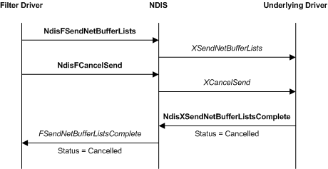
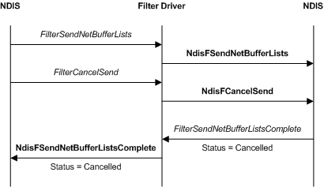

# Canceling a Send Request in a Filter Driver

Filter drivers can cancel send requests that were originated by the filter driver or that were originated by overlying drivers.

### Canceling Filter Driver Send Requests

The following figure illustrates canceling a send request that was originated by a filter driver.

A filter driver calls the [**NDIS\_SET\_NET\_BUFFER\_LIST\_CANCEL\_ID**](https://msdn.microsoft.com/library/windows/hardware/ff567299) macro for each [**NET\_BUFFER\_LIST**](https://msdn.microsoft.com/library/windows/hardware/ff568388) structure that it creates for send operations. The NDIS\_SET\_NET\_BUFFER\_LIST\_CANCEL\_ID function marks the specified data with a cancellation identifier.

Before assigning cancellation IDs to network data, a filter driver must call [**NdisGeneratePartialCancelId**](https://msdn.microsoft.com/library/windows/hardware/ff562623) to obtain the high-order byte of each cancellation ID that it assigns. This ensures that the driver does not duplicate cancellation IDs assigned by other drivers in the system. Drivers typically call **NdisGeneratePartialCancelId** one time from the [**DriverEntry**](https://msdn.microsoft.com/library/windows/hardware/ff544113) routine. However, drivers can obtain more than one partial cancellation identifier by calling **NdisGeneratePartialCancelId** multiple times.

To cancel the pending transmission of data in a marked NET\_BUFFER\_LIST structure, a filter driver passes the cancellation ID to the [**NdisFCancelSendNetBufferLists**](https://msdn.microsoft.com/library/windows/hardware/ff561794) function. Drivers can obtain a NET\_BUFFER\_LIST structure's cancellation ID by calling the [**NDIS\_GET\_NET\_BUFFER\_LIST\_CANCEL\_ID**](https://msdn.microsoft.com/library/windows/hardware/ff565683) macro.

If a filter driver marks all NET\_BUFFER\_LIST structures with the same cancellation identifier, it can cancel all pending transmissions with a single call to **NdisFCancelSendNetBufferLists**. If a filter driver marks all NET\_BUFFER\_LIST structures within a subgroup of NET\_BUFFER\_LIST structures with a unique identifier, it can cancel all pending transmissions within that subgroup with a single call to **NdisFCancelSendNetBufferLists**.

NDIS calls the cancel send function of the underlying drivers. After aborting the pending transmission, the underlying drivers call a send complete function (for example [**NdisMSendNetBufferListsComplete**](https://msdn.microsoft.com/library/windows/hardware/ff563668)) to return the NET\_BUFFER\_LIST structures with a completion status of NDIS\_STATUS\_SEND\_ABORTED. NDIS, in turn, calls the filter driver's [*FilterSendNetBufferListsComplete*](https://msdn.microsoft.com/library/windows/hardware/ff549967) function.

In *FilterSendNetBufferListsComplete*, a filter driver can call NDIS\_SET\_NET\_BUFFER\_LIST\_CANCEL\_ID with *CancelId* set to **NULL**. This prevents the NET\_BUFFER\_LIST from accidentally being used again with a stale cancellation ID.

### Canceling Send Requests Originated by Overlying Drivers

The following figure illustrates canceling a send request that was originated by an overlying driver.

Overlying drivers call a cancel send function ( [**NdisFCancelSendNetBufferLists**](https://msdn.microsoft.com/library/windows/hardware/ff561794) or [**NdisCancelSendNetBufferLists**](https://msdn.microsoft.com/library/windows/hardware/ff561623)) to cancel outstanding send requests. These overlying drivers must mark the send data with a cancellation ID before making a send request.

NDIS calls a filter driver's [*FilterCancelSendNetBufferLists*](https://msdn.microsoft.com/library/windows/hardware/ff549915) function to cancel the transmission of all [**NET\_BUFFER\_LIST**](https://msdn.microsoft.com/library/windows/hardware/ff568388) structures that are marked with a specified cancellation identifier.

*FilterCancelSendNetBufferLists* performs the following operations:

1.  Traverses the filter driver's list of queued NET\_BUFFER\_LIST structures for the specified filter module and calls the [**NDIS\_GET\_NET\_BUFFER\_LIST\_CANCEL\_ID**](https://msdn.microsoft.com/library/windows/hardware/ff565683) macro to obtain the cancellation identifier for each structure. The filter driver compares the cancellation ID that NDIS\_GET\_NET\_BUFFER\_LIST\_CANCEL\_ID returns with the cancellation ID that NDIS passed to *FilterCancelSendNetBufferLists*.

2.  Removes from the send queue (unlinks) all NET\_BUFFER\_LIST structures whose cancellation identifiers match the specified cancellation identifier.

3.  Calls the [**NdisFSendNetBufferListsComplete**](https://msdn.microsoft.com/library/windows/hardware/ff562618) function for all unlinked NET\_BUFFER\_LIST structures to return the structures. The filter driver sets the status field of the NET\_BUFFER\_LIST structures to NDIS\_STATUS\_SEND\_ABORTED.

4.  Calls the **NdisFCancelSendNetBufferLists** function to pass the cancel send request to underlying drivers. The filter driver passes on the cancellation identifier that it received from the overlying driver. The cancel operation proceeds as with a filter-driver-originated cancel send operation.

 

 

