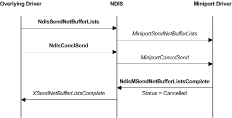

# Canceling a Send Request in a Miniport Driver

The following figure illustrates a miniport driver cancel send operation.

Protocol, filter, and intermediate drivers can call [**NdisCancelSendNetBufferLists**](https://msdn.microsoft.com/library/windows/hardware/ff561623) to cancel outstanding send requests. These overlying drivers must mark the send data with a cancellation ID before making a send request.

NDIS calls a miniport driver's [*MiniportCancelSend*](https://msdn.microsoft.com/library/windows/hardware/ff559342) function to cancel the transmission of all [**NET\_BUFFER\_LIST**](https://msdn.microsoft.com/library/windows/hardware/ff568388) structures that are marked with a specified cancellation identifier.

A miniport driver's *MiniportCancelSend* function performs the following operations:

1.  Traverses its list of outstanding send requests for the specified adapter and calls [**NDIS\_GET\_NET\_BUFFER\_LIST\_CANCEL\_ID**](https://msdn.microsoft.com/library/windows/hardware/ff565683) to obtain the cancellation identifier for each NET\_BUFFER\_LIST structure. The miniport driver compares the cancellation ID that NDIS\_GET\_NET\_BUFFER\_LIST\_CANCEL\_ID returns with the cancellation ID that NDIS passed to *MiniportCancelSend*.

2.  Removes from all NET\_BUFFER\_LIST structures whose cancellation identifiers match the specified cancellation identifier from its list of outstanding send requests.

3.  Calls the [**NdisMSendNetBufferListsComplete**](https://msdn.microsoft.com/library/windows/hardware/ff563668) function for all canceled NET\_BUFFER\_LIST structures to return the structures.The miniport driver sets the status field of the NET\_BUFFER\_LIST structures to NDIS\_STATUS\_SEND\_ABORTED.

 

 

