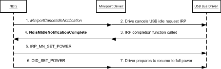
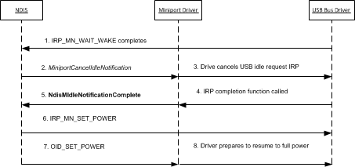

# Canceling the NDIS Selective Suspend Idle Notification

If the network adapter becomes inactive for an idle time-out period, NDIS starts the selective suspend operation. Through this operation, the network adapter is transitioned to a low-power state. NDIS begins this operation by issuing an idle notification to the miniport driver. For more information about this operation, see [Handling the NDIS Selective Suspend Idle Notification](handling-the-ndis-selective-suspend-idle-notification.md).

NDIS calls the [*MiniportIdleNotification*](https://msdn.microsoft.com/library/windows/hardware/hh464092) handler function to notify the driver that the underlying network adapter seems to be idle. After the idle notification is issued, NDIS cancels a pending idle notification if one or more of the following conditions are true:

-   An overlying protocol or filter driver issues either a send packet request or an object identifier (OID) request to the miniport driver.

    For more information about how NDIS cancels the idle notification for this scenario, see [Canceling the Idle Notification because of Overlying Driver Activity](#canceling-the-idle-notification-because-of-overlying-driver-activity).

-   The underlying adapter signals a wake-up event, such as receiving a packet or detecting a change in its media connection status.

    For more information about how NDIS cancels the idle notification for this scenario, see [Canceling the Idle Notification because of Wake-up Events](#canceling-the-idle-notification-because-of-wake-up-events).

NDIS cancels the idle notification by calling the [*MiniportCancelIdleNotification*](https://msdn.microsoft.com/library/windows/hardware/hh464088) handler function of the underlying miniport driver. When this function is called, the miniport driver must complete the idle notification to resume the adapter to a full-power state. For guidelines on this process, see [Completing the NDIS Selective Suspend Idle Notification](completing-the-ndis-selective-suspend-idle-notification.md).

For more information about how to implement the [*MiniportCancelIdleNotification*](https://msdn.microsoft.com/library/windows/hardware/hh464088) handler function, see [Implementing a *MiniportCancelIdleNotification* Handler Function](implementing-a-miniportcancelidlenotification-handler-function.md).

## Canceling the Idle Notification Because of Overlying Driver Activity

NDIS monitors send requests and OID requests that are issued to a miniport driver whose network adapter has been suspended and is in a low-power state. When this happens, NDIS cancels the outstanding idle notification so that the network adapter can resume to a full-power state.

NDIS and the miniport driver follow these steps when an idle notification is canceled:

1.  NDIS calls the [*MiniportCancelIdleNotification*](https://msdn.microsoft.com/library/windows/hardware/hh464088) handler function to cancel an outstanding idle notification. When this handler function is called, the miniport driver must cancel any bus-specific I/O request packets (IRPs) that it may have previously issued for the idle notification.

    For example, when [*MiniportCancelIdleNotification*](https://msdn.microsoft.com/library/windows/hardware/hh464088) is called, the miniport for a USB network adapter performs the following steps:

    1.  The miniport driver cancels the pending USB idle request ([**IOCTL\_INTERNAL\_USB\_SUBMIT\_IDLE\_NOTIFICATION**](https://msdn.microsoft.com/library/windows/hardware/ff537270)) IRP. The miniport driver previously issued this IRP to the underlying USB bus driver when NDIS called the driver's [*MiniportIdleNotification*](https://msdn.microsoft.com/library/windows/hardware/hh464092) function. The miniport driver cancels this IRP by calling [**IoCancelIrp**](https://msdn.microsoft.com/library/windows/hardware/ff548338).

    2.  When the bus driver cancels the USB idle request IRP, it calls the miniport driver's completion routine for the IRP. This call notifies the driver that the IRP is completed and the network adapter can transition to a full-power state. From the context of the completion routine, the driver calls [**NdisMIdleNotificationComplete**](https://msdn.microsoft.com/library/windows/hardware/hh451491) to notify NDIS that the network adapter can be transitioned to a full-power state.

    **Note**  Depending on the dependencies for canceling bus-specific idle requests, the miniport driver calls [**NdisMIdleNotificationComplete**](https://msdn.microsoft.com/library/windows/hardware/hh451491) either synchronously in the context of the call to [*MiniportCancelIdleNotification*](https://msdn.microsoft.com/library/windows/hardware/hh464088) or asynchronously after *MiniportCancelIdleNotification* returns.

    For more information about how to implement a USB idle request IRP completion routine, see [Implementing a USB Idle Request IRP Completion Routine](implementing-a-usb-idle-request-irp-completion-routine.md).

2.  After the miniport driver cancels any bus-specific IRPs for the idle notification, it calls [**NdisMIdleNotificationComplete**](https://msdn.microsoft.com/library/windows/hardware/hh451491). This call notifies NDIS that the idle notification has been completed. NDIS then completes the selective suspend operation by transitioning the network adapter to a full-power state.

    When [**NdisMIdleNotificationComplete**](https://msdn.microsoft.com/library/windows/hardware/hh451491) is called, NDIS performs the following steps:

    1.  NDIS issues [**IRP\_MN\_SET\_POWER**](https://msdn.microsoft.com/library/windows/hardware/ff551744) to the underlying bus driver. This IRP requests the bus driver to set the power state of the network adapter to PowerDeviceD0.

    2.  NDIS issues an OID set request of [OID\_PNP\_SET\_POWER](https://msdn.microsoft.com/library/windows/hardware/ff569780) to the miniport driver. In this OID request, NDIS specifies that the network adapter is now transitioning to a full-power state of NdisDeviceStateD0.

        When it handles this OID set request, the driver prepares the adapter for full- power operation. This includes restoring the receive and send engines to the same state they were in before the transition to the low-power state. The driver then completes the OID request with NDIS\_STATUS\_SUCCESS.

The following figure shows the steps that are involved when NDIS cancels an idle notification that was issued to a miniport driver for a USB network adapter.

## Canceling the Idle Notification Because of Wake-up Events

Before the network adapter is transitioned to a low-power state, NDIS issues an OID set request of [OID\_PM\_PARAMETERS](https://msdn.microsoft.com/library/windows/hardware/ff569768) to the network adapter. This OID request specifies the types of wake-up events that the adapter can signal to resume to a full-power state. For NDIS selective suspend, the adapter is configured to signal any of the following wake-up events:

-   The reception of a packet that matches a filter that was previously configured through an OID set request of [OID\_PM\_ADD\_WOL\_PATTERN](https://msdn.microsoft.com/library/windows/hardware/ff569764) or [OID\_GEN\_CURRENT\_PACKET\_FILTER](https://msdn.microsoft.com/library/windows/hardware/ff569575).

-   A change in the media connection status on the adapter.

NDIS and the miniport driver follow these steps when NDIS cancels an idle notification because of a wake-up signal generated by the network adapter:

1.  The bus driver completes the [**IRP\_MN\_WAIT\_WAKE**](https://msdn.microsoft.com/library/windows/hardware/ff551766) that was issued by NDIS before transitioning the adapter to a low-power state. By completing the IRP, the bus driver notifies NDIS that the network adapter has generated a wake-up signal.

2.  NDIS calls the [*MiniportCancelIdleNotification*](https://msdn.microsoft.com/library/windows/hardware/hh464088) handler function to start the operation of canceling the idle notification. The steps that are involved in this operation are the same as described in [Canceling the Idle Notification because of Overlying Driver Activity](#cancel-due-to-driver-activity).

For example, the following figure shows the steps that are involved when NDIS cancels an idle notification because of a wake-up event signaled by a USB network adapter.

