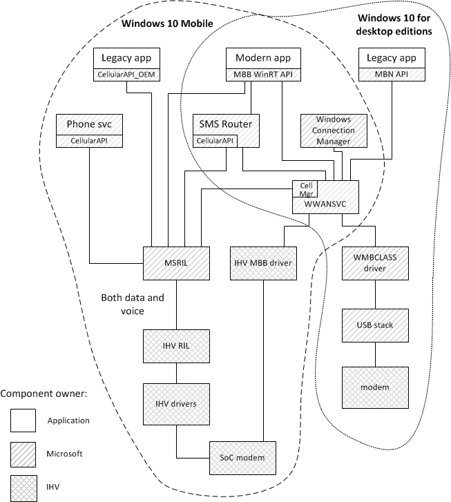
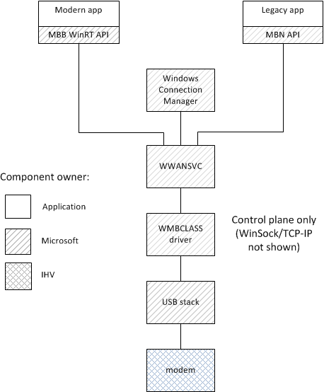
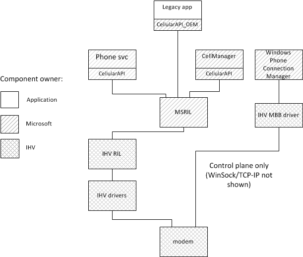

# Cellular architecture and implementation

The cellular architecture for Windows 10 contains elements from both Windows 8.1 and Windows Phone 8.1. Below are the Windows 8.1 and Windows Phone 8.1 cellular architecture diagrams for comparison, along with the new Windows 10 architecture diagram and the cellular components that must be implemented.

## Windows 10 architecture:

## Windows 10 cellular implementation requirements

For Windows 10, the cellular components that must be implemented depend upon whether the device uses Windows 10 for desktop editions or Windows 10 Mobile.

For Windows 10 for desktop editions, the following is required.

-   Implement the MBIM protocol interface in your modem hardware.
-   Implement a USB interface to the modem hardware. It could be a removable USB dongle or another interface that presents itself as a USB host controller.

For Windows 10 Mobile, the following is required:

- Implement an IHV RIL (Radio Interface Layer) and Mobile Broadband NDIS driver for your modem hardware.
  ## Windows 8.1 architecture:

## Windows Phone 8.1 architecture:

## Related topics

[Mobile Broadband (MB) Design Guide](mobile-broadband--mb--design-guide.md)

 

 

