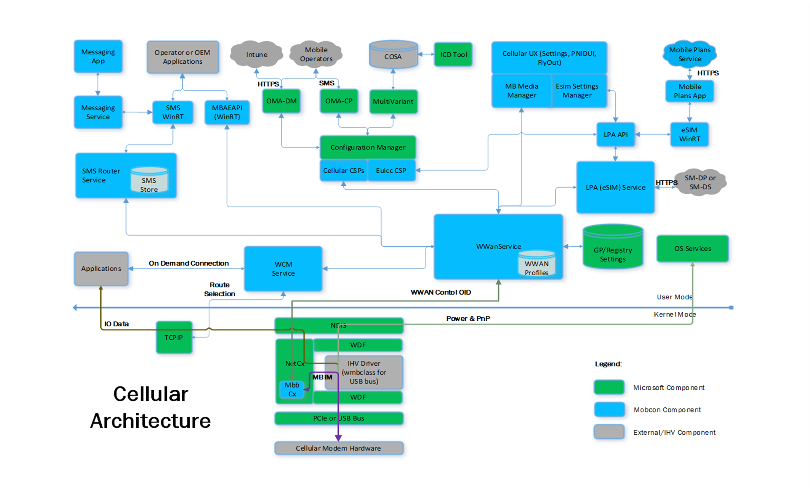

# Cellular architecture

This section describes the elements of the cellular architecture for Windows 10 and how they interact. It also includes the implementation requirements for making cellular modem hardware compatible with Windows 10.

## Windows 10 cellular architecture

The following describes the elements shown in the Windows 10 cellular architecture:

### User Mode ​

**WWAN Service and MBAE WinRT API** 

The Wireless Wide Area Network Service (WwanSvc) is responsible for handling modem initialization, registration, power state changes, and automatic and manual connection for default and on-demand cellular connection. WWAN Service also handles the modem access interface for SAR, PCO, Scan, SMS, USSD, LTE configuration, SIM File, SIM PIN, and low level SIM card access. The Mobile Broadband Account Experience Windows Runtime (MBAE WinRT) API allows programmatic access to these interfaces for original equipment manufacturer (OEM)/Mobile Operator (MO) applications.​

**WCM Service** 

The Windows Connection Manager (WCM) Service controls L3 connectivity and dynamically selects which specific L2 media (Ethernet, Wi-Fi, or Cellular) should be connected or disconnected at any given time.​

**SMS Router Service and SMS WinRT API**
 
The SMS Router Service is responsible for decoding the SMS Packet Data Unit (PDU) and routing SMS messages to associated applications. The SMS WinRT API allows applications to subscribe to SMS messages and launch when the matching messages are received. Apps can also send SMS messages. The SMS messages are temporarily stored for concatenation while decoding the messages and for reliable delivery to services and applications.​

**Messaging Service and Messaging App**

The messaging service stores user text messages for persistent access and the application displays the messages to users.​

**LPA (eSIM) Service and eSIM WinRT API**

The Local Profile Assistant (LPA) Service implements GSMA specification for remote SIM profile management by interacting with the Subscription Manager – Device Provisioning server (SM-DP+) to download eSIM profiles for the user. The WinRT API allows accessing eSIM profiles, enabling, disabling, and deleting profiles, and sending low level Application Protocol Data Unit (APDU) for firmware update via smartcard interface.​

**Cellular CSPs**

Cellular Configuration Service Providers (CSPs) allow configuration management through Intune (Enterprise), Multivariant, and Open Mobile Alliance – Device Management and Client Provisioning (OMA-DM/CP). Enterprise uses EnterpriseAPN, eUICC, and MultiSIM CSPs to override the APN connectivity settings, download and activate eSIM profiles, and switch to preferred SIM slot. CM CellularEntries CSP is used to configure the default connectivity for the modem. Cellular Settings CSP is used to control roaming and automatic connection configurations. CSPLte is used for Verizon-specific configurations.​

**Mobile Plans Service and Mobile Plans App**

The mobile plans service and application offers users a simplified mechanism to purchase and install eSIM profiles.

**Cellular UX**

Cellular UX is a settings application and VANUI network flyout that allows users to view and control the cellular settings, control connectivity, and change radio state. PNIDUI shows the default network connection and signal bars for the network. Quick actions and airplane mode controls allow radio state control. ​

**COSA/MultiVariant Service**

Country & Operator Settings Asset (COSA) is an OEM configurable database with settings that are applied through the MultiVariant service that are specific to the SIM inserted by the user. ​

### Kernel Mode​

**NDIS**

[Network Driver Interface Specification (NDIS)](ndis-drivers.md) is a driver model that abstracts network hardware from network drivers and specifies a standard interface between layered network drivers.​

**NetCx**

[Network Adapter WDF Class Extension (NetAdapterCx)](../netcx/index.md) is a driver model that enables you to write a KMDF-based client driver for a Network Interface Controller (NIC). NetAdapterCx gives you the power and flexibility of WDF and the networking performance of NDIS, and makes it easy to write a NIC driver.

**MBBCx**

[Mobile Broadband WDF Class Extension (MBBCx)](../netcx/mobile-broadband-mbb-wdf-class-extension-mbbcx.md) extends the NetAdatperCx Driver Framework with cellular-specific functionalities, and implementing the "upper edge" which is common across different modems. MbbCx handles the control OIDs from NDIS and converts them to MBIM commands for the IHV driver.​

**IHV Driver (wmbclass)**

The IHV-implemented "lower edge" cellular device driver implements all of the adapter-specific cellular driver functionalities that are specified by MBIM. For USB based modems, the interfaces are standardized and handled by the inbox wmbclass driver. For PCIe cellular modem devices, the IHV vendors are expected to provide an IHV client driver that translates the MBIM commands to be transmitted over the PCIe bus. ​

### MBB and MBIM Driver Interactions

## Windows 10 cellular implementation requirements

For Windows 10, the following is required.

-   Implement the MBIM protocol interface in your modem hardware.
-   Implement a USB interface to the modem hardware. This can be a removable USB dongle or another interface that presents itself as a USB host controller.

 

 

