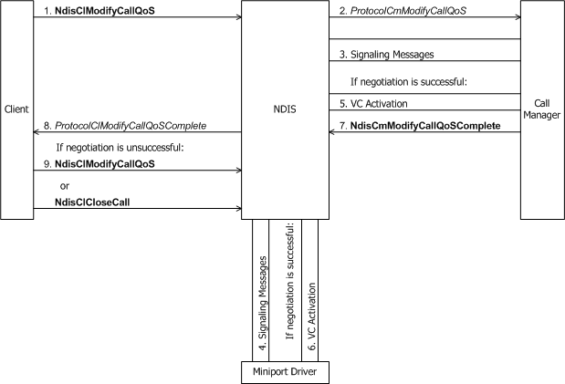
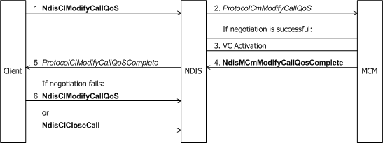

# Client-Initiated Request to Change Call Parameters

A client requests a change in quality of service (QoS) on an active virtual connection (VC) with [**NdisClModifyCallQoS**](https://msdn.microsoft.com/library/windows/hardware/ff561636).

The following figure shows the client of a call manager requesting a change in quality of service.

The following figure shows the client of an MCM driver requesting a change in quality of service.

In the call to **NdisClModifyCallQoS**, the client supplies:

-   An *NdisVcHandle* parameter that identifies the VC.

-   A pointer to a [**CO\_CALL\_PARAMETERS**](https://msdn.microsoft.com/library/windows/hardware/ff545384) structure that contains the call parameters the client is requesting.

The circumstances under which a client can request a change in QoS are determined by the signaling protocol.

The call to **NdisClModifyCallQoS** causes NDIS to call the call manager's or MCM driver's [**ProtocolCmModifyCallQoS**](https://msdn.microsoft.com/library/windows/hardware/ff570247) function, which inputs the *NdisVcHandle* and buffered CO\_CALL\_PARAMETERS structure that the client passes to **NdisClModifyCallQoS**. **ProtocolCmModifyQoS** communicates with network control devices or other media-specific agents, as necessitated by its media, to modify the media-specific call parameters for an established virtual connection.

After communicating with the network and determining that the changes were successful, a call manager must call [**NdisCmActivateVc**](https://msdn.microsoft.com/library/windows/hardware/ff561649)(and an MCM driver must call [**NdisMCmActivateVc**](https://msdn.microsoft.com/library/windows/hardware/ff562792)) to activate the specified VC with the new call parameters.

If the network does not accept the new call parameters or if the underlying miniport driver cannot accept the parameters, the call manager or MCM driver must restore the VC to the state that existed before any modifications were attempted, and return NDIS\_STATUS\_FAILURE.

To indicate the status of the client's request to change QoS, a call manager calls [**NdisCmModifyCallQoSComplete**](https://msdn.microsoft.com/library/windows/hardware/ff561679), and an MCM driver calls [**NdisMCmModifyCallQoSComplete**](https://msdn.microsoft.com/library/windows/hardware/ff563545). In this call, the call manager or MCM driver passes:

-   An NDIS\_STATUS that indicates the status of the request.

-   An *NdisVcHandle* that identifies the VC.

-   A pointer to a CO\_CALL\_PARAMETERS structure that contains the call parameters for the VC.

If allowed by the signaling protocol, the call manager or MCM driver can pass modified call parameters back to the client. These modifications can be the product of negotiation with the network or they can be supplied by the call manager or MCM driver itself. A call manager or MCM driver should indicate that the call parameters have been modified by setting the CALL\_PARAMETERS\_CHANGED flag in the CO\_CALL\_PARAMETERS structure.

The call to **Ndis(M)CmModifyCallQoSComplete** causes NDIS to call the client's [**ProtocolClModifyCallQoSComplete**](https://msdn.microsoft.com/library/windows/hardware/ff570233) function. NDIS passes the following to *ProtocolClModifyCallQoSComplete*:

-   An NDIS\_STATUS that indicates the status of the client's request to change the QoS.

-   A *ProtocolVcContext* handle that identifies the VC.

-   A pointer to a CO\_CALL\_PARAMETERS structure that contains the call parameters that are passed by the call manager or MCM driver to **Ndis(M)CmModifyCallQoSComplete**.

If the CALL\_PARAMETERS\_CHANGED flag is set in the CO\_CALL\_PARAMETERS structure, the client must examine the returned call parameters and determine whether the modifications are acceptable. If the client's call to **NdisClModifyCallQoS** succeeds, *ProtocolClModifyCallQoSComplete* can accept the QoS change by simply returning control. Otherwise, *ProtocolClModifyCallQoSComplete* can engage in further negotiation with the call manager if allowed by the signaling protocol and as long as the client's developer places some reasonable limit on the number of possible renegotiations. Alternatively, *ProtocolClModifyCallQoSComplete* can simply tear down the call with [**NdisClCloseCall**](https://msdn.microsoft.com/library/windows/hardware/ff561627)(see [Client-Initiated Request to Close a Call](client-initiated-request-to-close-a-call.md)) whenever the call manager rejects a request to change the QoS and the previously established QoS has become unacceptable to the client.

 

 

