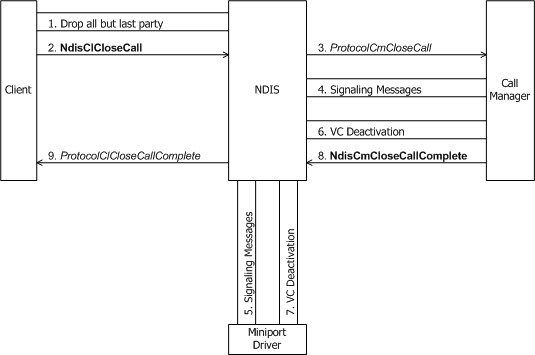
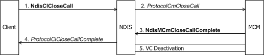

# Client-Initiated Request to Close a Call

If a client is closing a multipoint call to which more than one party is still connected, it must first call [**NdisClDropParty**](/windows-hardware/drivers/ddi/ndis/nf-ndis-ndiscldropparty) as many times as necessary to drop all but the last party from the call (see [Dropping a Party from a Multipoint Call](dropping-a-party-from-a-multipoint-call.md)).

A client initiates the closing of a call with [**NdisClCloseCall**](/windows-hardware/drivers/ddi/ndis/nf-ndis-ndisclclosecall). The following figure shows a client initiating the closing of a call through a call manager.

The next figure shows a client initiating the closing of a call through an MCM driver.

A connection-oriented client typically calls **NdisClCloseCall** in any one of the following circumstances:

-   To close an established outgoing or incoming call.

-   From the [**ProtocolClIncomingCloseCall**](/windows-hardware/drivers/ddi/ndis/nc-ndis-protocol_cl_incoming_close_call) function to tear down an established call (see [Incoming Request to Close a Call](incoming-request-to-close-a-call.md)).

-   From the [*ProtocolClIncomingCallQoSChange*](/windows-hardware/drivers/ddi/ndis/nc-ndis-protocol_cl_incoming_call_qos_change) function to tear down an established call if a QoS change that the remote party proposes is unacceptable (see [Incoming Request to Change Call Parameters](incoming-request-to-change-call-parameters.md)).

-   From the [**ProtocolClModifyCallQoSComplete**](/windows-hardware/drivers/ddi/ndis/nc-ndis-protocol_cl_modify_call_qos_complete) function to tear down an established call if a QoS change that the client proposes is unacceptable to the remote party (see [Client-Initiated Request to Change Call Parameters](client-initiated-request-to-change-call-parameters.md)).

A client's call to **NdisClCloseCall** causes NDIS to call the call manager's or MCM driver's [**ProtocolCmCloseCall**](/windows-hardware/drivers/ddi/ndis/nc-ndis-protocol_cm_close_call) function. *ProtocolCmCloseCall* must communicate with network control devices to terminate a connection between the local node and a remote node.

If *ProtocolCmCloseCall* is passed an explicit *CallMgrPartyContext*, the call that is being terminated is a multipoint call. The call manager or MCM driver must perform any necessary network communication with its networking hardware, as appropriate to its media type, to terminate the call as a multipoint call.

NDIS can pass *ProtocolCmCloseCall* a pointer to a buffer containing data supplied by the client in the call to **NdisClClose**. This data can be diagnostic data that indicates why the call was closed or any other data that is required by the signaling protocol. *ProtocolCmCloseCall* must send any such data across the network before completing the call termination. If sending data concurrent with a connection being terminated is not supported, a call manager or MCM driver should return NDIS\_STATUS\_INVALID\_DATA.

*ProtocolCmCloseCall* can complete synchronously or, more probably, asynchronously with [**NdisCmCloseCallComplete**](/windows-hardware/drivers/ddi/ndis/nf-ndis-ndiscmclosecallcomplete)(in the case of a call manager) or [**NdisMCmCloseCallComplete**](/windows-hardware/drivers/ddi/ndis/nf-ndis-ndismcmclosecallcomplete)(in the case of an MCM driver). A call to **Ndis(M)CmCloseCallComplete** causes NDIS to call the client's [**ProtocolClCloseCallComplete**](/windows-hardware/drivers/ddi/ndis/nc-ndis-protocol_cl_close_call_complete) function.

The call manager or MCM driver must then initiate deactivation of the VC used for the call by respectively calling [**NdisCmDeactivateVc**](/windows-hardware/drivers/ddi/ndis/nf-ndis-ndiscmdeactivatevc) or [**NdisMCmDeactivateVc**](/windows-hardware/drivers/ddi/ndis/nf-ndis-ndismcmdeactivatevc)(see [Deactivating a VC](deactivating-a-vc.md)). The creator of the VC (client, call manager, or MCM driver) can then optionally initiate deletion of the VC (see [Deleting a VC](deleting-a-vc.md)).

 

