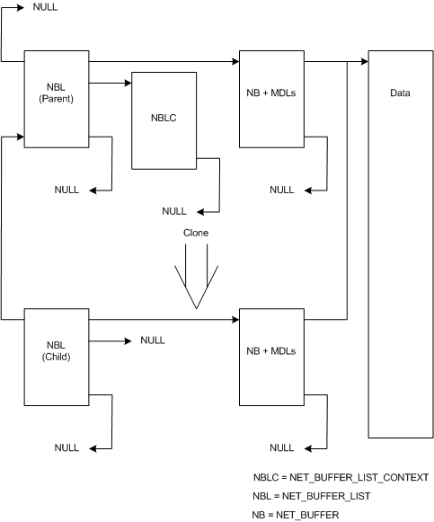

# Cloned NET\_BUFFER\_LIST Structures

An NDIS driver creates a cloned [**NET\_BUFFER\_LIST**](/windows-hardware/drivers/ddi/nbl/ns-nbl-net_buffer_list) structure from an existing NET\_BUFFER\_LIST structure. The cloned structure references the original structures data. Drivers can use this type of structure to efficiently transfer the same data to multiple paths.

The following figure shows the relationship between a parent NET\_BUFFER\_LIST structure and a cloned child structure.

The preceding figure contains a parent [**NET\_BUFFER\_LIST**](/windows-hardware/drivers/ddi/nbl/ns-nbl-net_buffer_list) structure and a child structure that was derived from that parent. The parent structure has one [**NET\_BUFFER\_LIST\_CONTEXT**](/windows-hardware/drivers/ddi/nbl/ns-nbl-net_buffer_list_context) structure and one [**NET\_BUFFER**](/windows-hardware/drivers/ddi/nbl/ns-nbl-net_buffer) structure with MDLs attached. The parent structure's parent pointer is **NULL** indicating that it is not a derived structure.

The child NET\_BUFFER\_LIST structure has one NET\_BUFFER structure with MDLs attached. The child NET\_BUFFER\_LIST has a pointer to the parent structure. The **NULL** where a NET\_BUFFER\_LIST\_CONTEXT structure pointer would be indicates that the child has no NET\_BUFFER\_LIST\_CONTEXT structure.

Drivers call the [**NdisAllocateCloneNetBufferList**](/windows-hardware/drivers/ddi/nblapi/nf-nblapi-ndisallocateclonenetbufferlist) function to create a clone [**NET\_BUFFER\_LIST**](/windows-hardware/drivers/ddi/nbl/ns-nbl-net_buffer_list) structure. NDIS allocates new [**NET\_BUFFER**](/windows-hardware/drivers/ddi/nbl/ns-nbl-net_buffer) structures and MDLs with the cloned NET\_BUFFER\_LIST structure. NDIS does not allocate a [**NET\_BUFFER\_LIST\_CONTEXT**](/windows-hardware/drivers/ddi/nbl/ns-nbl-net_buffer_list_context) structure for the cloned structure. The new NET\_BUFFER structures and MDLs describe the same data as in the parent structure. The data is not copied.

Drivers call the [**NdisFreeCloneNetBufferList**](/windows-hardware/drivers/ddi/nblapi/nf-nblapi-ndisfreeclonenetbufferlist) function to free a NET\_BUFFER\_LIST structure and all associated NET\_BUFFER structures and MDL chains that were previously allocated by calling **NdisAllocateCloneNetBufferList**.

## Related topics

[Derived NET\_BUFFER\_LIST Structures](derived-net-buffer-list-structures.md)

 

