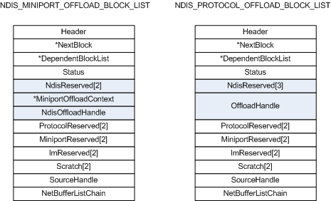

# Comparison of Offload Block List Types

\[The TCP chimney offload feature is deprecated and should not be used.\]

The following figure shows the differences between an [**NDIS\_MINIPORT\_OFFLOAD\_BLOCK\_LIST**](https://msdn.microsoft.com/library/windows/hardware/ff566469) structure and an [**NDIS\_PROTOCOL\_OFFLOAD\_BLOCK\_LIST**](https://msdn.microsoft.com/library/windows/hardware/ff566833) structure.

An NDIS\_MINIPORT\_OFFLOAD\_BLOCK\_LIST structure and an NDIS\_PROTOCOL\_OFFLOAD\_BLOCK\_LIST structure differ as follows:

-   In an NDIS\_MINIPORT\_OFFLOAD\_BLOCK\_LIST structure, the **NdisReserved** member is an array of two PVOIDs. In an NDIS\_PROTOCOL\_OFFLOAD\_BLOCK\_LIST structure, the **NdisReserved** member is an array of three PVOIDs.

-   The NDIS\_MINIPORT\_OFFLOAD\_BLOCK\_LIST structure contains **MiniportOffloadContext** and **NdisOffloadHandle** members. (For a description of how these two members are used, see [Storing and Referencing Offloaded State](storing-and-referencing-offloaded-state.md).) Instead of these two members, an NDIS\_PROTOCOL\_OFFLOAD\_BLOCK\_LIST structure contains an **OffloadHandle** member. (For a description of how the **OffloadHandle** is used, see [Referencing Offloaded State Through an Intermediate Driver](referencing-offloaded-state-through-an-intermediate-driver.md).)

When propagating a state-manipulation operation, an intermediate driver must convert an incoming NDIS\_MINIPORT\_OFFLOAD\_BLOCK\_LIST structure to an NDIS\_PROTOCOL\_OFFLOAD\_BLOCK\_LIST. For more information about this conversion, see [Reusing an NDIS\_MINIPORT\_OFFLOAD\_BLOCK\_LIST Structure](reusing-an-ndis-miniport-offload-block-list-structure.md).

When propagating the completion of a state-manipulation operation, an intermediate driver must convert an incoming NDIS\_PROTOCOL\_OFFLOAD\_BLOCK\_LIST structure to an NDIS\_MINIPORT\_OFFLOAD\_BLOCK\_LIST. For more information about this conversion, see [Reusing an NDIS\_PROTOCOL\_OFFLOAD\_BLOCK\_LIST Structure](reusing-an-ndis-protocol-offload-block-list-structure.md).

 

 

