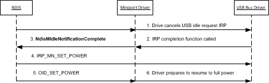

# Completing the NDIS Selective Suspend Idle Notification

NDIS calls the [*MiniportIdleNotification*](https://msdn.microsoft.com/library/windows/hardware/hh464092) handler function to notify the driver that the underlying network adapter seems to be idle. For more information about this operation, see [Handling the NDIS Selective Suspend Idle Notification](handling-the-ndis-selective-suspend-idle-notification.md).

After the idle notification is issued, the miniport driver completes the NDIS selective suspend idle notification under the following conditions:

-   NDIS cancels the idle notification by calling the [*MiniportCancelIdleNotification*](https://msdn.microsoft.com/library/windows/hardware/hh464088) handler function of the underlying miniport driver.

-   The miniport driver completes the idle notification itself. The reasons for doing this are specific to the design and requirements of the driver and adapter. For example, the driver could complete the idle notification if it detects receive activity on the network adapter.

**Note**  The miniport driver cannot explicitly cancel the idle notification. When NDIS cancels the idle notification, the miniport driver must complete the notification as described in this topic. For more information, see [Canceling the NDIS Selective Suspend Idle Notification](canceling-the-ndis-selective-suspend-idle-notification.md).

 

In either case, the miniport driver must complete the idle notification to resume the adapter to a full-power state. To complete the idle notification, the miniport driver must cancel any bus-specific I/O request packets (IRPs) that it may have previously issued for the idle notification. Finally, the driver calls [**NdisMIdleNotificationComplete**](https://msdn.microsoft.com/library/windows/hardware/hh451491) to notify NDIS that the network adapter can be transitioned to a full-power state.

For example, the miniport driver for a USB network adapter completes an idle notification by following these steps:

1.  The miniport driver cancels the pending USB idle request ([**IOCTL\_INTERNAL\_USB\_SUBMIT\_IDLE\_NOTIFICATION**](https://msdn.microsoft.com/library/windows/hardware/ff537270)) IRP. The miniport driver previously issued this IRP to the underlying USB bus driver when NDIS called the driver's [*MiniportIdleNotification*](https://msdn.microsoft.com/library/windows/hardware/hh464092) function. The miniport driver cancels this IRP by calling [**IoCancelIrp**](https://msdn.microsoft.com/library/windows/hardware/ff548338).

2.  When the bus driver cancels the USB idle request IRP, it calls the miniport driver's completion routine for the IRP. This call notifies the driver that the IRP is completed and the network adapter can transition to a full-power state. From the context of the completion routine, the driver calls [**NdisMIdleNotificationComplete**](https://msdn.microsoft.com/library/windows/hardware/hh451491) to notify NDIS that the network adapter can be transitioned to a full-power state.

    For more information about how to implement a USB idle request IRP completion routine, see [Implementing a USB Idle Request IRP Completion Routine](implementing-a-usb-idle-request-irp-completion-routine.md).

**Note**  Depending on the dependencies for canceling bus-specific idle requests, the miniport driver calls [**NdisMIdleNotificationComplete**](https://msdn.microsoft.com/library/windows/hardware/hh451491) either synchronously in the context of the call to [*MiniportCancelIdleNotification*](https://msdn.microsoft.com/library/windows/hardware/hh464088) or asynchronously after *MiniportCancelIdleNotification* returns.

 

After the miniport driver cancels any bus-specific IRPs for the idle notification, it calls [**NdisMIdleNotificationComplete**](https://msdn.microsoft.com/library/windows/hardware/hh451491). This call notifies NDIS that the idle notification has been completed. NDIS then completes the selective suspend operation by transitioning the network adapter to a full-power state.

When [**NdisMIdleNotificationComplete**](https://msdn.microsoft.com/library/windows/hardware/hh451491) is called, NDIS performs the following steps:

1.  NDIS issues [**IRP\_MN\_SET\_POWER**](https://msdn.microsoft.com/library/windows/hardware/ff551744) to the underlying bus driver. This IRP requests the bus driver to set the power state of the network adapter to PowerDeviceD0.

2.  NDIS issues an object identifier (OID) set request of [OID\_PNP\_SET\_POWER](https://msdn.microsoft.com/library/windows/hardware/ff569780) to the miniport driver. In this OID request, NDIS specifies that the network adapter is now transitioning to a full-power state of NdisDeviceStateD0.

    When it handles this OID set request, the driver prepares the adapter for full-power operation. This includes restoring the receive and send engines to the same state they were in before the transition to the low-power state. The driver then completes the OID request with NDIS\_STATUS\_SUCCESS.

The following figure shows the steps that are involved when the miniport driver completes an idle notification for a USB network adapter.

**Note**  When the miniport driver completes an idle notification, it must not call [**NdisMIdleNotificationConfirm**](https://msdn.microsoft.com/library/windows/hardware/hh451492) for an idle notification that was previously completed through a call to [**NdisMIdleNotificationComplete**](https://msdn.microsoft.com/library/windows/hardware/hh451491).

 

 

 

