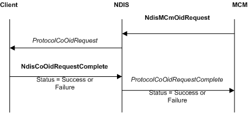
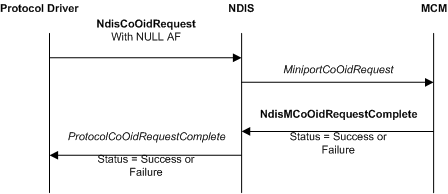
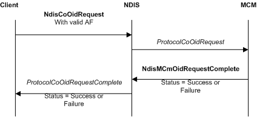

# CoNDIS MCM OID Requests

Like other CoNDIS call managers, miniport call managers (MCMs) can query or set the operating parameters of CoNDIS client drivers. CoNDIS client drivers can query or set the call manager parameters or the miniport driver parameters of an MCM.

To originate an OID request to a CoNDIS client driver, an MCM calls the [**NdisMCmOidRequest**](https://msdn.microsoft.com/library/windows/hardware/ff563548) function.

The following figure illustrates an OID request that an MCM originated.

After an MCM driver calls the [**NdisMCmOidRequest**](https://msdn.microsoft.com/library/windows/hardware/ff563548) function, NDIS calls the [**ProtocolCoOidRequest**](https://msdn.microsoft.com/library/windows/hardware/ff570254) function of the client driver.

To complete synchronously, **NdisMCmOidRequest** returns NDIS\_STATUS\_SUCCESS or an error status. To complete asynchronously, **NdisMCmOidRequest** returns NDIS\_STATUS\_PENDING.

If [**NdisMCmOidRequest**](https://msdn.microsoft.com/library/windows/hardware/ff563548) returns NDIS\_STATUS\_PENDING, NDIS calls the [**ProtocolCoOidRequestComplete**](https://msdn.microsoft.com/library/windows/hardware/ff570255) function of the MCM after the client drivers complete the OID request by calling the [**NdisCoOidRequestComplete**](https://msdn.microsoft.com/library/windows/hardware/ff561716) function. In this case, NDIS passes the results of the request at the *OidRequest* parameter of *ProtocolCoOidRequestComplete*. NDIS passes the final status of the request at the *Status* parameter of *ProtocolCoOidRequestComplete*.

If **NdisMCmOidRequest** returns NDIS\_STATUS\_SUCCESS, it returns the results of a query request in the [**NDIS\_OID\_REQUEST**](https://msdn.microsoft.com/library/windows/hardware/ff566710) structure at the *OidRequest* parameter. In this case, NDIS does not call the *ProtocolCoOidRequestComplete* function of the MCM.

CoNDIS client drivers can query or set the call manager operating parameters or miniport operating parameters of MCMs. To originate an OID request for MCM call manager parameters, a client calls the [**NdisCoOidRequest**](https://msdn.microsoft.com/library/windows/hardware/ff561711) function and provides a valid address family (AF) handle at the *NdisAfHandle* parameter. To originate an OID request for MCM miniport parameters, a client calls the **NdisCoOidRequest** function and sets the AF handle to **NULL**.

After a client calls the **NdisCoOidRequest** function, NDIS calls either the [**MiniportCoOidRequest**](https://msdn.microsoft.com/library/windows/hardware/ff559362) function or the [**ProtocolCoOidRequest**](https://msdn.microsoft.com/library/windows/hardware/ff570254) function of the MCM driver.

The following figure illustrates an OID request for the miniport parameters of the MCM.

The following figure illustrates an OID request for the call manager parameters of the MCM.

To complete synchronously, [**NdisCoOidRequest**](https://msdn.microsoft.com/library/windows/hardware/ff561711) returns NDIS\_STATUS\_SUCCESS or an error status. To complete asynchronously, [**ProtocolCoOidRequest**](https://msdn.microsoft.com/library/windows/hardware/ff570254) or [**MiniportCoOidRequest**](https://msdn.microsoft.com/library/windows/hardware/ff559362) returns NDIS\_STATUS\_PENDING.

If *ProtocolCoOidRequest* or **MininportCoOidRequest** returns NDIS\_STATUS\_PENDING, NDIS calls the [**ProtocolCoOidRequestComplete**](https://msdn.microsoft.com/library/windows/hardware/ff570255) function of the client after the MCM completes the OID request by calling the [**NdisMCoOidRequestComplete**](https://msdn.microsoft.com/library/windows/hardware/ff563568) or [**NdisMCmOidRequestComplete**](https://msdn.microsoft.com/library/windows/hardware/ff563551) function. In this case, NDIS passes the results of the request at the *OidRequest* parameter of *ProtocolCoOidRequestComplete*. NDIS passes the final status of the request at the *Status* parameter of *ProtocolCoOidRequestComplete*.

If [**NdisCoOidRequest**](https://msdn.microsoft.com/library/windows/hardware/ff561711) returns NDIS\_STATUS\_SUCCESS, it returns the results of a query request in the [**NDIS\_OID\_REQUEST**](https://msdn.microsoft.com/library/windows/hardware/ff566710) structure at the *OidRequest* parameter. In this case, NDIS does not call the client's *ProtocolCoOidRequestComplete* function.

 

 

