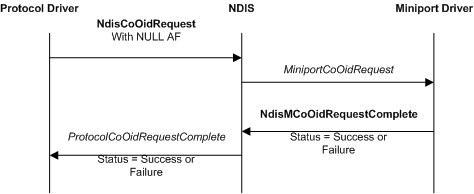
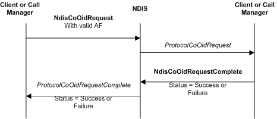

# CoNDIS Protocol Driver OID Requests

CoNDIS protocol drivers, either clients or call managers, can query or set the operating parameters of miniport drivers and other protocol drivers. CoNDIS protocol drivers can also query or set information in miniport call managers (MCMs). For more information about OID requests and MCMs, see [CoNDIS MCM OID Requests](condis-mcm-oid-requests.md).

To originate an OID request to an underlying driver, a protocol driver calls the [**NdisCoOidRequest**](/windows-hardware/drivers/ddi/ndis/nf-ndis-ndiscooidrequest) function and sets the address family (AF) handle, at the *NdisAfHandle* parameter, to **NULL**. To originate an OID request to another CoNDIS protocol driver, a protocol driver calls **NdisCoOidRequest** and provides a valid AF handle.

After a protocol driver calls the **NdisCoOidRequest** function, NDIS calls the OID request function of the other driver (an underlying driver or another CoNDIS protocol driver). For miniport drivers, NDIS calls the [**MiniportCoOidRequest**](/windows-hardware/drivers/ddi/ndis/nc-ndis-miniport_co_oid_request) function. For protocol drivers, NDIS calls the [**ProtocolCoOidRequest**](/windows-hardware/drivers/ddi/ndis/nc-ndis-protocol_co_oid_request) function.

The following figure illustrates an OID request that is directed to a miniport driver.

The following figure illustrates an OID request that is directed to a protocol driver.

To complete synchronously, [**NdisCoOidRequest**](/windows-hardware/drivers/ddi/ndis/nf-ndis-ndiscooidrequest) returns NDIS\_STATUS\_SUCCESS or an error status. To complete asynchronously, **NdisCoOidRequest** returns NDIS\_STATUS\_PENDING.

If **NdisCoOidRequest** returns NDIS\_STATUS\_PENDING, NDIS calls the [**ProtocolCoOidRequestComplete**](/windows-hardware/drivers/ddi/ndis/nc-ndis-protocol_co_oid_request_complete) function after the other driver completes the OID request by calling the [**NdisMCoOidRequestComplete**](/windows-hardware/drivers/ddi/ndis/nf-ndis-ndismcooidrequestcomplete) function or the [**NdisCoOidRequestComplete**](/windows-hardware/drivers/ddi/ndis/nf-ndis-ndiscooidrequestcomplete) function. In this case, NDIS passes the results of the request at the *OidRequest* parameter of *ProtocolCoOidRequestComplete*. NDIS passes the final status of the request at the *Status* parameter of *ProtocolCoOidRequestComplete*.

If [**NdisCoOidRequest**](/windows-hardware/drivers/ddi/ndis/nf-ndis-ndiscooidrequest) returns NDIS\_STATUS\_SUCCESS, it returns the results of a query request in the [**NDIS\_OID\_REQUEST**](/windows-hardware/drivers/ddi/oidrequest/ns-oidrequest-ndis_oid_request) structure at the *OidRequest* parameter points. In this case, NDIS does not call the *ProtocolCoOidRequestComplete* function.

If an underlying driver should associate the OID request with a subsequent status indication, the protocol driver should set the **RequestId** and **RequestHandle** members in the NDIS\_OID\_REQUEST structure. If the underlying driver makes a status indication, the driver sets the **RequestId** member in the [**NDIS\_STATUS\_INDICATION**](/windows-hardware/drivers/ddi/ndis/ns-ndis-_ndis_status_indication) structure to the value from the **RequestId** member of the NDIS\_OID\_REQUEST structure and the **DestinationHandle** member in the NDIS\_STATUS\_INDICATION structure to the value from the **RequestHandle** member of the NDIS\_OID\_REQUEST structure.

A driver can call [**NdisCoOidRequest**](/windows-hardware/drivers/ddi/ndis/nf-ndis-ndiscooidrequest) when a binding is in the *Restarting*, *Running*, *Pausing*, or *Paused* state.

 

