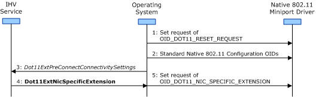

# Configuration through a Network Profile

**Important**  The [Native 802.11 Wireless LAN](native-802-11-wireless-lan4.md) interface is deprecated in Windows 10 and later. Please use the WLAN Device Driver Interface (WDI) instead. For more information about WDI, see [WLAN Universal Windows driver model](wifi-universal-driver-model.md).

 

This topic describes the manner in which a miniport driver, operating in Extensible Station (ExtSTA) mode, is configured through a network profile.

A network profile consists of the following configuration settings:

**Connectivity Settings**   
These settings are required and are used to configure the 802.11 station for a network connection. Connectivity settings include:

-   Standard 802.11 connectivity settings, such as desired basic service set (BSS) type and the service set identifier (SSID) of the BSS with which the 802.11 station will connect. The operating system will configure the miniport driver with the standard connectivity settings through set requests of the Native 802.11 object identifiers (OIDs) described in [Native 802.11 Miniport Driver Configuration](native-802-11-miniport-driver-configuration.md).

-   Independent hardware vendor (IHV) connectivity settings. These settings are proprietary to the implementation by the IHV's miniport driver and 802.11 station. The IHV must install an IHV Extensions DLL in order to issue set requests to the miniport driver for the configuration of IHV connectivity settings. For more information about the IHV Extensions DLL, see [Native 802.11 Software Architecture](native-802-11-software-architecture.md).

**Security Settings**   
These settings are optional and are used to configure the 802.11 station for the security settings used on the network connection. Security settings include enabling 802.11 cipher and authentication algorithms, as well as defining decryption exemptions on certain packet types.

Security settings include:

-   Standard 802.11 security settings for the 802.11 cipher and authentication algorithms that are supported by the operating system. For more information about these algorithms, see [802.11 Cipher Algorithms](802-11-cipher-algorithms.md) and [802.11 Authentication Algorithms](802-11-authentication-algorithms.md).

-   Independent hardware vendor (IHV) security settings for the cipher and authentication algorithm extensions that are supported by the IHV's miniport driver and 802.11 station. The IHV must install an IHV Extensions DLL in order to issue set requests to the miniport driver for the configuration of IHV security settings. For more information about IHV security extensions, see [Extending Support for 802.11 Authentication Algorithms](extending-support-for-802-11-authentication-algorithms.md) and [Extending Support for 802.11 Cipher Algorithms](extending-support-for-802-11-cipher-algorithms.md).

When a network profile is selected for an 802.11 network connection, the operating system will first configure the miniport driver with the profile's connectivity settings in the following way:

-   The miniport driver must be in the initialization (INIT) state of the ExtSTA operation mode before the settings from the network profile can be configured on the 802.11 station. The operating system will first issue a method request of [OID\_DOT11\_RESET\_REQUEST](https://msdn.microsoft.com/library/windows/hardware/ff569409) to bring the miniport driver to the INIT state. For more information about this state, see [Extensible Station Operating States](extensible-station-operating-states.md).

    When the method request of [OID\_DOT11\_RESET\_REQUEST](https://msdn.microsoft.com/library/windows/hardware/ff569409) is made, the miniport driver must restore the 802.11 station, including the IEEE media access control (MAC) and physical (PHY) layers, to its default configuration and settings.

-   The operating system will issue OID set requests to the miniport driver for standard 802.11 settings. These OIDs include:
    -   [OID\_DOT11\_DESIRED\_BSS\_TYPE](https://msdn.microsoft.com/library/windows/hardware/ff569142)
    -   [OID\_DOT11\_DESIRED\_SSID\_LIST](https://msdn.microsoft.com/library/windows/hardware/ff569145)
    -   [OID\_DOT11\_ENABLED\_AUTHENTICATION\_ALGORITHM](https://msdn.microsoft.com/library/windows/hardware/ff569356)
    -   [OID\_DOT11\_ENABLED\_UNICAST\_CIPHER\_ALGORITHM](https://msdn.microsoft.com/library/windows/hardware/ff569358)
    -   [OID\_DOT11\_ENABLED\_MULTICAST\_CIPHER\_ALGORITHM](https://msdn.microsoft.com/library/windows/hardware/ff569357)
-   If the 802.11 station's desired basic service set (BSS) type is configured for the independent BSS (IBSS) network type, the operating system can optionally issue OID set requests for IBSS network configuration. These OIDs include:
    -   [OID\_DOT11\_ATIM\_WINDOW](https://msdn.microsoft.com/library/windows/hardware/ff569105)
    -   [OID\_DOT11\_BEACON\_PERIOD](https://msdn.microsoft.com/library/windows/hardware/ff569109)
-   If the profile contains IHV connectivity settings, the operating system will call the IHV Extension DLL's [*Dot11ExtIhvPerformPreAssociate*](https://msdn.microsoft.com/library/windows/hardware/ff547499) function. The IHV Extensions DLL will parse the IHV connectivity settings within the profile and will configure the miniport driver by calling the [**Dot11ExtNicSpecificExtension**](https://msdn.microsoft.com/library/windows/hardware/ff547526) IHV Extensibility function, which causes the operating system to issue a method request of [OID\_DOT11\_NIC\_SPECIFIC\_EXTENSION](https://msdn.microsoft.com/library/windows/hardware/ff569393) to the miniport driver with data from the function call. The IHV Extension DLL can make as many calls to **Dot11ExtNicSpecificExtension** as needed when parsing the IHV connectivity settings.

    For more information about the IHV Extensibility functions, see [Native 802.11 IHV Extensions](https://msdn.microsoft.com/library/windows/hardware/ff560614).

The following figure illustrates the method used to configure connectivity settings on a miniport driver operating in ExtSTA mode.

After the connectivity settings have been configured, the operating system will next configure the miniport driver with the profile's security settings in the following way:

-   If the network profile contains standard security, the operating system will issue OID set requests to the miniport driver to configure the 802.11 cipher and authentication algorithms specified in the profile. For more information about the OIDs used to configure standard 802.11 cipher and authentication algorithms, see [Extensible Station Cipher Operations](extensible-station-cipher-operations.md) and [Extensible Station Authentication Operations](extensible-station-authentication-operations.md).

-   If network profile contains proprietary security settings supported by the IHV, the operating system will call the IHV Extension DLL's [*Dot11ExtIhvPerformPreAssociate*](https://msdn.microsoft.com/library/windows/hardware/ff547499) function. The IHV Extensions DLL will parse the IHV security settings within the profile and will configure the miniport driver by calling the [**Dot11ExtNicSpecificExtension**](https://msdn.microsoft.com/library/windows/hardware/ff547526) IHV Extensibility function, which causes the operating system to issue a method request of [OID\_DOT11\_NIC\_SPECIFIC\_EXTENSION](https://msdn.microsoft.com/library/windows/hardware/ff569393) to the miniport driver with data from the function call. The IHV Extension DLL can make as many calls to **Dot11ExtNicSpecificExtension** as needed when parsing the IHV security settings..

    The IHV service can also register packet types for privacy exemptions through a call to the [**Dot11ExtSetEtherTypeHandling**](https://msdn.microsoft.com/library/windows/hardware/ff547587) IHV Extensibility function, which causes the operating system to issue a set request of [OID\_DOT11\_PRIVACY\_EXEMPTION\_LIST](https://msdn.microsoft.com/library/windows/hardware/ff569404) to the miniport driver with data from the function call. For more information about privacy exemption lists, see [Decryption Exemptions](decryption-exemptions.md).

After the connectivity and security settings have been configured on the miniport driver, the operating system will initiate a connection operation on the 802.11 station. For more information about this operation, see [Connection Operations](connection-operations.md).

For more information about the IHV Extensions DLL, see [Native 802.11 Software Architecture](native-802-11-software-architecture.md).

 

 

