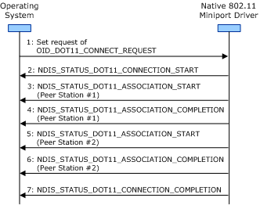

# Connection Operation Guidelines for Independent BSS Networks

**Important**  The [Native 802.11 Wireless LAN](native-802-11-wireless-lan4.md) interface is deprecated in Windows 10 and later. Please use the WLAN Device Driver Interface (WDI) instead. For more information about WDI, see [WLAN Universal Windows driver model](wifi-universal-driver-model.md).

 

When connecting to an independent basic service set (IBSS) network, the miniport driver and 802.11 station must follow the general guidelines defined in [General Connection Operation Guidelines](general-connection-operation-guidelines.md).

**Note**  IBSS (Ad hoc) and SoftAP are deprecated. Starting with Windows 8.1 and Windows Server 2012 R2, use [Wi-Fi Direct](wi-fi-direct-miniport-initialization-and-configuration.md).

 

In addition, the miniport driver and 802.11 station must follow these guidelines for connection operations to an IBSS network:

-   The miniport driver initiates an association operation with peer stations from the candidate list of BSS networks. For more information about the candidate list, see [BSS Network Candidate List](bss-network-candidate-list.md).

    The miniport driver must enclose the association operation between [NDIS\_STATUS\_DOT11\_ASSOCIATION\_START](https://msdn.microsoft.com/library/windows/hardware/ff567321) and [NDIS\_STATUS\_DOT11\_ASSOCIATION\_COMPLETION](https://msdn.microsoft.com/library/windows/hardware/ff567319) indications. For more information about the association operation, see [Association Operations](association-operations.md).

-   Additional parameters for operations within an IBSS network are provided through the DOT11\_IBSS\_PARAMS structure, which accompanies set requests of [OID\_DOT11\_IBSS\_PARAMS](https://msdn.microsoft.com/library/windows/hardware/ff569378). In particular, the **bJoinOnly** member specifies how the 802.11 station connects to an IBSS network.
    **Note**  The 802.11 station does not use the members of the DOT11\_IBSS\_PARAMS structure when preparing its BSS network candidate list.

     

-   If the 802.11 station's list of candidate IBSS networks is not empty, the station must join an existing IBSS network that matches an entry in the candidate list. The 802.11 station must always attempt to connect to an existing IBSS network regardless of the value of the **bJoinOnly** member.

-   If the 802.11 station's list of candidate IBSS networks is empty or the 802.11 station has failed to connect to any candidate IBSS network, the station must do one of the following based on the value of the **bJoinOnly** member:
    -   If **bJoinOnly** is **FALSE**, start a new IBSS network following the guidelines described below.
    -   If **bJoinOnly** is **TRUE**, continue to search for IBSS networks to connect to until either a set request of [OID\_DOT11\_DISCONNECT\_REQUEST](https://msdn.microsoft.com/library/windows/hardware/ff569147) or a method request of [OID\_DOT11\_RESET\_REQUEST](https://msdn.microsoft.com/library/windows/hardware/ff569409) are made. When these requests are made, the miniport driver must make an [NDIS\_STATUS\_DOT11\_CONNECTION\_COMPLETION](https://msdn.microsoft.com/library/windows/hardware/ff567325) indication with the **uStatus** member of the indication set to DOT11\_CONNECTION\_STATUS\_CANCELED.
-   When making the [NDIS\_STATUS\_DOT11\_CONNECTION\_START](https://msdn.microsoft.com/library/windows/hardware/ff567328) indication, the miniport driver must provide the service set identifier (SSID) and BSS identifier (BSSID) of the IBSS network with which it is either joining or starting.

-   If the 802.11 station joins an existing IBSS network, the miniport driver must successfully complete an association operation through an [NDIS\_STATUS\_DOT11\_CONNECTION\_COMPLETION](https://msdn.microsoft.com/library/windows/hardware/ff567325) indication with one or more peer stations within the IBSS network before the miniport driver can successfully complete the connection operation.

-   If the 802.11 station starts a new IBSS network, the miniport driver can successfully complete the connection operation before any peer stations join the IBSS.

When starting a new IBSS network, the 802.11 station must define the SSID and BSSID for the network, as well as the PHY to be used for data sent and received on the network. If the 802.11 station supports more than one regulatory domain, the station must also define the regulatory domain for the IBSS network. The 802.11 station must follow these guidelines when starting an IBSS network:

-   The 802.11 station uses the first entry from the desired SSID list for the SSID of the IBSS network.

    If the first entry in the desired SSID list is the wildcard SSID, the miniport driver must not initiate a connection operation. Instead, the driver must fail the set request of [OID\_DOT11\_CONNECT\_REQUEST](https://msdn.microsoft.com/library/windows/hardware/ff569122) by returning NDIS\_STATUS\_INVALID\_DATA from its [*MiniportOidRequest*](https://msdn.microsoft.com/library/windows/hardware/ff559416) function. For more information about the wildcard SSID, see [OID\_DOT11\_DESIRED\_SSID\_LIST](https://msdn.microsoft.com/library/windows/hardware/ff569145).

-   The 802.11 station uses the first entry from the desired BSSID list for the BSSID of the IBSS network.

    If the first entry in the desired BSSID list is the wildcard BSSID, the 802.11 station must generate a locally administrated individual media access control (MAC) address for the BSSID of the new IBSS network. For more information about the wildcard BSSID, see [OID\_DOT11\_DESIRED\_BSSID\_LIST](https://msdn.microsoft.com/library/windows/hardware/ff569141).

-   The 802.11 station uses the first entry from the desired PHY list for the PHY that it uses to send and receive data over an IBSS network.

    If the first entry in the desired PHY list has a value of DOT11\_PHY\_ID\_ANY, the 802.11 station can use any PHY that is currently turned on and enabled. For more information about the desired PHY list, see [OID\_DOT11\_DESIRED\_PHY\_LIST](https://msdn.microsoft.com/library/windows/hardware/ff569144).

-   If the 802.11 station supports multiple regulatory domains as defined through the IEEE 802.11d-2001 standard, it defines the regulatory domain for the IBSS network through the following guidelines:

    -   If the Extensible Station (ExtSTA) **msDot11DesiredCountryorRegionString** management information base (MIB) object is set to a country or region string of all zeros and the IEEE 802.11d **dot11CurrentRegDomain** MIB object is not set to a value of DOT11\_REG\_DOMAIN\_OTHER, the 802.11 uses the regulatory domain defined by the **dot11CurrentRegDomain** MIB object.

        For more information about the **msDot11DesiredCountryorRegionString** MIB object, see [OID\_DOT11\_DESIRED\_COUNTRY\_OR\_REGION\_STRING](https://msdn.microsoft.com/library/windows/hardware/ff569143). For more information about the **dot11CurrentRegDomain** MIB object, see [OID\_DOT11\_CURRENT\_REG\_DOMAIN](https://msdn.microsoft.com/library/windows/hardware/ff569136).

    -   If the **msDot11DesiredCountryorRegionString** MIB object is set to a valid country or region string, the 802.11 uses the regulatory domain defined by the **msDot11DesiredCountryorRegionString** MIB object.

    If the 802.11 can define a regulatory domain, it must configure the PHY for the regulatory domain. The 802.11 station must also include the 802.11d Country information element (IE), which contains the country or region string in all 802.11 Beacon and Probe Response frames it sends.

    If the 802.11 station cannot define a regulatory domain, the miniport driver must not initiate a connection operation. Instead, the driver must fail the set request of [OID\_DOT11\_CONNECT\_REQUEST](https://msdn.microsoft.com/library/windows/hardware/ff569122) by returning NDIS\_STATUS\_INVALID\_DATA from its [*MiniportOidRequest*](https://msdn.microsoft.com/library/windows/hardware/ff559416) function.

The following figure shows the sequence of events when the 802.11 station associates with two peer stations during the connection operation.

 

 

