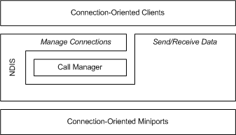
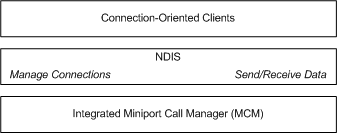

# Connection-Oriented Environment

NDIS supports the following connection-oriented drivers:

-   Connection-oriented client

-   Call manager

-   Integrated miniport call manager (MCM) driver

-   Connection-oriented miniport driver

The following figure shows a configuration of connection-oriented clients, a call manager, and a miniport driver.

The following figure shows a configuration of connection-oriented clients and an integrated MCM driver.

A *connection-oriented miniport driver* controls one or more network interface cards (NICs) and provides an interface between connection-oriented protocol drivers (connection-oriented clients and call managers) and the NIC hardware.

For a summary of connection-oriented operations performed by a connection-oriented miniport driver, see [Connection-Oriented Operations Performed by Miniport Drivers](connection-oriented-operations-performed-by-miniport-drivers.md).

A *call manager* is an NDIS protocol driver that provides call setup and tear-down services for connection-oriented clients. A call manager:

-   Uses the send and receive capabilities of a connection-oriented miniport driver to exchange signaling messages with network entities, such as network switches or remote peers.

-   Supports one or more signaling protocol drivers. For a summary of connection-oriented operations performed by a call manager, see [Connection-Oriented Operations Performed by Call Managers](connection-oriented-operations-performed-by-call-managers.md).

An *integrated MCM driver* is a connection-oriented miniport driver that also provides call manager services to connection-oriented clients. An MCM driver has the following characteristics:

-   An MCM driver provides the same connection-oriented services to clients as a call manager that is paired with a connection-oriented miniport driver; however, the call manager-to-miniport driver interface is internal to the driver and therefore opaque to NDIS.

-   Multiple call managers and MCM drivers can coexist in the same environment.

-   Each call manager or MCM driver can support multiple signaling protocol drivers.

For a detailed comparison of MCM drivers and call managers, see [How an MCM Driver Differs from a Call Manager](mcm-drivers-vs--call-managers.md).

A *connection-oriented client*:

-   Uses the call setup and tear-down services of a call manager or MCM driver.

-   Uses the send and receive capabilities of a connection-oriented miniport driver or an MCM driver to send and receive data.

-   Can provide its own network and transport-layer services to a higher-layer application at its upper edge.

-   Uses the services of a call manager and a connection-oriented miniport driver, or it uses the services of an MCM driver at its upper edge.

-   Can be an adaptation layer, that resides between an old protocol and connection-oriented NDIS.

    Such adaptation layers use call management services to establish underlying connections but hide the connection-oriented nature of this interface from the connectionless protocols above it.

**Note**  The definition of a connection-oriented client's upper-edge interface is beyond the scope of the NDIS documentation. If a client serves as an adaptation layer, its upper-edge interface is defined by the protocol that it adapts to connection-oriented NDIS.

 

For a summary of connection-oriented operations performed by a connection-oriented client, see [Connection-Oriented Operations Performed by Clients](connection-oriented-operations-performed-by-clients.md).

## Related topics

[NDIS Miniport Drivers](ndis-miniport-drivers2.md)

 

 

