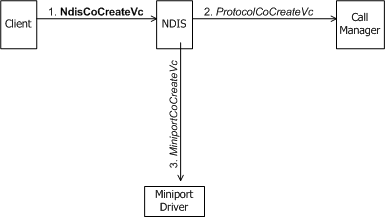
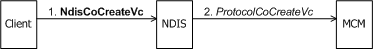
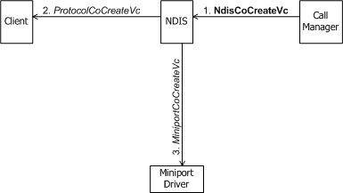
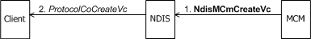

# Creating a VC

Before making an outgoing call, a connection-oriented client initiates the creation a virtual connection (VC). Before indicating an incoming call to a connection-oriented client, a call manager or an MCM driver initiates the creation of a VC . After the VC has been set up and activated, client data can be transmitted or received on the VC.

A call manager or an MCM driver can also initiate the creation of a VC on which signaling messages are exchanged with network components, such as a network switch.

### Client-Initiated Creation of a VC

Before [making a call](making-a-call.md) with [**NdisClMakeCall**](https://msdn.microsoft.com/library/windows/hardware/ff561635), a connection-oriented client calls [**NdisCoCreateVc**](https://msdn.microsoft.com/library/windows/hardware/ff561696) to initiate the creation of a VC.

The following figure shows a client of a call manager initiating the creation of a VC.

The following figure shows a client of an MCM driver initiating the creation of a VC.

When a connection-oriented client of a call manager calls **NdisCoCreateVc**, NDIS calls, as a synchronous operation, the [**ProtocolCoCreateVc**](https://msdn.microsoft.com/library/windows/hardware/ff570252) function of the call manager and the [**MiniportCoCreateVc**](https://msdn.microsoft.com/library/windows/hardware/ff559354) function of the underlying miniport driver (see the first figure in this topic). NDIS passes an *NdisVcHandle* that represents the VC to both *ProtocolCoCreateVc* and *MiniportCoCreateVc*. If the call to **NdisCoCreateVc** is successful, NDIS returns the *NdisVcHandle* to **NdisCoCreateVc**.

*ProtocolCoCreateVc* allocates and initializes any dynamic resources and structures that the call manager requires to perform subsequent operations on a VC that will be activated. *MiniportCoCreateVc* allocates and initializes any resources that the miniport driver requires to maintain state information about the VC. Both *ProtocolCoCreateVc* and *MiniportCoCreateVc* store the *NdisVcHandle* .

When a connection-oriented client of an MCM driver, the call to **NdisCoCreateVc** causes NDIS to call the MCM driver's *ProtocolCoCreateVc* function (see Client-Initiated Creation of a VC (MCM Driver Present)). In this case, *ProtocolCoCreateVc* performs the necessary allocation and initialization of resources for the VC. There is no call (internal or otherwise) to *MiniportCoCreateVc*, because an MCM driver does not supply such a function.

### Call Manager-Initiated Creation of a VC

Before [indicating an incoming call](indicating-an-incoming-call.md) to a connection-oriented client with [**NdisCmDispatchIncomingCall**](https://msdn.microsoft.com/library/windows/hardware/ff561664), a call manager calls **NdisCoCreateVc** to initiate the creation of a VC (see the following figure).

When a call manager calls [**NdisCoCreateVc**](https://msdn.microsoft.com/library/windows/hardware/ff561696), NDIS calls, as a synchronous operation, the [**ProtocolCoCreateVc**](https://msdn.microsoft.com/library/windows/hardware/ff570252) function of the connection-oriented client that registered the SAP on which the call is being received, as well as the [**MiniportCoCreateVc**](https://msdn.microsoft.com/library/windows/hardware/ff559354) function of the underlying miniport. NDIS passes an *NdisVcHandle* that represents the VC to both *ProtocolCoCreateVc* and *MiniportCoCreateVc*. If the call to **NdisCoCreateVc** is successful, NDIS returns the *NdisVcHandle* to **NdisCoCreateVc**.

### MCM Driver-Initiated Creation of a VC

Before [indicating an incoming call](indicating-an-incoming-call.md) to a connection-oriented client with [**NdisMCmDispatchIncomingCall**](https://msdn.microsoft.com/library/windows/hardware/ff562830), an MCM driver calls [**NdisMCmCreateVc**](https://msdn.microsoft.com/library/windows/hardware/ff562812) to initiate the creation of a VC (see the following figure).

When an MCM driver calls **NdisMCmCreateVc**, NDIS calls, as a synchronous operation before **NdisMCmCreateVc** returns, the [**ProtocolCoCreateVc**](https://msdn.microsoft.com/library/windows/hardware/ff570252) function of the connection-oriented client that registered the SAP on which the call is being received. NDIS passes an *NdisVcHandle* that represents the VC to *ProtocolCoCreateVc*. If the call to **NdisMCmCreateVc** is successful, NDIS returns the *NdisVcHandle* to **NdisMCmCreateVc**.

*ProtocolCoCreateVc* allocates and initializes any dynamic resources and structures that the client requires to perform subsequent operations on the VC. *ProtocolCoCreateVc* also stores the *NdisVcHandle* .

Note that when an MCM driver creates a VC for exchanging signaling messages with a network component, it does not use **Ndis*Xxx*** calls to create a VC. In fact, an MCM driver does not use **Ndis*Xxx*** calls to create, activate, deactivate, or delete such VCs. Instead, an MCM driver performs these operations internally. Such VCs are therefore opaque to NDIS.

 

 

