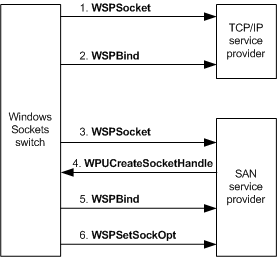

# Creating and Binding SAN Sockets

If the Windows Sockets switch determines that it can route data through a SAN connection rather than through the TCP/IP stack, it requests the appropriate SAN service provider to create, bind, and set options for a socket on which the data can be transferred.

The socket created by the SAN service provider is a *companion* to the socket that the TCP/IP service provider created at the request of the application, either from or to which the data is being transferred. The *companion socket* created by the SAN service provider has the same options as the socket created by the TCP/IP service provider, if the SAN service provider supports those options.

The companion socket also has the same IP address and TCP port as the socket that was created by the TCP/IP service provider. The SAN data is transferred through the companion socket created by the SAN service provider rather than the socket created by the TCP/IP service provider. The SAN socket is not visible to the application. From the application's perspective, the data is transferred on the socket that it requested to be created for the data transfer.

**Note**  The switch always uses the TCP/IP service provider to transfer data over *raw sockets*. The switch therefore never requests a SAN service provider to create a raw socket.

 

The following figure shows an overview of how the Windows Sockets switch creates a companion socket. The sequence in the sections that follow describe creating a companion socket in more detail.

### Initiating Creation of a TCP/IP Socket

1.  After the Windows Sockets switch receives a **WSPSocket** call that was initiated by an application, the switch calls the TCP/IP provider's **WSPSocket** function to request the TCP/IP provider to create a socket.

2.  The Windows Sockets switch returns the descriptor for the created socket to the application and stores this descriptor in a private data structure that is associated with the socket.

    From the application's perspective, the socket created by the TCP/IP provider is the socket used for data transfers, whether the switch uses the TCP/IP service provider or the SAN service provider to transfer the data.

### Binding a TCP/IP Socket

1.  The switch receives a **WSPBind** call if an application requests to bind the socket to a specific network interface controller (NIC) or to the wildcard IP address (0.0.0.0). A socket bound to the wildcard IP address can listen for incoming connection requests from all NICs.

    **Note**  Beginning with Windows Vista, the wildcard IP address 0.0.0.0 is not available.
    Also beginning with Windows Vista, if the **IPAutoconfigurationEnabled** registry key is set to a value of 0, automatic IP address assignment is disabled, and no IP address is assigned. In this case, the **ipconfig** command line tool will not display an IP address. If the key is set to a nonzero value, an IP address is automatically assigned. This key can be located at the following paths in the registry:

    **HKEY\_LOCAL\_MACHINE\\SYSTEM\\Current Control Set\\Services\\Tcpip\\Parameters\\IPAutoconfigurationEnabled**

    **HKEY\_LOCAL\_MACHINE\\SYSTEM\\Current Control Set\\Services\\Tcpip\\Parameters\\Interfaces\\*GUID*\\IPAutoconfigurationEnabled**

     

2.  The switch forwards this call to the TCP/IP service provider by calling the TCP/IP provider's **WSPBind** function.

### Service Provider Determination

1.  The switch determines whether to use a SAN service provider for data transfer on a socket after the application initiates a **WSPListen** or **WSPConnect** call to the switch, as described in [Setting Up a SAN Connection](setting-up-a-san-connection.md).

2.  If the switch determines that it cannot use a SAN service provider for a data transfer, the switch routes the data transfer through the TCP/IP service provider.

3.  If the switch chooses a SAN service provider to service an application's socket, the switch calls the SAN service provider's [**WSPSocket**](https://msdn.microsoft.com/library/windows/hardware/ff566319) function to create a companion socket.

### Initiating Creation of a Companion Socket

1.  The SAN service provider's **WSPSocket** function initializes an internal data structure in which it stores information about the companion socket.

2.  The SAN service provider's **WSPSocket** function must next call the **WPUCreateSocketHandle** function to acquire a socket descriptor from the switch.

3.  The SAN service provider must store the switch's socket descriptor in its internal data structure for the companion socket and must return its own descriptor for the companion socket to complete the **WSPSocket** call. The socket descriptor returned by the SAN service provider can be any meaningful value, such as a pointer to a private data structure.

4.  To perform an operation on the socket, the switch supplies the socket descriptor that was returned by the SAN service provider to the appropriate function of the SAN service provider. Similarly, the SAN service provider must supply the socket descriptor that was acquired from the switch in the **WPUCreateSocketHandle** call if the SAN service provider makes any of the following up calls:

    **WPUQuerySocketHandleContext**

    **WPUCloseSocketHandle**

    **WPUCompleteOverlappedRequest**

### Binding a Companion Socket

1.  If a SAN service provider's **WSPSocket** function completes successfully, the switch immediately calls the SAN service provider's [**WSPBind**](https://msdn.microsoft.com/library/windows/hardware/ff566268) function to assign a local IP address and TCP port to the socket.

2.  The switch assigns the same IP address and TCP port to the SAN socket as was assigned to the socket that was created by the TCP/IP provider. The SAN service provider must translate this TCP/IP address into its native format.

3.  The switch supplies a fully qualified IP address and TCP port (that is, nonzero values) to the SAN service provider's **WSPBind** function unless an application requested to listen for incoming connections from all NICs. In the later case, the switch supplies the wildcard IP address to the SAN service provider's **WSPBind** function.

### Setting Options for a Companion Socket

-   If the application specified any socket options, the switch stores those options. After creating the SAN socket, the switch calls the SAN service provider's [**WSPSetSockOpt**](https://msdn.microsoft.com/library/windows/hardware/ff566318) function for each supported option that was specified by the application to immediately set these options for the SAN socket.

### Failing a Companion Socket Call

-   If a SAN service provider fails any of the preceding calls to its **WSPSocket**, **WSPBind**, or **WSPSetSockOpt** functions, the switch calls the SAN service provider's [**WSPCloseSocket**](https://msdn.microsoft.com/library/windows/hardware/ff566273) function to destroy the SAN socket. The switch then uses the TCP/IP provider to continue servicing the application socket. Note that, after the switch establishes a connection using a SAN service provider, the switch cannot use the TCP/IP provider to service the application's socket. In this case, the switch returns the appropriate error to the application.

### Connecting the Companion Socket

-   After the switch sets up the companion socket, the switch calls either the **WSPListen** or **WSPConnect** function for the SAN service provider to perform the operation that caused the SAN service provider to originally set up the socket. For example, if an application originally requested to listen for incoming connections, the switch calls the SAN service provider's [**WSPListen**](https://msdn.microsoft.com/library/windows/hardware/ff566297) function.

 

 

