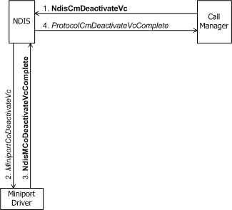
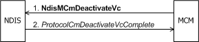

# Deactivating a VC

A call manager calls [**NdisCmDeactivateVc**](https://msdn.microsoft.com/library/windows/hardware/ff561657) as an essential step in closing either an outgoing or incoming call, typically after the packet exchange with network components that tears down the call (see [Client-Initiated Request to Close a Call](client-initiated-request-to-close-a-call.md) and [Incoming Request to Close a Call](incoming-request-to-close-a-call.md)). An MCM driver does the same thing by calling [**NdisMCmDeactivateVc**](https://msdn.microsoft.com/library/windows/hardware/ff562818).

The call to **NdisCmDeactivateVc** causes NDIS to call the underlying miniport driver's [**MiniportCoDeactivateVc**](https://msdn.microsoft.com/library/windows/hardware/ff559356) function (see the following figure). *MiniportCoDeactivateVc* communicates with its network adapter to terminate all communication across this VC (for example, clearing receive or send buffers on the adapter).

Before it deactivates a VC, the miniport driver must complete any pending transfers on the VC. That is, the miniport driver must wait until it has completed all sends in progress and until all receive packets that it has indicated are returned to it. After deactivating the VC, the miniport driver cannot indicate receives or transmit sends on the VC.

Note that *MiniportCoDeactivateVc* does not delete the VC. The creator (client, call manager, or MCM driver) of a particular VC that will not be reused calls [**NdisCoDeleteVc**](https://msdn.microsoft.com/library/windows/hardware/ff561698) to [destroy that VC](deleting-a-vc.md). A deactivated VC can be [reactivated](activating-a-vc.md) by a connection-oriented client, a call manager, or an MCM driver.

*MiniportCoDeactivateVc* can complete synchronously or asynchronously. A call to [**NdisMCoDeactivateVcComplete**](https://msdn.microsoft.com/library/windows/hardware/ff563559). causes NDIS to call the [**ProtocolCmDeactivateVcComplete**](https://msdn.microsoft.com/library/windows/hardware/ff570242) function of the call manager that originally requested the VC deactivation. Completion of the deactivation means that all call parameters for the VC used on activation are no longer valid. Any further use of the VC is prohibited except to reactivate it with a new set of call parameters.

An MCM driver's call to **NdisMCmDeactivateVc** informs NDIS that it has deactivated a VC or changed the call parameters on an established VC (see the following figure). NDIS completes the deactivation sequence by calling the MCM driver's *ProtocolCmDeactivateVcComplete* function.

An MCM driver does not call **NdisMCmDeactivateVc** to deactivate VCs used for exchanging signaling messages between the MCM driver and network components such as a switch. An MCM driver deactivates a signaling VC internally without calling any **Ndis*Xxx*** function.

 

 

